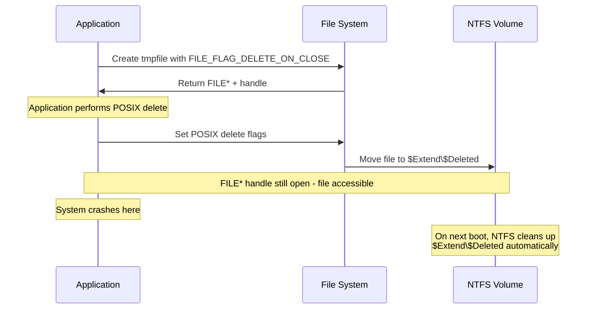
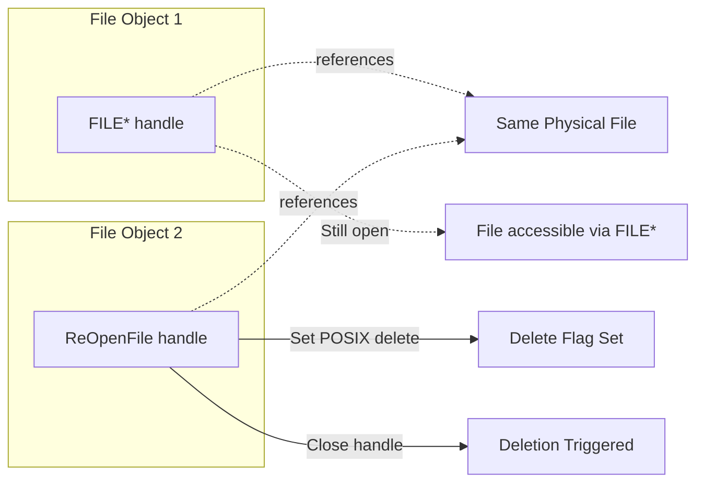
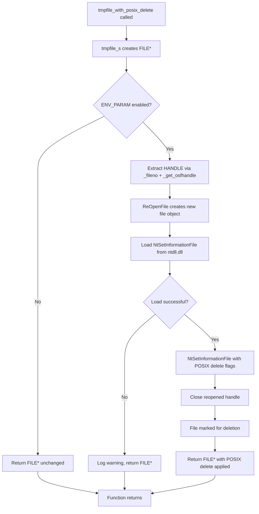
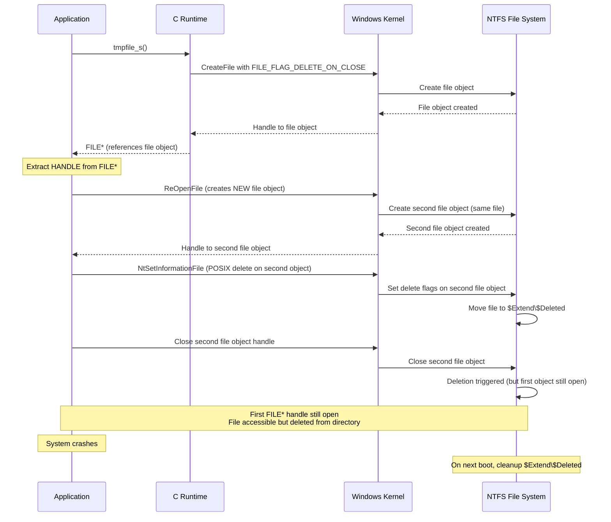

<!--
Copyright (C) 2023 - 2025 Advanced Micro Devices, Inc. All rights reserved.
Licensed under the MIT License.
-->

# How It Works: tmpfile POSIX Delete Mechanism

This document provides a comprehensive technical explanation of how the tmpfile POSIX delete mechanism works in MorphiZen, including the problem it solves, the solution architecture, and a detailed code walkthrough.

## Table of Contents

1. [Problem Statement](#problem-statement)
2. [Solution Overview](#solution-overview)
3. [Architecture Explanation](#architecture-explanation)
4. [Code Walkthrough](#code-walkthrough)
5. [Flow Diagrams](#flow-diagrams)
6. [Key Concepts](#key-concepts)
7. [Why This Works for Crash Scenarios](#why-this-works-for-crash-scenarios)
8. [Configuration](#configuration)
9. [Testing](#testing)

---

## Problem Statement

### The Normal tmpfile Behavior

When you call `tmpfile_s()` in MSVC, it creates a temporary file with the `FILE_FLAG_DELETE_ON_CLOSE` flag. This means:

- **Normal case**: The file is automatically deleted when all handles to it are closed
- **If you call `fclose()`**: The file is deleted immediately
- **If you forget `fclose()`**: The kernel closes all handles during normal process termination, and the file is still deleted

### The Failure Cases

However, there are scenarios where `FILE_FLAG_DELETE_ON_CLOSE` fails:

1. **System crashes**: If the system crashes before the process can close its handles, the NT "file object" with `FILE_FLAG_DELETE_ON_CLOSE` is never closed, and the file remains on disk.

2. **Session 0 processes during shutdown**: During Windows shutdown, processes in session 0 (system processes) are **not terminated** - they're only notified of shutdown. Many system processes don't terminate themselves during shutdown. As a result, files marked with `FILE_FLAG_DELETE_ON_CLOSE` are not automatically deleted.

### Why This Matters

Temporary files that aren't cleaned up can:
- Accumulate over time, consuming disk space
- Potentially expose sensitive data
- Cause issues in long-running systems or after crashes
- Create problems in session 0 services that survive shutdown

---

## Solution Overview

### POSIX Delete Semantics

The solution uses **POSIX delete semantics**, a Windows feature available since Windows 10 version 1809 (October 2018). When a file is POSIX deleted:

1. **Immediate disappearance**: The file is moved to the special NTFS directory `$Extend\$Deleted` and disappears from normal directory listings immediately.

2. **Deferred full deletion**: The file is fully deleted when all NT file objects to it are closed.

3. **Automatic cleanup**: When an NTFS volume is mounted, any files left over in `$Extend\$Deleted` are automatically deleted.

### How POSIX Delete Solves the Problem



**Key advantage**: Even if the system crashes after POSIX deletion but before the process closes its handles, the file is already in `$Extend\$Deleted` and will be cleaned up automatically on the next boot.

---

## Architecture Explanation

### Windows File Objects vs Handles

Understanding this requires knowledge of Windows internals:

- **File Object**: A kernel object representing an open file instance. Multiple handles can reference the same file object.
- **Handle**: A user-mode reference to a file object. Closing a handle closes that reference, not necessarily the file object itself.
- **File Object Deletion**: Occurs when **all handles** to the file object are closed.

### The ReOpenFile Trick

The critical insight is that we need to:

1. Keep the original `FILE*` handle open (so the file remains accessible)
2. Create a **separate file object** for the same file
3. Set POSIX delete flags on the separate file object
4. Close the separate file object to trigger deletion

**Why `ReOpenFile` instead of `DuplicateHandle`?**

- `DuplicateHandle` creates another handle to the **same file object**
- If we set delete flags on that file object, deletion won't occur until **all handles** (including the `FILE*`) are closed
- `ReOpenFile` creates a **new file object** for the same file
- We can close this new file object independently, triggering deletion while keeping the original `FILE*` handle open



---

## Code Walkthrough

### Function: `tmpfile_with_posix_delete()`

This is the core function that implements the POSIX delete mechanism, located in `morphizen-core/src/util_mswin.cpp`.

#### Step 1: Create the Temporary File

```cpp
FILE* tmp_file = nullptr;
errno_t err = tmpfile_s(&tmp_file);
if (err != 0 || tmp_file == nullptr) {
    return tmp_file; // Return nullptr on failure
}
```

- Creates a temporary file using `tmpfile_s()`
- The file is created with `FILE_FLAG_DELETE_ON_CLOSE`
- Returns a `FILE*` pointer for standard C I/O operations
- **Important**: This `FILE*` is kept open throughout the process

#### Step 2: Check Environment Variable

```cpp
if (ENV_PARAM(MORPHIZEN_ENABLE_POSIX_DELETE) == 0) {
    return tmp_file; // POSIX delete disabled, return standard tmpfile
}
```

- Checks the `MORPHIZEN_ENABLE_POSIX_DELETE` environment variable
- Default value is `"1"` (enabled)
- Allows opt-out for testing/debugging

#### Step 3: Extract the Windows Handle

```cpp
int fd = _fileno(tmp_file);
HANDLE temp_file_handle = reinterpret_cast<HANDLE>(_get_osfhandle(fd));
```

- Converts `FILE*` → file descriptor (`int fd`) using `_fileno()`
- Converts file descriptor → Windows `HANDLE` using `_get_osfhandle()`
- This handle is needed to call Windows APIs like `ReOpenFile` and `NtSetInformationFile`

#### Step 4: The POSIX Delete Operation

##### 4a. Create a New File Object with ReOpenFile

```cpp
reopened_handle = ReOpenFile(
    temp_file_handle, DELETE,
    FILE_SHARE_DELETE | FILE_SHARE_READ | FILE_SHARE_WRITE, 0);
```

- `ReOpenFile` creates a **new file object** for the same file
- Request `DELETE` access rights (needed to set delete flags)
- Share modes allow other handles to continue accessing the file

**Why this works**: This creates a separate file object that can be closed independently of the original `FILE*` handle.

##### 4b. Load NtSetInformationFile Dynamically

```cpp
HMODULE ntdll = GetModuleHandleW(L"ntdll.dll");
NtSetInformationFileFunc NtSetInformationFile =
    reinterpret_cast<NtSetInformationFileFunc>(
        GetProcAddress(ntdll, "NtSetInformationFile"));
```

- Dynamically loads `NtSetInformationFile` from `ntdll.dll`
- This allows graceful fallback on older Windows versions
- The function is available on Windows 10 1809+ (when POSIX delete was introduced)

##### 4c. Set POSIX Delete Flags

```cpp
FILE_DISPOSITION_INFORMATION_EX disp{};
disp.Flags = FILE_DISPOSITION_DELETE | FILE_DISPOSITION_POSIX_SEMANTICS;

IO_STATUS_BLOCK io_status_block = {};
NTSTATUS status = NtSetInformationFile(
    reopened_handle, &io_status_block, &disp, sizeof(disp),
    static_cast<FILE_INFORMATION_CLASS>(FileDispositionInformationEx));
```

- `FILE_DISPOSITION_DELETE`: Marks the file for deletion
- `FILE_DISPOSITION_POSIX_SEMANTICS`: Uses POSIX semantics (moves to `$Extend\$Deleted`)
- Uses the NT API `NtSetInformationFile` (documented as callable from user mode)
- Sets the flags on the **reopened file object**, not the original

##### 4d. Close the Reopened Handle

```cpp
CloseHandle(reopened_handle);
```

- Closing the reopened handle triggers the POSIX deletion
- The file is immediately moved to `$Extend\$Deleted`
- The original `FILE*` handle remains open and the file is still accessible

#### Step 5: Error Handling

The implementation includes comprehensive error handling:

- **Graceful fallback**: On any failure, logs a warning and returns the standard `FILE*`
- **No operation failure**: The file remains usable even if POSIX delete fails
- **Backward compatibility**: Works on older Windows versions (falls back to standard behavior)

---

## Flow Diagrams

### Overall Program Flow



### File Object Lifecycle



---

## Key Concepts

### 1. Windows File Objects

- **File Object**: A kernel object representing an open instance of a file
- **Multiple handles**: Multiple handles can reference the same file object
- **Independent file objects**: `ReOpenFile` creates a **new** file object for the same file
- **Deletion semantics**: File deletion occurs when **all handles** to a file object are closed

### 2. FILE_FLAG_DELETE_ON_CLOSE

- **Normal operation**: File is deleted when all handles close
- **Crash scenario**: If handles aren't closed (due to crash), file remains
- **Limitation**: Requires clean process termination to work reliably

### 3. POSIX Delete Semantics

- **Immediate effect**: File disappears from directory listings immediately
- **Deferred deletion**: Full deletion occurs when all handles close
- **Crash resilience**: Files in `$Extend\$Deleted` are cleaned up on volume mount
- **Windows 10 1809+**: Requires Windows 10 version 1809 or later

### 4. ReOpenFile vs DuplicateHandle

| Operation | Result | Use Case |
|-----------|--------|----------|
| `DuplicateHandle` | Creates another handle to the **same file object** | Sharing access to the same file object |
| `ReOpenFile` | Creates a **new file object** for the same file | Independent lifecycle management |

**Why ReOpenFile is needed**: We need to set delete flags on a file object that can be closed independently of the original `FILE*` handle.

### 5. NT API: NtSetInformationFile

- **User-mode callable**: Documented as callable from user mode (unlike many NT APIs)
- **FileDispositionInformationEx**: Information class for setting delete flags
- **POSIX semantics flag**: `FILE_DISPOSITION_POSIX_SEMANTICS` enables POSIX delete behavior
- **Dynamic loading**: Loaded at runtime to allow graceful fallback on older Windows

---

## Why This Works for Crash Scenarios

### Timeline: Normal Operation

1. **File created**: `tmpfile_s()` creates file with `FILE_FLAG_DELETE_ON_CLOSE`
2. **POSIX delete performed**: File moved to `$Extend\$Deleted`
3. **Process exits normally**: `FILE*` is closed (or leaked, but process terminates)
4. **File cleaned up**: All handles closed, file fully deleted

### Timeline: Crash Scenario

1. **File created**: `tmpfile_s()` creates file with `FILE_FLAG_DELETE_ON_CLOSE`
2. **POSIX delete performed**: File moved to `$Extend\$Deleted` ✅
3. **System crashes**: `FILE*` handle is lost, but file is already in `$Extend\$Deleted`
4. **System reboots**: NTFS mounts the volume
5. **Automatic cleanup**: NTFS cleans up `$Extend\$Deleted` directory ✅

### Comparison: Without POSIX Delete

**Without POSIX delete**:
- File remains in normal directory
- If system crashes, file stays on disk permanently
- No automatic cleanup mechanism

**With POSIX delete**:
- File moved to `$Extend\$Deleted` immediately
- If system crashes, file is in `$Extend\$Deleted`
- Automatic cleanup on next boot

---

## Configuration

### Environment Variable

The POSIX delete feature can be controlled via the `MORPHIZEN_ENABLE_POSIX_DELETE` environment variable:

- **Default**: `"1"` (enabled)
- **Disable**: Set to `"0"` to disable POSIX delete and use standard `tmpfile()` behavior
- **Use cases**:
  - Testing/debugging
  - Systems where POSIX delete is not desired
  - Troubleshooting file cleanup issues

### Example Usage

```bash
# Enable POSIX delete (default)
set MORPHIZEN_ENABLE_POSIX_DELETE=1

# Disable POSIX delete
set MORPHIZEN_ENABLE_POSIX_DELETE=0
```

---

## Testing

### Test Scenarios

1. **Normal operation**: Verify file is accessible and can be written to/read from
2. **POSIX delete enabled**: Verify file disappears from directory listings
3. **POSIX delete disabled**: Verify standard `tmpfile()` behavior
4. **Older Windows versions**: Verify graceful fallback to standard behavior
5. **Crash scenario**: Create file, crash system, verify cleanup on reboot

### Verification Steps

1. Create a temporary file using `tmpfile_with_posix_delete()`
2. Write data to the file
3. Verify file is accessible via `FILE*`
4. Check that file is not visible in normal directory listings (moved to `$Extend\$Deleted`)
5. Verify file can still be read/written via `FILE*`
6. Close file handle
7. Verify file is fully deleted

### Windows Version Requirements

- **Minimum**: Windows 10 version 1809 (October 2018)
- **Fallback**: On older versions, gracefully falls back to standard `tmpfile()` behavior
- **Detection**: Uses dynamic loading of `NtSetInformationFile` to detect availability

---

## Summary

This implementation solves the problem of temporary files not being cleaned up after system crashes by:

1. **Using POSIX delete semantics**: Moves files to `$Extend\$Deleted` which is automatically cleaned up on volume mount
2. **Using ReOpenFile trick**: Creates a separate file object that can be closed independently to trigger deletion while keeping the original `FILE*` handle open
3. **Leveraging NTFS cleanup**: Relies on NTFS's automatic cleanup of `$Extend\$Deleted` on volume mount
4. **Graceful fallback**: Falls back to standard behavior on older Windows versions or on failure

The key insight is that POSIX delete provides crash-resilient cleanup that doesn't depend on process termination, making it ideal for temporary files that need to survive system crashes.

---

## References

- [Windows Internals, Part 2](https://www.microsoftpressstore.com/store/windows-internals-part-2-9780735689208) - Startup and Shutdown chapter
- [NtSetInformationFile Documentation](https://learn.microsoft.com/windows-hardware/drivers/ddi/ntifs/nf-ntifs-ntsetinformationfile)
- Windows 10 version 1809 (October 2018) - First version with POSIX delete support
- Reference implementation: https://github.com/chwarr/msvc-tmpfile-posix-delete.git
