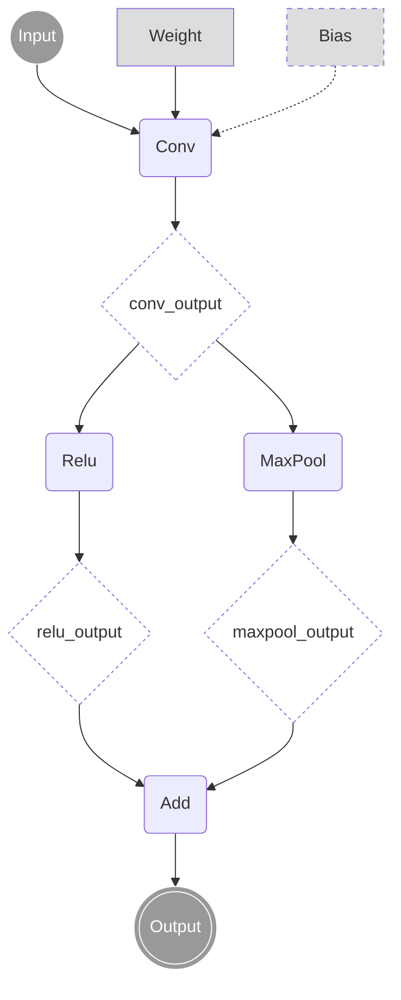
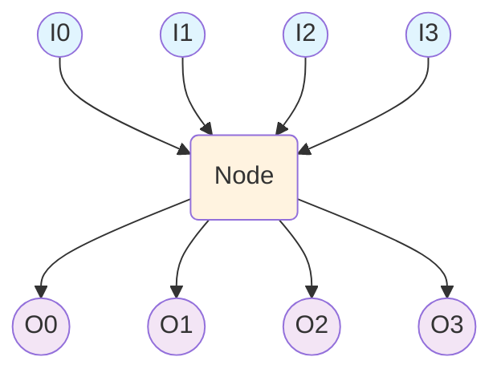

<!--
Copyright (C) 2023 - 2025 Advanced Micro Devices, Inc. All rights reserved.
Licensed under the MIT License.
-->
# ORT Bridge Design Document

## Overview

The ORT (ONNX Runtime) Bridge in MorphiZen provides a type-safe, efficient interface between the MorphiZen core and ONNXRuntime's graph representation. This bridge abstracts away direct ONNX Protocol Buffer manipulation and provides a more intuitive, performant API for graph analysis and transformation.

This design document details the conceptual architecture and design decisions for the core classes: `Graph`, `Node`, `NodeIndex`, and `NodeArgIndex`.

## Class Hierarchy and Relationships

```
┌─────────────────┐    ┌─────────────────┐
│     Graph       │◄───┤     Model       │
│                 │    │                 │
├─────────────────┤    └─────────────────┘
│ + nodes_        │
│ + node_args_map_│
│ + producer_map_ │
│ + consumer_map_ │
└─────────┬───────┘
          │
          │ contains
          ▼
┌─────────────────┐    ┌─────────────────┐
│   NodeIndex     │◄───┤     Node        │
│                 │    │                 │
├─────────────────┤    ├─────────────────┤
│ + index_: 31    │    │                 │
│ + is_valid_: 1  │    │ + inputs_       │
│ + graph_id_: 32 │    │ + outputs_      │
└─────────┬───────┘    └─────────────────┘
          │
          │ references
          ▼
┌─────────────────┐
│ NodeArgIndex    │
│                 │
├─────────────────┤
│ + index_: 29    │
│ + type_: 3      │
│ + graph_id_: 32 │
└─────────────────┘
```
## Class Design Details

### 1. Graph

#### Purpose
The `morphizen::Graph` class serves as the central orchestrator for all graph operations, managing nodes, node arguments, and their relationships within an ONNX graph structure.

#### Design Rationale

The storage structure of an ONNX graph is `onnx::GraphProto`.
``` proto
message GraphProto {
  repeated NodeProto node = 1;
  repeated TensorProto initializer = 5;
  repeated ValueInfoProto input = 11;
  repeated ValueInfoProto output = 12;
  repeated ValueInfoProto value_info = 13;
  ...
}
```
The `morphizen::Graph` is an in-memory structure model that allows efficient data access.
**Core Componments**:

```
┌─────────────────────────────────────────────────────────────┐
│                    morphizen::Graph                         │
├─────────────────────────────────────────────────────────────┤
│  Core Data:                                                 │
│  • morphizen_onnx::GraphProto& graph_proto_                 │
│  • uint32_t graph_id_                                       │
├─────────────────────────────────────────────────────────────┤
│  Index Maps:                                                │
│  • node_args_map_: string → NodeArgIndex                    │
│  • producer_map_: NodeArgIndex → NodeIndex                  │
│  • consumer_map_: NodeArgIndex → vector<NodeIndex>          │
│  • nodes_: vector<Node>                                     │
│  • initializers_map_: string → TensorProto*                 |
└─────────────────────────────────────────────────────────────┘
```


**Key Design Decisions**:

1. **Reference Semantics**: The graph holds a reference to `GraphProto` rather than ownership, enabling efficient updates to the underlying ONNX representation.

2. **Centralized Index Management**: All index creation and validation is centralized in the Graph class, ensuring consistency and preventing invalid references.

3. **Multi-level Caching**:
   - `node_args_map_`: O(1) node_arg_name-to-index lookup
   - `producer_map_`: O(1) NodeArgIndex to producer NodeIndex lookup
   - `consumer_map_`: O(1) NodeArgIndex to consumers lookup
   - `nodes_`: O(1) Index into `GraphProto::nodes()`


##### Node Argument Mapping (`node_args_map_`)

Maps node argument names to their typed indices:

```cpp
std::unordered_map<std::string, NodeArgIndex> node_args_map_;
```

**Index Types and Meanings:**
- `GRAPH_INPUT`: Index into `graph_proto_.input()`
- `INITIALIZER`: Index into `graph_proto_.initializer()`
- `NODE_OUTPUT`: Index into `graph_proto_.value_info()`
- `GRAPH_OUTPUT`: Index into `graph_proto_.output()`

##### Producer Map (`producer_map_`)
```cpp
std::unordered_map<NodeArgIndex, NodeIndex> producer_map_;
```
Maps each node argument to the node that produces it.

**Rules:**
- Graph inputs and initializers have no producers (not in map)
- Node outputs map to their producing node
- Graph outputs may map to their producing node

##### Consumer Map (`consumer_map_`)
```cpp
std::unordered_map<NodeArgIndex, std::vector<NodeIndex>> consumer_map_;
```
Maps each node argument to all nodes that consume it.

**Rules:**
- Graph inputs may have multiple consumers
- Initializers may have multiple consumers
- Node outputs may have multiple consumers
- Graph outputs have no consumers (empty vector)

### Node (`nodes_`)
```cpp
std::vector<Node> nodes_;
```
`nodes_` Index into `GraphProto::nodes()`, to store topological order.
The array index corresponds to the node index and always maintains the same topological order as the GraphProto nodes.


#### Example
Here is a simple graph example to illustrate the data structures:


In this example, the NodeArgIndex objects would have 4 types:
- `Input`: `GRAPH_INPUT` (index 0 in GraphProto.input)
- `Weight`: `INITIALIZER` (index 0 in GraphProto.initializer)
- `Bias`: `INITIALIZER` (index 1 in GraphProto.initializer) or `INVALID` when `Bias` is optional
- `conv_output`: `NODE_OUTPUT` (index 0 in GraphProto.value_info)
- `relu_output`: `NODE_OUTPUT` (index 1 in GraphProto.value_info)
- `maxpool_output`: `NODE_OUTPUT` (index 2 in GraphProto.value_info)
- `Output`: `GRAPH_OUTPUT` (index 0 in GraphProto.output)

##### Graph Data Structure Mappings
For the above example graph, the internal mappings would be:

**`Graph.node_args_map_`**: Size is 7, includes:
- 1 graph input: `Input`
- 1 constant initializer: `Weight`
- 1 optional constant initializer: `Bias`
- 3 node outputs: `conv_output`, `relu_output`, `maxpool_output`
- 1 graph output: `Output`

**`Graph.producer_map_`**: Size is 4
```cpp
{
    conv_output -> conv,
    relu_output -> relu,
    maxpool_output -> maxpool,
    Output -> add
}
```

**`Graph.consumer_map_`**: Size is 6
```cpp
{
    Input -> [conv],
    Weight -> [conv],
    Bias -> [conv],
    conv_output -> [relu, mp],
    relu_output -> [add],
    maxpool_output -> [add]
}
```

**`Graph.nodes_`**: Size is 4
```cpp
[
    Node{self: conv, inputs: [Input, Weight, Bias], outputs: [conv_output]},
    Node{self: relu, inputs: [conv_output], outputs: [relu_output]},
    Node{self: mp, inputs: [conv_output], outputs: [maxpool_output]},
    Node{self: add, inputs: [relu_output, maxpool_output], outputs: [Output]}
]
```

### 2. Node Class

#### Purpose
The `Node` class provides a lightweight wrapper around node operations and serves as a bridge between the index-based system and operational APIs.

The primary role of a Node is to store the graph's topology.

#### Design Rationale

**Composition over Inheritance**:
```cpp
class Node {
private:
    std::vector<NodeArgIndex> inputs_;      // Input arguments
    std::vector<NodeArgIndex> outputs_;     // Output arguments
};
```
#### Node Structure Example

Here is a node with multiple inputs and multiple outputs:



**Node Topology Representation**:
```cpp
Node {
    self_: NodeIndex,                                    // Reference to this node
    inputs_: [I0, I1, I2, I3],          // Vector of NodeArgIndex
    outputs_: [O0, O1, O2, O3]          // Vector of NodeArgIndex
}
```

**NodeArgIndex Type Classification**:
The node inputs and outputs are all `NodeArgIndex` objects, which can represent:
- **Graph Input**: External input to the entire graph
- **Constant Initializer**: Weight or bias tensor (immutable)
- **Node Output**: Result from another node's computation
- **Graph Output**: Final output of the entire graph

**Real-world Example**: A `Split` operation that takes one input tensor and splits it into multiple output tensors along a specified axis.


### 3. NodeIndex Class

#### Purpose
`NodeIndex` provides a compact, type-safe reference to nodes within a graph. It replaces raw pointer usage with a validated index system.

#### Design Rationale

**Memory Layout** (64-bit total):
```cpp
union {
    struct {
        unsigned int index_    : 31;  // Node index (0-2^31-1)
        unsigned int is_valid_ : 1;   // Validity flag
        unsigned int graph_id_ : 32;  // Graph context (0-2^32-1)
    } fields_;
    uint64_t value_;                  // Raw 64-bit value for hashing
};
```

**Key Design Decisions**:

1. **Bit-field Optimization**: Packs all necessary information into 64 bits for cache efficiency:
   - 31 bits for index: Supports up to 2.1 billion nodes per graph
   - 1 bit for validity: Immediate validation without lookup
   - 32 bits for graph_id: Supports up to 4.3 billion graphs

2. **Value Semantics**: NodeIndex can be copied efficiently and passed by value:
   ```cpp
   static_assert(sizeof(NodeIndex) == 8, "NodeIndex must be 64 bits");
   ```

3. **Hash Optimization**: The union design enables O(1) hashing using the raw `value_` field:
   ```cpp
   std::size_t hash() const { return static_cast<std::size_t>(value_); }
   ```

4. **Immutable Design**: Once created, NodeIndex values cannot be modified, ensuring referential integrity.


### 4. NodeArgIndex Class

#### Purpose
`NodeArgIndex` represents references to values (tensors/arguments) in the graph, supporting different types of values with unified access patterns.

#### Design Rationale

**Memory Layout** (64-bit total):
```cpp
union {
    struct {
        unsigned int index_    : 29;  // Index within type category
        unsigned int type_     : 3;   // Type enumeration (0-7)
        unsigned int graph_id_ : 32;  // Graph context
    } fields_;
    uint64_t value_;                  // Raw value for operations
};
```

**Key Design Decisions**:

**Type-based Indexing**: Different value types use separate index spaces:
   - `INVALID`: Represents an invalid/optional NodeArgIndex
   - `GRAPH_INPUT`: Index into `GraphProto.input()`
   - `INITIALIZER`: Index into `GraphProto.initializer()`
   - `NODE_OUTPUT`: Index into `GraphProto.value_info()`
   - `GRAPH_OUTPUT`: Index into `GraphProto.output()`


## Performance Characteristics

### Time Complexity

| Operation | Complexity | Notes |
|-----------|------------|-------|
| NodeIndex validation | O(1) | Bit flag + hash lookup |
| NodeArgIndex validation | O(1) | Type-specific bounds check |
| Name to NodeArgIndex | O(1) | Hash map lookup |
| Producer lookup | O(1) | Cached in producer_map_ |
| Consumer lookup | O(1) | Cached in consumer_map_ |
| Index creation | O(1) | Bit field operations |

### Space Complexity

| Structure | Size | Capacity |
|-----------|------|----------|
| NodeIndex | 8 bytes | 2^31 nodes per graph |
| NodeArgIndex | 8 bytes | 2^29 args per type per graph |
| Graph overhead | ~100 bytes + maps | Variable based on graph size |

### Cache Efficiency

1. **Compact Indices**: 64-bit indices fit in single cache lines
2. **Locality of Reference**: Related indices stored contiguously
3. **Minimal Indirection**: Direct bit field access without pointer chasing

## Architecture Philosophy

### Core Design Principles

1. **Type Safety**: All operations use strongly-typed index objects instead of raw pointers
2. **Memory Efficiency**: Compact 64-bit representations for indices with bit-field optimization
3. **Runtime Efficiency**: O(1) conversions between different representations
4. **Graph Integrity**: Immutable indices with validation and bounds checking
5. **API Compatibility**: Seamless integration with both ONNX Runtime and MorphiZen core APIs

### Design Goals

- **Zero-cost abstractions**: Index objects should be as efficient as raw indices
- **Memory safety**: Eliminate dangling pointer issues through index validation
- **Maintainability**: Clear separation of concerns and consistent interfaces
- **Extensibility**: Support for future graph operations and optimizations


## Future Extensions

### Planned Enhancements

1. **Versioning Support**: Track graph modifications for incremental updates
2. **Parallel Access**: Thread-safe index operations for concurrent processing
3. **Serialization**: Efficient index serialization for caching and IPC
4. **Debug Support**: Enhanced debugging information and validation modes

### Compatibility Considerations

The design maintains backward compatibility with existing ONNX Runtime APIs while providing enhanced type safety and performance. Migration paths are provided for legacy code using raw pointer patterns.

## Conclusion

The ORT Bridge design provides a robust, efficient foundation for graph operations in MorphiZen. The type-safe index system eliminates common memory safety issues while maintaining high performance through careful bit-field optimization and caching strategies. The clear separation of concerns and consistent API patterns ensure maintainability and extensibility for future enhancements.
