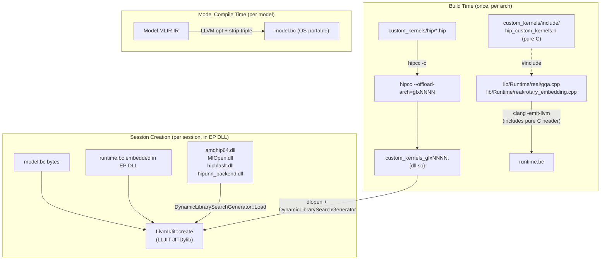

<!--
Copyright (C) 2026 Advanced Micro Devices, Inc. All rights reserved.
Licensed under the MIT License.
-->
# Custom HIP Kernel Infrastructure

## Architecture

The existing ops (Conv, Gemm, etc.) call ROCm library APIs (MIOpen, hipBLASLt) which ship as `.lib` + `.dll`. GQA, RoPE, and the other ops without ROCm-library coverage are built as **per-arch shared libraries** (`custom_kernels_<arch>.{dll,so}`) that ship next to the EP binary. `LlvmIrJit` `dlopen`s the matching variant at JIT init based on the device's `gcnArchName`, so the per-model bitcode never carries kernel code.



Key insight: The `.hip` files contain `__global__` kernels compiled by hipcc into fat binaries (host + device code). They live in `custom_kernels_<arch>.{dll,so}` co-located with the EP binary, NOT inside the per-model artifact. `LlvmIrJit` resolves `hip_*` launcher symbols against this shared library at JIT init via `DynamicLibrarySearchGenerator::Load`, anchored on `GetModuleFileName` / `dladdr` of the EP DLL.

## Directory Structure

```
onnx-hipdnn-ep/
├── 3rd-party/custom_kernels/
│   ├── CMakeLists.txt                # Builds .hip files into static lib + install rules
│   ├── cmake/
│   │   └── hip_utils.cmake           # hipcc compilation infrastructure
│   ├── include/
│   │   ├── hip_custom_kernels.h     # Pure C header (no HIP types)
│   │   └── debug_log.h
│   └── hip/
│       ├── rope_kernel.hip           # RoPE __global__ kernel + host launcher
│       ├── gqa_kernel.hip            # GQA __global__ kernel + host launcher
│       └── ...                       # Additional op kernels
├── lib/Runtime/
│   ├── real/
│   │   ├── rotary_embedding.cpp      # wrap_rotary_embedding -> calls C launchers
│   │   └── gqa.cpp                   # wrap_group_query_attention -> calls C launchers
│   └── CMakeLists.txt                # MODIFIED: Add new bitcode modules
└── backend-mlir-compiler/custom-op-mlir/
    ├── src/LlvmIrJit.cpp            # dlopens custom_kernels_<arch>.{dll,so} at JIT init
    └── CMakeLists.txt                # add_dependencies on per-arch custom_kernels_<arch>
```

## File Details

### 1. `custom_kernels/cmake/hip_utils.cmake`

Adapted from onnx-hipdnn-ep. Provides `hip_add_library()` function that:

- On Windows: Uses `hipcc -c` to compile each `.hip` file to `.obj`, bundles into static lib
- On Linux: Uses CMake HIP language support
- Handles architecture flags (`--offload-arch=gfxNNNN`), MSVC ABI compatibility (`-fms-extensions`, `-fms-compatibility`), CRT flags (`/MT` static CRT), and Debug/Release configs
- Finds HIP via `HIP_PATH`, `ROCM_PATH`, or `THEROCK_DIST` environment/CMake variables

### 2. `custom_kernels/include/hip_custom_kernels.h`

Pure C header with `extern "C"` declarations -- no HIP types, only `void*`, `int64_t`, `float`, etc. This is what the runtime `.cpp` files include (compiled by Clang to bitcode). Example interface:

```c
#ifdef __cplusplus
extern "C" {
#endif

int hip_rope_forward(
    void* stream,           // hipStream_t cast to void*
    const void* input,      // GPU pointer
    const void* position_ids,
    const void* cos_cache,
    const void* sin_cache,
    void* output,
    int64_t batch_size, int64_t seq_len,
    int64_t num_heads, int64_t head_dim,
    int64_t rotary_dim,
    int64_t interleaved,
    int64_t element_size_bytes);

int hip_gqa_forward(
    void* stream,
    const void* query, const void* key, const void* value,
    const void* past_key, const void* past_value,
    const void* seqlens_k, const void* total_seq_len,
    void* output, void* present_key, void* present_value,
    int64_t batch_size, int64_t seq_len_q, int64_t seq_len_kv,
    int64_t num_heads, int64_t kv_num_heads, int64_t head_dim,
    float scale, float softcap,
    int64_t do_rotary, int64_t rotary_interleaved,
    const void* cos_cache, const void* sin_cache,
    int64_t element_size_bytes);

#ifdef __cplusplus
}
#endif
```

### 3. `custom_kernels/hip/rope_kernel.hip`

Implements the RoPE HIP kernel:

- `__global__ void rope_forward_kernel(...)` -- per-element rotary embedding: for each (batch, head, pos, dim_pair), applies cos/sin rotation
- `extern "C" int hip_rope_forward(...)` -- host launcher that calculates grid/block dims and calls `hipLaunchKernelGGL`

### 4. `custom_kernels/hip/gqa_kernel.hip`

Implements GQA as a multi-step operation:

- **KV cache update**: Concatenate current K/V with past K/V into present K/V
- **Optional RoPE**: If `do_rotary`, apply RoPE to Q and K (reuse rope logic)
- **Attention** (single-token decode): two co-resident kernel families dispatched by `lib/Runtime/real/gqa.cpp`:
  - `gqa_fused_decode` — short-context kernel (one block per query head); preferred at small `skv` where the split-K reduction overhead would dominate. Uses LDS-tiled K/V prefetch: each outer iteration cooperatively stages `TILE=8` rows of K and V into shared memory, then the inner loop crunches 8 softmax steps from LDS. This drives memory-level parallelism via TILE (16 outstanding loads per thread per tile) rather than wave count, since the decode grid (B=1, H=32 → ~32 blocks / ~128 waves on RDNA3 wave32) is too small to hide ~400-cycle global-load latency by wave switching. LDS use per block: `2 * TILE * D * sizeof(_Float16)` = 8 KB at D=128. No `__syncthreads` is needed between prefetch and inner loop because each thread writes only its own column (`K_tile[i*D + tid]`) and reads only its own column. TILE=8 chosen by sweep: TILE=4 loses to outer-loop overhead at small skv; TILE=16 saturates the per-thread outstanding-load budget.
  - `gqa_flash_decode<D, K_SPLITS>` + `gqa_flash_decode_reduce_kernel<D, K_SPLITS>` — GQA-aware split-K Flash Attention 2 for long contexts. One block per (batch, kv-head, K_SPLIT); each block stages K/V tiles into LDS once and reuses them across all HPG=4 query heads (eliminating the 4× KV bandwidth waste of per-query-head loops). Online softmax in log2e space writes `{m, l, O[D]}` partials to a workspace; the reduction kernel merges them across splits. Templated for `D ∈ {64, 128}`, `K_SPLITS=8`.
- **Prefill**: `gqa_fused_prefill` (multi-token) computes Q·K^T, softmax, and `attn·V` against the assembled KV cache.
- Can start with a straightforward implementation and optimize later (or swap in CK).

### 5. `custom_kernels/CMakeLists.txt`

Build one SHARED library per arch in `HIP_ARCHITECTURES`, each carrying a single fatbin slice for that arch. Install side-by-side with the EP binary so `LlvmIrJit` finds it via `GetModuleFileName` / `dladdr` anchoring. No static archive is produced.

```cmake
cmake_minimum_required(VERSION 3.18)

include(${CMAKE_CURRENT_SOURCE_DIR}/cmake/hip_utils.cmake)

# Require HIP_ARCHITECTURES (no silent default that may not match hardware)
if(NOT HIP_ARCHITECTURES)
    message(FATAL_ERROR "HIP_ARCHITECTURES is not set.")
endif()

set(_kernel_sources
    hip/rope_kernel.hip
    hip/gqa_kernel.hip
    # ... ~30 more .hip TUs
)

# One SHARED target per arch; OFFLOAD_ARCHS narrows the global list to a
# single element so each DLL/SO carries one fatbin slice instead of N.
foreach(_arch IN LISTS HIP_ARCHITECTURES)
    set(_target custom_kernels_${_arch})
    hip_add_library(${_target} SHARED ${_kernel_sources}
        INCLUDE_DIRECTORIES ${CMAKE_CURRENT_SOURCE_DIR}/include
        OFFLOAD_ARCHS       ${_arch}
    )
    install(TARGETS ${_target}
        RUNTIME DESTINATION bin   # Windows .dll co-located with EP .dll
        LIBRARY DESTINATION lib   # Linux .so co-located with EP .so
        ARCHIVE DESTINATION lib   # Windows import lib (unused by EP, harmless)
    )
endforeach()

set(HIP_CUSTOM_KERNELS_INCLUDE_DIR "${CMAKE_CURRENT_SOURCE_DIR}/include" PARENT_SCOPE)
```

After `cmake --install`, the install prefix contains one DLL/SO per requested arch:

- Windows: `<prefix>/bin/custom_kernels_gfx1100.dll`, `<prefix>/bin/custom_kernels_gfx1151.dll`, ...
- Linux:   `<prefix>/lib/libcustom_kernels_gfx1100.so`, `<prefix>/lib/libcustom_kernels_gfx1151.so`, ...

The header is intentionally NOT installed: the EP-side build always uses the in-tree header at `3rd-party/custom_kernels/include/hip_custom_kernels.h` so the host-side declarations stay in lockstep with the kernel TUs.

The top-level `CMakeLists.txt` adds the subdir on real-runtime EP builds (the per-arch SHARED targets are needed by `backend-mlir-compiler/custom-op-mlir/CMakeLists.txt` to register `add_dependencies`):

```cmake
if(BUILD_EP AND NOT BUILD_MOCK_RUNTIME AND NOT _CUSTOM_KERNELS_SUBDIR_ADDED)
    add_subdirectory(3rd-party/custom_kernels)
    set(_CUSTOM_KERNELS_SUBDIR_ADDED TRUE)
endif()
```

### 6. `lib/Runtime/real/rotary_embedding.cpp` and `gqa.cpp`

These are compiled to bitcode (via `clang -emit-llvm`) and merged into `runtime.bc`. They:

- Include `hip_custom_kernels.h` (pure C, Clang-compatible)
- Implement `wrap_rotary_embedding(...)` and `wrap_group_query_attention(...)` (declared in [hipdnn_ep_runtime.h](lib/Runtime/hipdnn_ep_runtime.h))
- Extract the HIP stream from `RuntimeState*` via `hipdnn_ep_state_get_stream()`
- Compute shape info from the parameters passed by the compiler lowering
- Call the `hip_rope_forward()` / `hip_gqa_forward()` C functions

### 7. `lib/Runtime/CMakeLists.txt` changes

Add the new bitcode modules to the real runtime build (around line 210):

```cmake
compile_to_bitcode(real/rotary_embedding.cpp runtime_rotary_embedding.bc)
compile_to_bitcode(real/gqa.cpp runtime_gqa.bc)
```

Add them to `RUNTIME_BC_MODULES` list. Also add `-I${CMAKE_SOURCE_DIR}/custom_kernels/include` to the `compile_to_bitcode` macro's include flags so Clang can find `hip_custom_kernels.h`.

### 8. Consumer-side resolution in `LlvmIrJit::create`

The compiler is no longer involved in linking against the kernel library — the per-model bitcode keeps external `hip_*` declarations and resolution happens at JIT init inside the EP DLL:

```cpp
// 3rd-party/custom_kernels installs custom_kernels_<arch>.{dll,so} next
// to the EP binary. LlvmIrJit picks the matching variant via gcnArchName.
const std::string kernel_arch = detectCustomKernelArch();   // hipGetDeviceProperties
const std::string basename =
#ifdef _WIN32
    "custom_kernels_" + kernel_arch + ".dll";
#else
    "libcustom_kernels_" + kernel_arch + ".so";
#endif
std::string kernel_lib = thisModuleDirectory();             // GetModuleFileName / dladdr
kernel_lib += path_sep;
kernel_lib += basename;

auto gen = llvm::orc::DynamicLibrarySearchGenerator::Load(
    kernel_lib.c_str(), global_prefix);
jit->getMainJITDylib().addGenerator(std::move(*gen));
```

`thisModuleDirectory()` anchors the lookup to the EP DLL's own directory, so the kernel SO/DLL resolves through the loader without any `LD_LIBRARY_PATH` / `PATH` dependency. The generator is added BEFORE `GetForCurrentProcess` so the per-arch DLL takes priority over any look-alike symbol that may live in another already-loaded module.

### 9. Install layout

After `cmake --install`, the install prefix contains:

- Windows: `<prefix>/bin/onnxruntime_morphizen_ep.dll` (the EP) and `<prefix>/bin/custom_kernels_<arch>.dll` (one per requested arch) co-located.
- Linux:   `<prefix>/lib/libonnxruntime_morphizen_ep.so` (the EP) and `<prefix>/lib/libcustom_kernels_<arch>.so` (one per requested arch) co-located. The EP `.so` is built with `RPATH=$ORIGIN`.

CI workflows assert co-location by checking for `custom_kernels_gfx1151.dll` / `libcustom_kernels_gfx1151.so` in the staging step — failure here means the install rule in `3rd-party/custom_kernels/CMakeLists.txt` regressed.

### 10. `custom_kernels/hip/matmul_nbits_kernel.hip`

Implements MatMulNBits — fused dequant + matmul for INT4 packed weights (FP16 activations). This is the dominant operator in INT4 LLM decode (~78% of GPU time for Llama 8B).

Four execution paths, auto-dispatched by shape:

| Path | Condition | Strategy |
|------|-----------|----------|
| WMMA | batch==1, K%32==0, M≥16 | RDNA3 wave matrix multiply with double-buffered shared memory, grid swizzling |
| GEMV col-major | batch==1, K%32==0, 1<M<16 | K-parallel GEMV with internal row→col transpose, FP16 zero points, autotuned |
| GEMV row-major | batch==1, K%32==0, M=1 | K-parallel GEMV, uint8 zero points (nibble-unpacked if packed), autotuned |
| Naive | fallback | Per-element row-major, uint8 zero points (nibble-unpacked if packed) |

**Single-token decode (M=1) uses the GEMV row-major path.** Key design choices:

- **K-parallel reduction**: Each threadblock cooperates on the K dimension for TILE_N output columns. This gives sequential per-row B access that is prefetcher-friendly on LPDDR5X (APU shared memory). An N-parallel approach (each thread reads all K/2 bytes) was tried and abandoned — scattered reads across hundreds of loads defeated the LPDDR5X prefetcher. A tiled B layout variant `[K/32, N, 16]` was also tried (28% regression).
- **Factored dequant**: Computes `(dot(A,B) - a_sum*zp) * scale`, saving ~40% FLOPs vs the naive `sum(a[k] * (b[k]-zp) * scale)`. Single multiply per group instead of per-element.
- **Vectorized B loads**: 128-bit (uint4) main loop processes 32 nibbles per transaction, with uint2 (16-nibble) and uint32 (8-nibble) remainder phases. Load-compute separation issues all B loads before FMA compute. Explicit `__fmaf_rn` intrinsics for dot product accumulation.
- **Runtime autotune**: First call for each (M,N,K,block_size) benchmarks all 35 (BLOCK_SIZE, TILE_N) configurations and caches the fastest. BLOCK_SIZE ∈ {32,64,128,256,512,1024}, TILE_N ∈ {1,2,4,8,16,32,64}. BS=32 configs use single-warp shuffle-only reduction (no LDS). TILE_N=32 tested only when N≥1024; TILE_N=64 only when N≥2048.
- **Compile-time warp size**: RDNA 3 (gfx11xx) runs wave32 by default. The reduction uses `constexpr int WARP_SIZE = 32` for dead-code elimination — a runtime `__builtin_amdgcn_wavefrontsize()` check caused 13% regression due to both branches being compiled for every template instantiation.
- **Single-warp fast path**: For BLOCK_SIZE=32 (one wave on RDNA 3), `if constexpr (BLOCK_SIZE <= WARP_SIZE)` eliminates the shared memory reduction entirely — warp shuffle result is final, no `__syncthreads` or LDS write/read needed.
- **M=1 col-major bypass**: For M=1 decode, the GEMV path skips the col-major GEMV route (which requires FP16 zero-point conversion via `convertZpToFp16`) and falls through to the row-major GEMV path which reads uint8 zero_points natively. Saves 225 kernel launches per Llama 8B inference. The M=1 autotune cache key also deduplicates row/col entries since the layouts are identical for a single row.
- **Packed nibble ZP unpacking**: ONNX MatMulNBits stores zero_points as packed nibbles when `zp_elem_size==1`: shape `[N, ceil(k_blocks/2)]` with two 4-bit ZPs per byte (low nibble = even group, high nibble = odd group). The GEMV row-major and naive paths index ZPs as `zp[n * k_blocks + grp]` expecting one byte per group. A `unpack_zp_nibbles_to_u8_kernel` unpacks to `[N, k_blocks]` uint8 (one ZP per byte) into a persistent grow-on-demand GPU buffer before dispatch. Without this, block_size=128 models (e.g. Qwen2.5-14B) cause 2x out-of-bounds GPU memory reads and crash. The WMMA/col-major paths use `convertZpToFp16` which already handles packed nibbles correctly.
- **Optimization attempts that regressed**: K-loop unroll x2 (+5% register spilling), nontemporal stores (+3%, output too small to pollute cache), N-parallel tiled GEMV (+28%, prefetcher defeated). All reverted with comments documenting the regression.

**Weight layout**: B is stored as `[N, K/2]` with pairs of 4-bit values packed into bytes (low nibble first). Scales are per quantization group: `[N, ceil(K/block_size)]`. Zero-points may be individual uint8 `[N, k_blocks]` or packed nibbles `[N, ceil(k_blocks/2)]` — determined by `zp_elem_size` (1 = packed nibbles, 2 = individual uint8/uint16). block_size is always power-of-2 (typically 32 or 128), enabling bit-shift group index calculation.

**WMMA path** (prefill, M≥16): Transposes A/C to column-major internally, converts uint8 zero-points to FP16, then uses `__builtin_amdgcn_wmma_f16_16x16x16_f16` intrinsics with double-buffered shared memory for A tiles and grid swizzling (Morton-order blocks) for L2 cache locality.

## Key Design Decisions

- **Per-arch SHARED library, not static lib**: One `custom_kernels_<arch>.{dll,so}` per arch in `HIP_ARCHITECTURES`, each with a single fatbin slice. Co-located with the EP binary; `LlvmIrJit::create` `dlopen`s the matching variant at JIT init based on `gcnArchName`. Per-model bitcode stays free of GPU code, which is what keeps it OS-portable and bytewise-stable across model recompiles when only the host CRT changes.
- **Pure C header interface**: The header uses only C types (`void`*, `int64_t`, `float`) so it can be included by Clang during bitcode compilation AND by MSVC if needed.
- **Separation of concerns**: `.hip` files contain device code (compiled by hipcc); `.cpp` runtime wrappers contain host logic (compiled by Clang to bitcode and embedded as `runtime.bc` inside the EP DLL). They communicate through the C header.
- **`hip_utils.cmake` reuse**: Proven approach for Windows hipcc compilation, multi-config generators, architecture flags. The `OFFLOAD_ARCHS` arg overrides the global `HIP_ARCHITECTURES` so each per-arch target builds a single-slice fatbin instead of a multi-slice bloated one.
