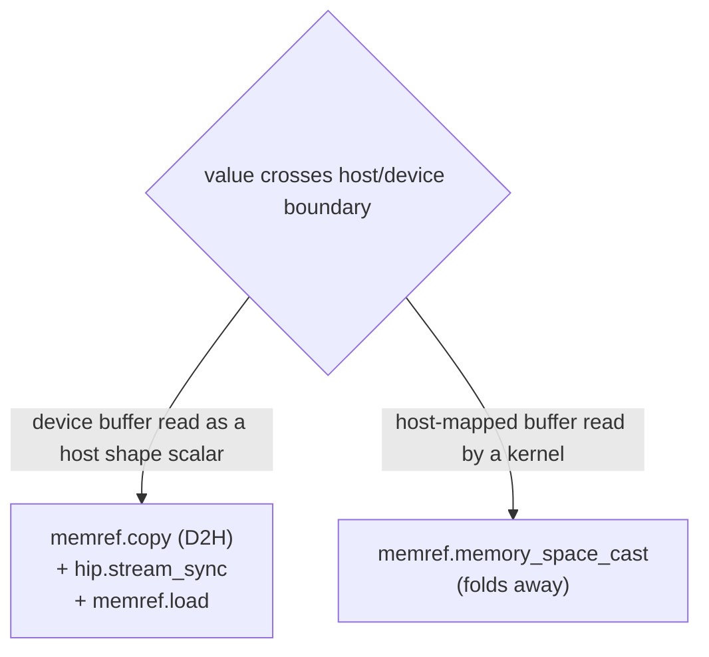

<!--
Copyright (C) 2026 Advanced Micro Devices, Inc. All rights reserved.
Licensed under the MIT License.
-->
# Memory Space — Design

**Date:** 2026-06-15
**Document Type:** Design
**Status:** Draft
**Related:** [hip-shape-inference.md](hip-shape-inference.md), [output-allocator-design.md](output-allocator-design.md), [pool-allocs-memory-planning.md](pool-allocs-memory-planning.md)

---

## Table of Contents

- [Problem](#problem)
- [Solution](#solution)
- [Design](#design)
- [Implementation Phases](#implementation-phases)
- [Key Points](#key-points)
- [Related Documents](#related-documents)

---

## Problem

- Data-dependent ops (`Range`, `Reshape -1`, `Expand`, `Loop` trip count, `Pad`, `ConstantOfShape`) need a few shape scalars host-accessible while the bulk compute stays on device.
- The type system records none of this — residency is re-derived per-pass from the use graph, and crossings are hand-inserted in each converter.
- Wrong inference fails *silently* on true device memory: a host store into device memory faults; an unsynchronized host load reads stale bytes.

---

## Solution

- Make residency a property of the `memref` type: default `device`, explicit `#hip.mem<host>`, declared where the value is produced.
- Make every host/device crossing an explicit op (a free aliasing cast, or a copy+sync+load transfer).
- Residency is declared once on the type and propagated, replacing the per-pass use-graph inference that was the source of the silent failures — the declared-by-construction approach from [shape inference](hip-shape-inference.md).
- **Guiding line:** shapes/extents are host `index` SSA values (no space); tensor data is a `memref` (carries a space); an explicit crossing is the only bridge.
- **Non-goals:** more than two spaces; a fused `readback_*` op; async tokens / sync coalescing; merging shape arithmetic into shape inference.

---

## Design

### Two spaces

| Space | Backing | Host access | Device access |
|---|---|---|---|
| `#hip.mem<device>` (default, elided) | GPU pool (`hip.get_pool`) | illegal | yes |
| `#hip.mem<host>` | host-mapped scratch (`hip.get_host_scratch`) | yes | yes (same VA) |

- Both lower to LLVM address space 0 — the attribute is a *placement domain*, not a hardware address space (no pointer conversion, no implicit copy).
- A bare `memref` is `device`; only `#hip.mem<host>` is ever printed.

### Where the space lives

- The space lives on the `memref` — the single source of truth from bufferization onward.
- A `tensor` has no space, so the tensor stage is space-agnostic by definition (no space to carry yet).
- Intent is declared *to* bufferization: a host buffer is `bufferization.alloc_tensor {memory_space = #hip.mem<host>}`; an op's `getBufferType` returns `device` by default.
- Two-state invariant, no middle: tensors carry no space; every memref bufferization creates carries one.

### Two crossings



| Crossing | Realized by | Cost | Legal direction |
|---|---|---|---|
| Aliasing (H2D) | `memref.memory_space_cast` | free | source must be `#hip.mem<host>` |
| Transferring (D2H) | `memref.copy` + `hip.stream_sync` + `memref.load` | stream stall | `#hip.mem<device>` → host scalar |

- A `device` value reaching a host consumer is **not** host-addressable, so it must be physically copied D2H, synced, then loaded.
- A `host`-mapped buffer is already GPU-readable at the same VA, so feeding it to a kernel is just a free space cast.
- Reuses stock `memref.copy` / `memref.load`; one new primitive `hip.stream_sync` (lowers to `hipdnn_ep_stream_sync`).

### Crossing correctness (D2H)

- **Space — by construction:** the converter retargets the host read to the `host` copy, so the load reads a `host` buffer; the original `device` value stays for device consumers.
- **Freshness — ordering:** `memref.copy` is an *async* `hipMemcpyAsync`, so `hip.stream_sync` (a barrier) must sit between copy and load.
- Freshness holds **by construction:** the converter authors copy+sync+extract as one unit; bufferize materializes them in order. The sync is *authored*, never *inferred*.

---

## Implementation Phases

Land **end-to-front**: foundations → allocation routing → device→host transfer → host→device cast + heuristic removal. Each phase leaves the pipeline green. The existing `hip-materialize-host-scalars` heuristic is kept as a *temporary* space source until Phase 4 deletes it.

### Phase 1 — Foundations (inert)

- **Goal:** add the vocabulary; wire nothing in; pipeline output byte-identical.
- Define `#hip.mem<host|device>` (absent ⇒ `device`); register an attribute→AS conversion mapping both to AS 0 (required, or the converter rejects the non-integer space).
- Define `hip.stream_sync` (lowers to `hipdnn_ep_stream_sync`) with a barrier side effect.

```mlir
// Phase 1 rewrites no IR — it only defines the two memref types.
%a : memref<i64>                       // device (elided)
%h : memref<i64, #hip.mem<host>>       // host

%v = memref.load %h[]   // a host load reads a host buffer (the only legal form)
```

### Phase 2 — Space-driven allocation routing

- **Goal:** drive placement by the memory space instead of a structural rewrite; behavior-identical, heuristic as interim space source.
- Split `hip-materialize-host-scalars`: its scan now only **stamps** `#hip.mem<host>` (no longer rewrites to scratch views).
- A routing step places by space: `host` → `hip.get_host_scratch` view; `device` → left for `hip-pool-allocs`.
- Add a guard to `hip-pool-allocs`: **absorb only `device` allocs, skip `host`** — separation becomes type-enforced, not ordering-enforced.

```mlir
// === Input (after the stamp-only heuristic) ===
%a = memref.alloc() : memref<i64, #hip.mem<host>>     // host (stamped)
%t = memref.alloc() : memref<4x8xf16>                 // device (elided)

// === Output (after the routing pass) ===
%hs = hip.get_host_scratch(%ctx, %sz) : memref<?xi8, #hip.mem<host>>                          // inserted
%a  = memref.view %hs[%off][] : memref<?xi8, #hip.mem<host>> to memref<i64, #hip.mem<host>>   // host alloc -> scratch view
%t  = memref.alloc() : memref<4x8xf16>                // unchanged — pooled by hip-pool-allocs
```

### Phase 3 — Device→host transfer (the heavy half)

- **Goal:** move residency from the heuristic to op contracts for ops that read a device scalar onto the host; make the crossing explicit; carry the sync/freshness correctness.
- For a host read of a device value, the converter authors one unit at the **tensor stage**: `alloc_tensor{host}` + `materialize_in_destination` + `hip.stream_sync` + `tensor.extract`.
- One-shot-bufferize then materializes the `memref.copy` + `hip.stream_sync` + `memref.load` triple, with `host` carried from `alloc_tensor` and Phase-2 routing placing it in scratch.
- Stays DPS — `materialize_in_destination` writes into the host `alloc_tensor`, no extra temp.
- **Detecting the crossing:** `tensor.extract` is always the host side; the crossing exists iff the source's *producer contract* is `device` (read from the defining op, not the spaceless type, not a use-graph scan).
- Roll out **op by op** (`Range`, `Reshape -1`, `Expand`, `Loop` trip count, `Pad`, `ConstantOfShape`); heuristic covers the rest.

```mlir
// === Input: tensor stage — host read of a device value (spaceless) ===
%limit = ... : tensor<i64>                  // device-produced
%v = tensor.extract %limit[]                // host read (unbridged)
%n = arith.index_cast %v : i64 to index

// === Output: tensor stage — converter authors the transfer unit (DPS) ===
%limit = ... : tensor<i64>                                                          // unchanged
%h  = bufferization.alloc_tensor() {memory_space = #hip.mem<host>} : tensor<i64>    // inserted — host dest
%hc = bufferization.materialize_in_destination %limit in %h : (tensor<i64>, tensor<i64>) -> tensor<i64>  // inserted — DPS copy
hip.stream_sync(%ctx)                                                              // inserted — barrier
%v = tensor.extract %hc[]                                                          // retargeted to %hc
%n = arith.index_cast %v : i64 to index                                            // unchanged

// === After one-shot-bufferize: the spaced memref triple ===
%limit = ... : memref<i64>                                              // device
%h = memref.alloc() : memref<i64, #hip.mem<host>>                       // from alloc_tensor
memref.copy %limit, %h : memref<i64> to memref<i64, #hip.mem<host>>     // from materialize_in_destination
hip.stream_sync(%ctx)
%v = memref.load %h[] : memref<i64, #hip.mem<host>>                     // legal + fresh
%n = arith.index_cast %v : i64 to index
```

### Phase 4 — Host→device cast + heuristic removal (the light half)

- **Goal:** bridge the reverse edge (a host buffer read by a kernel), then delete the heuristic.
- This crossing is reconciled at the **memref stage** because the mismatch does not exist until bufferize assigns spaces (a tensor has no space to cast).
- Insert `memref.memory_space_cast` wherever a `host` memref reaches a `device`-typed operand, in a small pass **right after bufferize**.
- **Mechanical, not heuristic** — keyed on operand type; cast only on the host→device mismatch; leave the D2H copy's host destination and host loads untouched.
- The cast is a no-op alias (both AS 0, host memory is GPU-readable), so it carries no runtime stake — it only keeps operand types consistent with each op's space contract.
- Then **delete `hip-materialize-host-scalars`** — both crossings are now authored by the converters/passes, so residency is correct by construction.

```mlir
// === Input: after bufferize — a host buffer reaches a device-typed ins operand ===
%a = ... : memref<i64, #hip.mem<host>>                                         // host buffer
memref.store %v, %a[]                                                          // host store (legal)
%o = memref.alloc() : memref<1xi32>                                            // device DPS init
hip.cast(%ctx) ins(%a : memref<i64, #hip.mem<host>>) outs(%o : memref<1xi32>)  // mismatch: device op fed a host ins

// === Output: cast inserted (hip.cast stays DPS) ===
%a = ... : memref<i64, #hip.mem<host>>                                         // unchanged
memref.store %v, %a[]                                                          // unchanged
%o = memref.alloc() : memref<1xi32>                                            // unchanged
%d = memref.memory_space_cast %a : memref<i64, #hip.mem<host>> to memref<i64>  // inserted — no-op alias
hip.cast(%ctx) ins(%d : memref<i64>) outs(%o : memref<1xi32>)                  // ins retargeted to %d
```

---

## Key Points

- **The aliasing cast is truly free:** both spaces map to AS 0, so `memref.memory_space_cast` lowers to no `llvm.addrspacecast` — no instructions, no pointer conversion, no allocation, no copy.
- **Only D2H moves bytes:** the transfer's allocation is the separate host landing buffer; the cast never allocates.
- **Correctness is by construction, not by checking:** the converter authors D2H (copy+sync+retarget) and the Phase-4 pass inserts the H2D cast, so a correct pass set yields correct residency with no verifier in the loop.
- **D2H is authored at the tensor stage; H2D is reconciled at the memref stage** — because D2H carries authored correctness (the `hip.stream_sync`) that only the tensor stage can hold, while H2D is a pure type cast recoverable from local memref types (lossless to defer).
- **Nothing is lost by deferring H2D:** the cast decision is a local function of `(operand space, consumer contract)`; bufferize never blurs the space (it won't alias across spaces, and propagates through views/casts/control flow).
- **`hip-pool-allocs` guard makes separation type-enforced:** a `host` alloc that reaches pool-allocs is skipped on its space, so it can never be pooled into device memory regardless of pass order.
- **The heuristic is temporary:** `hip-materialize-host-scalars` is the interim space source for Phases 2–3 and is deleted in Phase 4.
- **stream_sync must be a barrier** (side-effecting) so no pass can hoist the host load above it; the plain copy→load dependency is not enough because the copy is async.
- **If buffers were not host-mapped** (e.g. discrete VRAM), H2D would also need a copy — both crossings would then be tensor-stage copies and the memref-stage cast pass would drop out.
- **Optional debug aid (not in the pipeline):** a standalone `-hip-verify-memory-space` pass could assert the invariants (no host load of a `device` buffer; casts sourced from `host`) to localize a converter/pass bug — but it does not perform any conversion and is not required for correctness.

---

## Related Documents

- [hip-shape-inference.md](hip-shape-inference.md) — the host `index` shape axis this design separates from the data axis.
- [output-allocator-design.md](output-allocator-design.md) — in-graph output allocation; its deferred data-dependent dims are the same patterns that trigger host scalars here.
- [pool-allocs-memory-planning.md](pool-allocs-memory-planning.md) — the GPU pool that `#hip.mem<device>` allocs route to.
