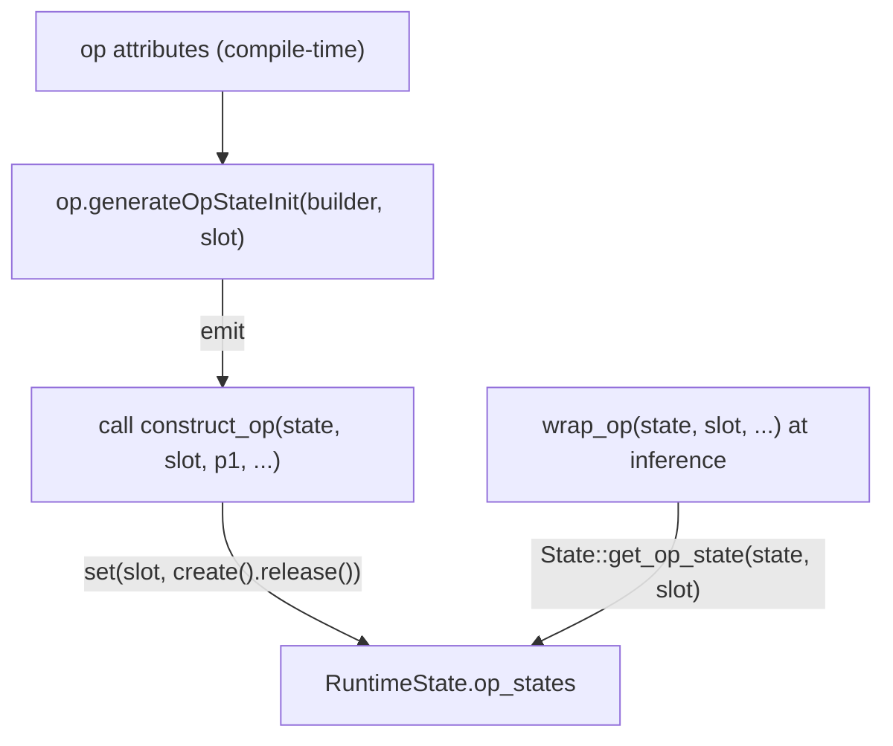

<!--
Copyright (C) 2026 Advanced Micro Devices, Inc. All rights reserved.
Licensed under the MIT License.
-->
# Op-State Slots Design

**Date:** 2026-06-15
**Document Type:** Design
**Status:** Draft
**Related:** [pool-allocs-memory-planning.md](pool-allocs-memory-planning.md), [constant-handling-design.md](constant-handling-design.md), [per-op-profiling.md](per-op-profiling.md)

---

## Contents

- [Overview](#overview)
- [Constraints](#constraints)
- [Design](#design)
  - [Data model](#data-model)
  - [Identity: one slot per instance](#identity-one-slot-per-instance)
  - [Construction: the op generates its own init](#construction-the-op-generates-its-own-init)
  - [Access](#access)
  - [Sharing is opt-in](#sharing-is-opt-in)
- [Pipeline](#pipeline)
- [Data flow example](#data-flow-example)
- [Authoring a stateful op](#authoring-a-stateful-op)
- [Why compile time](#why-compile-time)
- [Related Documents](#related-documents)

---

## Overview

Some operators keep state across a session: attention GEMM descriptors, dequant unpack buffers, autotuned algorithm choices, recurrent hidden state. That state needs a per-session home that does not pile unrelated concerns onto a shared `RuntimeState` struct and does not leak through a process-lifetime `static`. This design gives each stateful operator *instance* a compiler-assigned slot in a `RuntimeState` array; session init constructs each slot by asking the operator to emit its own initialization code, with construction arguments taken from the operator's compile-time attributes.

> **Which ops use slots (current codebase).** The ops actually on op-state slots are `matmul`, `matmul_nbits`, `gqa`, `multi_head_attention`, `causal_conv_with_state`, the three activations `sigmoid`/`tanh`/`softplus` (one shared `ActivationState`), the MIOpen op-tensor binaries `mul`/`add`/`min`/`max`, `rms_norm` (simplified layer norm), `skip_rms_norm` (skip simplified layer norm), and `gemm`. The last four groups were migrated off process-lifetime `static` descriptor/algo caches onto device-keyed `WeakStore` tables anchored by a slot (see [Sharing is opt-in](#sharing-is-opt-in)): the table is keyed by device, shared across every session on that device via a `weak_ptr`, and freed when the last session drops — fixing both the process-lifetime descriptor leak and the previously unlocked-map data race. **`conv` is used throughout this document only as an illustrative example of *parameterized* construction (kernel/stride passed from op attributes) — it is NOT slot-backed in the current codebase.** `conv` and `qmoe` keep their transient scratch in per-session `RuntimeState` fields (`conv_scratch`, `qmoe_scratch`/`qmoe_host_scratch`), shared across each session's instances and reused across `Run()` calls: that scratch is mutable per-execution memory whose correct sharing scope is per-session, and one buffer grown on demand uses far less VRAM than one per instance. The slot mechanism below is for *persistent* per-instance state (descriptor/algo caches, unpack caches) where per-instance isolation is the point.

## Constraints

- **Multi-model per process** — many sessions run in one process, so per-op state must not bloat a shared struct and must not outlive its session through a process `static`.
- **Per-instance isolation** — two operators of the same kind must hold independent state. Three stacked recurrent layers each keep their own hidden state; a single object shared by kind would corrupt them.
- **Construction from op data** — a slot must be constructible from values the operator knows at compile time (a device id, kernel geometry, a size hint), not only from a bare context pointer.

## Design

Three concerns are kept separate: *identity* (which slot an operator owns), *construction* (how the state is built and from what data), and *sharing* (whether instances reuse one object). Identity is per instance. Construction is code the operator emits for itself. Sharing is opt-in.

### Data model

```cpp
struct OpState {                 // base of every state struct
  void (*deletor)(OpState *);    // set at construction; enables generic teardown
};

template <class T> struct OpStateT : OpState {   // CRTP base each state derives from
  OpStateT() { deletor = [](OpState *p) { delete static_cast<T *>(p); }; }
  static T *get_op_state(RuntimeState *, int slot);        // typed slot accessor
  template <class... A>
  static std::unique_ptr<T> create(A &&...);               // build an owning instance
};

struct RuntimeState {
  /* core: stream, library handles, pools, constants */
  OpState **op_states;           // N entries, one per slot
  int       num_op_states;
};
```

Deriving from `OpStateT<T>` wires `deletor` (to a function that destroys the concrete type) in the base constructor, so a state can never forget to set it; session cleanup walks `op_states` and frees every slot without knowing the types. Slots reference nothing in other slots, so construction and teardown order never matter.

### Identity: one slot per instance

A stateful operator implements `OpStateOpInterface`. A module pass walks stateful ops and gives **each instance** its own dense slot `0..N-1`, recording `N` for the fused function. Two operators of the same kind get two slots and two state objects. Operators that would emit byte-identical initialization code may be deduplicated onto one slot, but that is an optimization layered on top, not the default.

### Construction: the op generates its own init

The interface exposes a code-generation method. Each operator emits the IR that constructs its own state:

```cpp
def OpStateOpInterface : OpInterface<"OpStateOpInterface"> {
  let methods = [
    InterfaceMethod<
      "Emit IR that constructs this op's state into op_states[slot].",
      /*retTy=*/"::mlir::Value",          // the constructed pointer (null => init fails)
      /*name=*/"generateOpStateInit",
      (ins "::mlir::OpBuilder &":$builder, "::mlir::Location":$loc,
           "::mlir::Value":$statePtr, "int32_t":$slot)>
  ];
}
```

An operator reads its own attributes, declares the constructor symbol it needs with whatever parameters it wants, and emits the call passing its slot. The constructor stores the built state into its slot itself (the pass emits no separate store):

```text
ConvOp::generateOpStateInit(b, loc, statePtr, slot):
    k     = this.attr("kernel")                              # the op's own attribute
    s     = this.attr("stride")
    ctor  = declare_extern("hipdnn_ep_op_state_construct_conv",
                           ret = i8, params = [ptr, i32, i64, i64])
    ok    = b.call(ctor, [ statePtr, const(slot), const(k), const(s) ])
    return ok                                                # i8: vestigial, always 0
```

The runtime constructor takes those parameters, builds the state with `OpStateT::create` (which returns an owning `std::unique_ptr<T>` with `deletor` already wired), and hands the released pointer to `hipdnn_ep_op_state_set`, which stores it into the slot. `_set` is plain C++ internal to the runtime bitcode (never called by generated IR) and has no failure path: the compiler always supplies a valid slot into an already-allocated array, so the `RuntimeState` layout stays opaque without bounds-check ceremony:

```cpp
struct ConvState : OpStateT<ConvState> {
  int64_t kernel, stride;
  ConvState(int64_t k, int64_t s) : kernel(k), stride(s) {}
};

extern "C" int8_t
hipdnn_ep_op_state_construct_conv(RuntimeState *s, int32_t slot,
                                  int64_t kernel, int64_t stride) {
  hipdnn_ep_op_state_set(s, slot,
                         ConvState::create(kernel, stride).release());  // build + store
  return 0;
}
```

Because the operator generates the call, it can pass any compile-time value it knows — a device id for multi-GPU selection, kernel geometry, a buffer-size hint, per-slot configuration. There is no shared class string and no central constructor table: the slot-to-construction binding lives in the operator and is visible in the IR it emits. This is the same compiler-supplied-init pattern as [constant-handling-design.md](constant-handling-design.md).

A value that is unknown until inference (an input's dynamic shape, a data pointer) is not available to `generateOpStateInit`, which runs before any input exists. An operator that needs such a value keys it at runtime inside its `wrap_*` entry, using the per-slot state object as the cache home.

### Access

Inside an operator's runtime entry, reaching the state is one indexed load through the typed `OpStateT::get_op_state` accessor. `slot` is the second argument (right after `RuntimeState *`) the lowering threads into the operator's `wrap_*` call:

```cpp
ConvState *c = ConvState::get_op_state(state, slot);   // == static_cast<ConvState*>(op_states[slot])
```

### Sharing is opt-in

Per-instance is the default, so like operators never collide. When like operators *should* share — an autotuned algorithm table is identical for a device and library version across every session in a process — the constructor pulls a `weak_ptr`-backed handle from a `WeakStore`: the value lives while some session holds it and is freed when the last session is destroyed. `WeakStore<Key, Val>` is a mutex-guarded global singleton per `<Key, Val>` (its storage lives behind a Meyers-singleton accessor, so there is no file-scope instance and no static-init-order hazard). The mutex guards concurrent construction from sessions initializing on independent threads. Sharing is then one line inside the constructor, decoupled from slot assignment:

```cpp
// inside the state's constructor (Key is typically the device id):
algo = WeakStore<AlgoKey, AlgoTable>::get_or_create(
    key, [] { return std::make_shared<AlgoTable>(); });   // shared_ptr
```

Expired entries are not pruned, so the residual is `O(#distinct keys)` — fine for a device-id key, but `WeakStore` must not be reused with an unbounded key space. (It is intentionally distinct from `morphizen::utils::WeakStore`, which is unlocked but does prune.)

## Pipeline



The slot-assignment pass stamps each op with its slot and records the slot count on the module. The interface generator, while building the `inference_init` entry, calls each op's `generateOpStateInit` to weave the per-slot construction in after core state and pool init. The lowerings thread the slot index in as the second `wrap_*` argument (right after `RuntimeState *`). This count-then-consume shape mirrors the memory pool, where a pass computes a count and offsets that generated init consumes; see [pool-allocs-memory-planning.md](pool-allocs-memory-planning.md).

## Data flow example

Two `conv` instances in one fused function, with different compile-time attributes. The example traces `kernel`/`stride` from the graph to the runtime entry. (As noted in the Overview, `conv` is an illustrative stand-in for a parameterized-construction op; it is not slot-backed in the current codebase. A real op with the same shape would be any of the five slot ops listed above.)

**1. After slot assignment** — each instance carries its own attributes and slot:

```mlir
%y0 = hip.conv(%x,  %w0) {kernel = 3, stride = 1, hip.op_state_slot = 0}
%y1 = hip.conv(%y0, %w1) {kernel = 5, stride = 2, hip.op_state_slot = 1}
```

**2. Compile time** — each op's `generateOpStateInit` emits a parameterized constructor call into `inference_init`:

```mlir
%sl0 = llvm.mlir.constant(0 : i32)
%k0  = llvm.mlir.constant(3 : i64)
%s0  = llvm.mlir.constant(1 : i64)
%ok0 = llvm.call @hipdnn_ep_op_state_construct_conv(%state, %sl0, %k0, %s0)
%sl1 = llvm.mlir.constant(1 : i32)
%k1  = llvm.mlir.constant(5 : i64)
%s1  = llvm.mlir.constant(2 : i64)
%ok1 = llvm.call @hipdnn_ep_op_state_construct_conv(%state, %sl1, %k1, %s1)
```

**3. Session init (runs once)** — constructors run with the baked-in arguments, each building an object with `OpStateT::create` and storing it into its own slot via `hipdnn_ep_op_state_set`:

```cpp
construct_conv(state, /*slot=*/0, /*kernel=*/3, /*stride=*/1);   // op_states[0] = ConvState{3,1}
construct_conv(state, /*slot=*/1, /*kernel=*/5, /*stride=*/2);   // op_states[1] = ConvState{5,2}
```

**4. Inference (per call)** — each conv reads its own slot; the two never collide:

```cpp
wrap_conv(state, /*slot=*/0, ...);   // ConvState::get_op_state(state, 0) -> kernel 3
wrap_conv(state, /*slot=*/1, ...);   // ConvState::get_op_state(state, 1) -> kernel 5
```

The input spatial size is unknown at step 2, so it is not a constructor argument; if `conv` needs a workspace sized by it, it grows that workspace inside `wrap_conv` from the runtime arguments, stored in the per-slot state.

## Authoring a stateful op

1. Define a state struct deriving from `OpStateT<MyState>` (the base wires `deletor` automatically).
2. Implement `OpStateOpInterface::generateOpStateInit` — read the op's attributes and call `mlir::hip::emitOpStateConstruct(builder, loc, statePtr, slot, "construct_symbol", {i64 args})`, returning the i8 ok result.
3. Provide the matching `extern "C" int8_t` constructor `(RuntimeState *, int32_t slot, params...)` that calls `hipdnn_ep_op_state_set(state, slot, MyState::create(params...).release())` and returns `0`; optionally fetch a shared value from a `WeakStore` inside `MyState`'s constructor.
4. Reach the state in the runtime entry with `MyState::get_op_state(state, slot)`.

Stateless operators declare nothing.

## Why compile time

The set of stateful operators in a fused function, and the attributes each needs to construct its state, are fixed at compile time, so identity and construction arguments are cheapest to decide there. It makes runtime access a plain array index, keeps the slot and its construction call visible in the IR for inspection and testing, and removes the runtime registry, string hashing, and process-global spec table that runtime-side resolution would otherwise need.

## Related Documents

- [pool-allocs-memory-planning.md](pool-allocs-memory-planning.md) — Pass computes a count + offsets; generated init consumes them.
- [constant-handling-design.md](constant-handling-design.md) — Compiler-supplied attribute consumed by generated init.
- [per-op-profiling.md](per-op-profiling.md) — Existing per-session operator state attached to `RuntimeState`.
