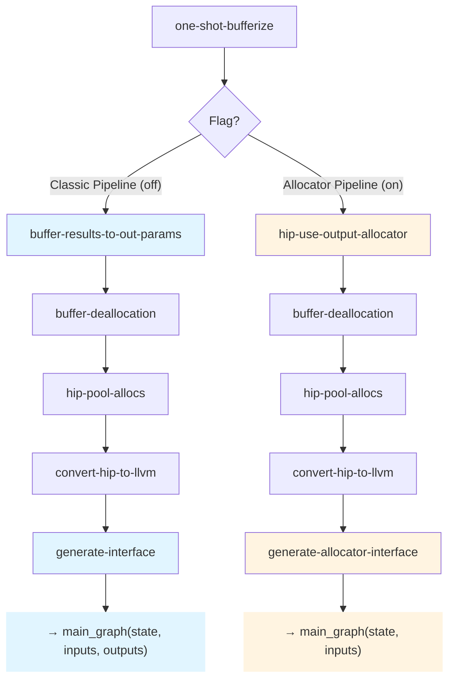
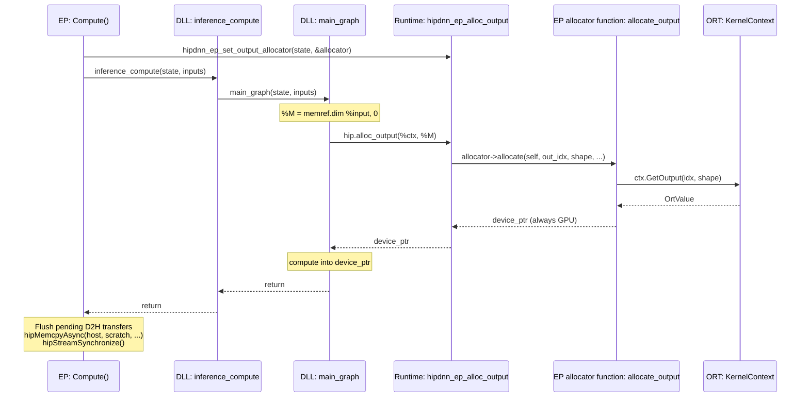

<!--
Copyright (C) 2026 Advanced Micro Devices, Inc. All rights reserved.
Licensed under the MIT License.
-->
# Output Allocator — Design

**Date:** 2026-06-06
**Document Type:** Design
**Status:** Draft

---

## Table of Contents

- [1. Overview](#1-overview)
- [2. Design](#2-design)
- [3. Phased Design](#3-phased-design)

---

## 1. Overview

Let `main_graph` allocate each output **at the point where its shape is computed** by pulling the buffer from an EP-supplied allocator. The graph owns *when/what shape*, the EP owns *where the memory comes from*.

**Scope.** Shape-derived dynamic outputs (extent from `memref.dim` of inputs). Data-dependent outputs (`NonZero`, `Range` — extent from kernel results) deferred.

---

## 2. Design

### Why a New Pipeline

**Today's pipeline** (classic):
1. Bufferize tensors → memrefs
2. `BufferResultsToOutParams` converts output returns → out-param arguments
3. `GenerateInterface` builds `outputs_array` from `prepare_output` calls
4. `main_graph(state, inputs_array, outputs_array)` signature

**The problem:** Output buffers are allocated by the EP **before** `main_graph` runs and passed as out-params. For dynamic shapes, the output shape is computed **inside** the graph (e.g., `M = memref.dim %input`), but the allocation happens **outside** the graph. This requires the EP to know output shapes before calling `inference_compute`, forcing shape computation to happen in two places: once in the graph (to size intermediate buffers), once in the EP (to allocate outputs).

**Attempting to retrofit allocator into this pipeline creates complexity:**
- `BufferResultsToOutParams` must skip allocator-based outputs (conditional logic)
- `GenerateInterface` must emit different code depending on allocation method (two code paths)
- Mixed semantics: some outputs are out-params, some are allocated in-graph
- Ambiguous intermediate states during compilation

**Solution:** A **new pipeline** where outputs are never converted to out-params. The DLL allocates outputs in-graph, calls the allocator when shape is known. `GenerateInterface` is replaced with a new pass that understands this model.

### Two Pipelines



**Pipeline A: Classic** (flag off, existing design)
```
one-shot-bufferize
buffer-results-to-out-params     ← outputs become out-params
buffer-deallocation
hip-pool-allocs
convert-hip-to-llvm
generate-interface               ← builds outputs_array, prepare/finalize
```
- `main_graph(state, inputs_array, outputs_array) -> i32`
- Outputs pre-allocated by EP, passed as array of memref pointers

**Pipeline B: Allocator** (flag on, new design)
```
one-shot-bufferize
~~buffer-results-to-out-params~~     ← REMOVED
hip-use-output-allocator         ← NEW: memref.alloc → hip.alloc_output
buffer-deallocation              ← skips hip.alloc_output (no Allocate effect)
hip-pool-allocs                  ← pools only intermediates
convert-hip-to-llvm
~~generate-interface~~               ← REMOVED
generate-allocator-interface     ← NEW: allocator-aware
```
- `main_graph(state, inputs_array) -> i32`
- Outputs allocated in-graph via `hip.alloc_output`, no `outputs_array`

Each pipeline has single responsibility, no conditional logic, clear semantics. Changes to allocator model don't affect classic path.

---

## 3. Phased Design

The design separates into four conceptual layers, each building on the previous.

### Phase 1: In-Graph Allocation Abstraction

Introduce `hip.alloc_output` — an operation that allocates output buffers via an external allocator.

```mlir
%out = hip.alloc_output(%ctx, %M, %N) {out_idx = 0 : i64} : memref<?x?xf16>
```

**Design:**
- Operands: runtime context + dynamic dimension values (one per dynamic dim, in type order)
- Attribute: `out_idx` identifying which graph output
- Result type: memref with static dims from type, dynamic dims from operands

**Key property:** Does not declare `Allocate` memory effect.

**Placement in pipeline:** After `one-shot-bufferize` (dynamic dims become live SSA values), before `buffer-deallocation` (so deallocator sees no Allocate effect and skips it), before `hip-pool-allocs` (so pooling skips EP-owned buffers).

The `hip-use-output-allocator` pass replaces `memref.alloc` for graph outputs with `hip.alloc_output`, reusing the alloc's dynamic-size operands.

**Example: Add → MatMul → Sigmoid**

After `one-shot-bufferize`:
```mlir
func.func @main_graph(%ctx: !hip.context, %X: memref<?x64xf16>, %W: memref<64x?xf16>)
    -> memref<?x?xf16> {
  %c0 = arith.constant 0 : index
  %c1 = arith.constant 1 : index
  %M = memref.dim %X, %c0
  %N = memref.dim %W, %c1
  %t0 = memref.alloc(%M) : memref<?x64xf16>
  hip.add(%ctx) ins(%X, %X) outs(%t0)
  %t1 = memref.alloc(%M, %N) : memref<?x?xf16>
  hip.matmul(%ctx) ins(%t0, %W) outs(%t1)
  %out = memref.alloc(%M, %N) : memref<?x?xf16>
  hip.sigmoid(%ctx) ins(%t1) outs(%out)
  return %out
}
```

After `hip-use-output-allocator`:
```mlir
func.func @main_graph(%ctx: !hip.context, %X: memref<?x64xf16>, %W: memref<64x?xf16>)
    -> memref<?x?xf16> {
  %c0 = arith.constant 0 : index
  %c1 = arith.constant 1 : index
  %M = memref.dim %X, %c0
  %N = memref.dim %W, %c1
  %t0 = memref.alloc(%M) : memref<?x64xf16>        // intermediate → pooled later
  hip.add(%ctx) ins(%X, %X) outs(%t0)
  %t1 = memref.alloc(%M, %N) : memref<?x?xf16>    // intermediate → pooled later
  hip.matmul(%ctx) ins(%t0, %W) outs(%t1)
  %out = hip.alloc_output(%ctx, %M, %N) {out_idx = 0 : i64} : memref<?x?xf16>  // ← output uses allocator
  hip.sigmoid(%ctx) ins(%t1) outs(%out)
  return %out
}
```

### Phase 2: LLVM Lowering

Lower `hip.alloc_output` to a runtime call that returns a device pointer, then construct a memref descriptor.

```mlir
// Before lowering
%out = hip.alloc_output(%ctx, %M, %N) {out_idx = 0 : i64} : memref<?x?xf16>

// After lowering to LLVM
%shape = llvm.alloca %c2 x i64           // shape array: [%M, %N]
llvm.store %M, %shape[0]
llvm.store %N, %shape[1]

// Call allocator (returns void* device pointer)
%ptr = llvm.call @hipdnn_ep_alloc_output(%state, %c0_out_idx, %shape, %c2_rank, %c2_elem_size)
  : (!llvm.ptr, i64, !llvm.ptr, i64, i64) -> !llvm.ptr

// Build memref descriptor: { allocPtr=%ptr, alignedPtr=%ptr, offset=0,
//                             sizes=[%M, %N], strides=[%N, 1] }
```

**Shape array:** Interleaves static dims (from result type) and dynamic dims (from operands) in correct order.

**Strides:** Computed as row-major from shape.

**Allocator contract:** Always returns device pointer (GPU buffer). DLL runtime never tracks memory types.

---

### Phase 3: Runtime Allocator Contract

**Allocator interface:**
```c
typedef struct {
  void *(*allocate)(void *self, int32_t out_idx,
                    const int64_t *shape, int64_t rank, int64_t elem_size);
  void *self;  // opaque context
} hipdnn_output_allocator_t;
```

**Runtime exports:**
```c
// EP calls before inference_compute to install allocator
void hipdnn_ep_set_output_allocator(void *state,
                                     const hipdnn_output_allocator_t *allocator);

// DLL calls when output shape is known (emitted by lowering hip.alloc_output)
void *hipdnn_ep_alloc_output(void *state, int64_t out_idx,
                              const int64_t *shape, int64_t rank,
                              int64_t elem_size);
```

**Contract:** Allocator always returns device pointer (GPU buffer). The allocator implementation is responsible for:
- GPU output: return ORT's GPU buffer pointer (zero-copy)
- Host output: allocate GPU scratch, track D2H task, return scratch pointer

### Phase 4: Allocator-Aware Code Generation

Classic pipeline uses `GenerateInterface` pass to emit:
```c
int inference_compute(void *state, span_t *inputs, span_t *outputs) {
  // prepare inputs → inputs_array
  // prepare outputs → outputs_array
  // main_graph(state, inputs_array, outputs_array)
}
```

Allocator pipeline uses new `GenerateAllocatorInterface` pass to emit:
```c
int inference_compute(void *state, span_t *inputs) {
  // prepare inputs → inputs_array
  // main_graph(state, inputs_array)
}
```

**Key differences:**

| Classic | Allocator |
|---------|-----------|
| 3 parameters: `state, inputs, outputs` | 2 parameters: `state, inputs` |
| Calls `prepare_output` per output | No `prepare_output` |
| Builds `outputs_array` from memref descriptors | No `outputs_array` |
| `main_graph(state, inputs_array, outputs_array)` | `main_graph(state, inputs_array)` |
| Calls `finalize_output` per output | No `finalize_output` |

**Design rationale:** Outputs are allocated in-graph via the allocator allocator function, which creates OrtValues directly. The `outputs` parameter serves no purpose and would be confusing.

### Phase 5: EP Bridge and Zero-Copy



**EP allocator allocator function implementation:**

```cpp
struct PendingD2H {
  void *scratch_ptr;   // GPU scratch buffer
  void *host_ptr;      // Host destination (from OrtValue)
  size_t bytes;
};

class HipdnnEP {
  std::vector<PendingD2H> pending_d2h_;  // per-Compute() call

  static void *allocate_output(void *self, int32_t out_idx,
                            const int64_t *shape, int64_t rank,
                            int64_t elem_size) {
    auto *ep = static_cast<HipdnnEP*>(self);
    auto ort_idx = ep->dll_to_ort_output_index_[out_idx];

    // Create ORT output tensor
    auto out = ep->ctx_->GetOutput(ort_idx, {shape, shape + rank});
    auto mem_info = out.GetTensorMemoryInfo();

    // GPU output: zero-copy path
    if (mem_info.GetDeviceType() == OrtDevice::GPU) {
      return out.GetTensorMutableRawData();
    }

    // Host output: allocate GPU scratch, queue D2H
    size_t bytes = elem_size;
    for (int64_t i = 0; i < rank; i++) bytes *= shape[i];

    void *scratch = ep->scratch_allocator_->Alloc(bytes);
    void *host_dest = out.GetTensorMutableRawData();

    ep->pending_d2h_.push_back({scratch, host_dest, bytes});
    return scratch;  // DLL computes into scratch
  }

  Status Compute(OpKernelContext *ctx) override {
    ctx_ = ctx;
    pending_d2h_.clear();

    // Install allocator
    hipdnn_output_allocator_t allocator = {allocate_output, this};
    hipdnn_ep_set_output_allocator(state_, &allocator);

    // Run inference (allocator called in-graph)
    span_t inputs[num_inputs];
    // ... prepare inputs ...
    int status = inference_compute(state_, inputs);

    // Flush pending D2H transfers
    for (auto &d2h : pending_d2h_) {
      hipMemcpyAsync(d2h.host_ptr, d2h.scratch_ptr, d2h.bytes,
                     hipMemcpyDeviceToHost, stream_);
    }
    hipStreamSynchronize(stream_);

    return status == 0 ? Status::OK() : /* error */;
  }
};
```

**Key design points:**

1. **Allocator always returns GPU device pointer:**
   - GPU OrtValue → returns ORT's buffer (zero-copy)
   - Host OrtValue → allocates scratch, returns scratch (queues D2H)

2. **DLL never knows about memory types:** Just uses device pointer for kernels

3. **EP owns D2H:** After `inference_compute` returns, EP flushes all D2H transfers

4. **KV cache share-buffer:** For `present.*` outputs, allocator function can request capacity shape (`max_length`) to get pre-bound buffer
