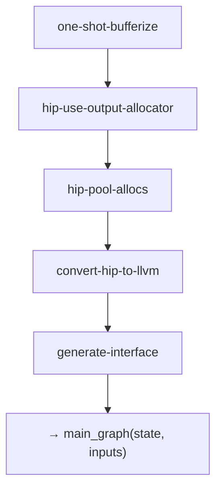
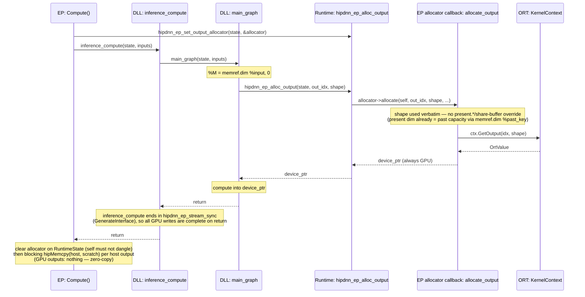

<!--
Copyright (C) 2026 Advanced Micro Devices, Inc. All rights reserved.
Licensed under the MIT License.
-->
# Output Allocator — Design

**Date:** 2026-06-06
**Document Type:** Design
**Status:** Draft

---

## Table of Contents

- [1. Overview](#1-overview)
- [2. Design](#2-design)
- [3. Phased Design](#3-phased-design)

---

## 1. Overview

Let `main_graph` allocate each output **at the point where its shape is computed** by pulling the buffer from an EP-supplied allocator. The graph owns *when/what shape*, the EP owns *where the memory comes from*.

**Scope.** Shape-derived dynamic outputs (extent from `memref.dim` of inputs). A data-dependent extent works only when its producer's converter turns the count into a host `index` (device scan + `hip.readback_dim`) *before* the allocation, so `hip.alloc_output` receives the real extent; `onnx.Compress` does this. `NonZero` computes into a capacity buffer and returns a zero-offset trimmed subview; the output-view contract copies that logical view into a fresh exact-shape output before return.

### Usage

Every model compiles with the 2-arg in-graph `hip.alloc_output` ABI, and there is nothing to configure — a plain session just works:

Pure ORT (Python):
```python
so = ort.SessionOptions()
so.add_provider_for_devices(devices, {})
sess = ort.InferenceSession(model_path, sess_options=so)
```

The compiler pipeline runs `hip-use-output-allocator` unconditionally, and `convert-hip-to-llvm` / `generate-interface` always emit the 2-arg ABI.

---

## 2. Design

### Why In-Graph Allocation

Dynamic output shapes are computed **inside** the graph (e.g. `M = memref.dim %input`). If the EP had to allocate outputs **before** `main_graph` runs and pass them as out-params, it would have to redo that shape math itself. The allocator ABI avoids the duplication: the DLL allocates each output in-graph and asks the EP-supplied allocator for the buffer once the shape is known.

### The Pipeline



`hip-use-output-allocator` rewrites each returned `memref.alloc` → `hip.alloc_output`. `convert-hip-to-llvm` and `generate-interface` always emit the 2-arg ABI.

```
one-shot-bufferize
hip-use-output-allocator         ← memref.alloc → hip.alloc_output
hip-pool-allocs                  ← pools only intermediates; skips hip.alloc_output
convert-hip-to-llvm              ← 2-arg main_graph wrapper
generate-interface               ← 2-arg inference_compute ABI
```
- `main_graph(state, inputs_array) -> i32`
- Outputs allocated in-graph via `hip.alloc_output`, no `outputs_array`

**Pipeline ordering is load-bearing.** `hip-use-output-allocator` runs *before* `hip-pool-allocs` (the "slot 4.5" placement) so the EP-owned output stays out of the GPU pool. Note this pipeline does **not** run ownership-based buffer deallocation at all — every transient is packed into session-owned pool(s) by `hip-pool-allocs` (as `memref.view` over `hip.get_pool`) rather than freed per-`memref.alloc`, so there is nothing to deallocate (see the pipeline-tail comment in `lib/Dialect/Transforms/Pipelines.cpp`). The historical constraint of running the output-allocator *after* deallocation (to stop the deallocator cloning the unowned `hip.alloc_output` at the `return`) is therefore moot.

---

## 3. Phased Design

The design separates into five conceptual layers, each building on the previous.

### Phase 1: In-Graph Allocation Abstraction

Introduce `hip.alloc_output` — an operation that allocates output buffers via an external allocator.

```mlir
%out = hip.alloc_output(%ctx, %M, %N) {out_idx = 0 : i64} : memref<?x?xf16>
```

**Design:**
- Operands: runtime context + dynamic dimension values (one per dynamic dim, in type order)
- Attribute: `out_idx` identifying which graph output
- Result type: memref with static dims from type, dynamic dims from operands

**Key property:** Does not declare `Allocate` memory effect — the buffer is owned by the EP/runtime, not the graph, so `hip-pool-allocs` skips it and no `hip.free` is ever emitted for it.

**Placement in pipeline:** *before* `hip-pool-allocs` (so pooling skips the EP-owned buffer). `hip-use-output-allocator` is FuncOp-scoped: it rewrites returned allocs (leaving each signature + `return` intact). See [§2](#the-pipeline).

The `hip-use-output-allocator` pass replaces the returned `memref.alloc` for each graph output with `hip.alloc_output`, reusing the alloc's dynamic-size operands. `BufferViewFlowAnalysis` discovers allocs returned through aliases, then an explicit backward walk validates the exact alloc-to-return chain. Direct returns, casts, and one representable `memref.collapse_shape` or `memref.expand_shape` (optionally wrapped in casts) are accepted. A rank-preserving subview with zero offsets, unit slice strides, byte-addressable elements, and an identity-layout return is materialized separately: its root remains an internal allocation, while a fresh `hip.alloc_output` is sized from `memref.dim` of the logical returned view and receives a descriptor-aware `memref.copy` immediately before return. Nonzero offsets, non-unit slices, mixed reshape/subview chains, and other unsupported views fail with an output-indexed diagnostic because the callback ABI cannot adopt their base/layout directly. Validation for all outputs completes before any alloc replacement, copy insertion, or dealloc removal, so a rejected function is not partially rewritten.

**Rank-reducing return (`collapse_shape`) — the ABI-shape attrs.** The internal compute buffer's rank can be *higher* than the ONNX / `func.return` output rank when the output is returned through `memref.collapse_shape` (e.g. a vision encoder produces `memref<?x?x2560xf16>` internally but the `image_features` graph output is rank-2 `memref<?x2560xf16>`). The EP output-allocator callback (`hipdnn_ep_alloc_output`) must receive the *returned* (ONNX) shape — ORT pre-binds the output `OrtValue` at the ONNX rank and rejects a mismatched request (`has shape {252,2560} but the computed output shape … is {1,252,2560}`). To carry that, `hip-use-output-allocator` stamps two discardable attrs on `hip.alloc_output` (names in `include/hip/Dialect/IR/HipDialect.h`):

- `hipdnn.abi_shape` — the external shape, one entry per external dim (`ShapedType::kDynamic` marks dynamic).
- `hipdnn.abi_groups` — the number of consecutive internal dims folded into each external dim (the contiguous collapse reassociation; entries sum to the internal rank).

`AllocOutputOpLowering` reads them and re-derives each external dim from the *internal* alloc sizes (which dominate the alloc site): static dims from `abi_shape`, dynamic dims as the runtime product of the internal dims they fold. **The stamping must happen in this pass, not in the lowering**, because the reassociation is only available while `memref.collapse_shape` is intact — the downstream `expand-strided-metadata` pass decomposes it into `reinterpret_cast` + `extract_strided_metadata` (which erases the reassociation and re-defines the external dims *after* the alloc, so the lowering can no longer walk to them without breaking SSA dominance). Exactly one rank-changing collapse or expand is supported; expand groups may contain at most one dynamic external dimension, matching what the lowering can reconstruct. Unsupported chains are rejected instead of falling back to the root allocation's rank, shape, or base. Positive stamping and exact-subview-copy coverage are in `test/lit/Dialect/hip-use-output-allocator.mlir`; rejection and pre-mutation atomicity are covered by `test/lit/Dialect/hip-use-output-allocator-invalid-views.mlir`.

**Example: Add → MatMul → Sigmoid**

After `one-shot-bufferize`:
```mlir
func.func @main_graph(%ctx: !hip.context, %X: memref<?x64xf16>, %W: memref<64x?xf16>)
    -> memref<?x?xf16> {
  %c0 = arith.constant 0 : index
  %c1 = arith.constant 1 : index
  %M = memref.dim %X, %c0
  %N = memref.dim %W, %c1
  %t0 = memref.alloc(%M) : memref<?x64xf16>
  hip.add(%ctx) ins(%X, %X) outs(%t0)
  %t1 = memref.alloc(%M, %N) : memref<?x?xf16>
  hip.matmul(%ctx) ins(%t0, %W) outs(%t1)
  %out = memref.alloc(%M, %N) : memref<?x?xf16>
  hip.sigmoid(%ctx) ins(%t1) outs(%out)
  return %out
}
```

After `hip-use-output-allocator`:
```mlir
func.func @main_graph(%ctx: !hip.context, %X: memref<?x64xf16>, %W: memref<64x?xf16>)
    -> memref<?x?xf16> {
  %c0 = arith.constant 0 : index
  %c1 = arith.constant 1 : index
  %M = memref.dim %X, %c0
  %N = memref.dim %W, %c1
  %t0 = memref.alloc(%M) : memref<?x64xf16>        // intermediate → pooled later
  hip.add(%ctx) ins(%X, %X) outs(%t0)
  %t1 = memref.alloc(%M, %N) : memref<?x?xf16>    // intermediate → pooled later
  hip.matmul(%ctx) ins(%t0, %W) outs(%t1)
  %out = hip.alloc_output(%ctx, %M, %N) {out_idx = 0 : i64} : memref<?x?xf16>  // ← output uses allocator
  hip.sigmoid(%ctx) ins(%t1) outs(%out)
  return %out
}
```

### Phase 2: LLVM Lowering

Lower `hip.alloc_output` to a runtime call that returns a device pointer, then construct a memref descriptor.

```mlir
// Before lowering
%out = hip.alloc_output(%ctx, %M, %N) {out_idx = 0 : i64} : memref<?x?xf16>

// After lowering to LLVM
%shape = llvm.alloca %c2 x i64           // shape array: [%M, %N]
llvm.store %M, %shape[0]
llvm.store %N, %shape[1]

// Call allocator (returns void* device pointer)
%ptr = llvm.call @hipdnn_ep_alloc_output(%state, %c0_out_idx, %shape, %c2_rank, %c2_elem_size)
  : (!llvm.ptr, i64, !llvm.ptr, i64, i64) -> !llvm.ptr

// Build memref descriptor: { allocPtr=%ptr, alignedPtr=%ptr, offset=0,
//                             sizes=[%M, %N], strides=[%N, 1] }
```

**Shape array:** Interleaves static dims (from result type) and dynamic dims (from operands) in correct order.

**Strides:** Computed as row-major from shape.

**Returns** a `void*` device pointer; the DLL never tracks memory types. Full allocator contract in Phase 3.

---

### Phase 3: Runtime Allocator Contract

Two runtime entry points bridge the EP and the generated `model.dll`, plus the struct that travels between them.

**Allocator interface:**
```c
typedef struct {
  void *self;          // opaque EP context (borrowed; runtime never owns/frees)
  void *(*allocate)(void *self, int64_t out_idx, const int64_t *shape,
                    int64_t rank, int64_t elem_size);
} hipdnn_output_allocator_t;
```

The struct is a fixed-layout ABI contract across the `model.dll` ↔ EP boundary, mirrored by an identical EP-side copy — same convention as `tensor_t`. There is intentionally no size/version field: a layout change is an ABI break resolved by rebuilding the `model.dll`, exactly like any other runtime change.

**Runtime entry points:**
```c
// EP → model.dll: installs the allocator before inference_compute.
void hipdnn_ep_set_output_allocator(RuntimeState *state,
                                    const hipdnn_output_allocator_t *allocator);

// main_graph → runtime (emitted by lowering hip.alloc_output):
// forwards to the installed callback; returns null if none is installed.
void *hipdnn_ep_alloc_output(RuntimeState *state, int64_t out_idx,
                             const int64_t *shape, int64_t rank,
                             int64_t elem_size);
```

The setter is the only output-allocator symbol the EP resolves by name; a pre-allocator `model.dll` simply lacks it, so the EP no-ops. `hipdnn_ep_alloc_output` is a null-guarded forwarder — it returns null if no allocator was installed.

**Allocator responsibility:** `allocate` always returns a device pointer. The implementation (Phase 5) maps each graph output to it:
- GPU output: return ORT's GPU buffer pointer (zero-copy)
- Host output: allocate GPU scratch, track a D2H task, return the scratch pointer

### Phase 4: Code Generation

`generate-interface` emits the 2-arg ABI:
```c
int inference_compute(void *state, span_t *inputs) {
  // prepare inputs → inputs_array
  // main_graph(state, inputs_array)
}
```
**No output arguments.** `inference_compute` takes only `(state, inputs)`. Each output is created inside `main_graph`: once its shape is known, the graph calls the allocator callback, which makes the `OrtValue` and hands back its buffer. The EP never passes output buffers in.

**`main_graph` arity check.** `convert-hip-to-llvm` runs *before* interface generation and verifies `main_graph`'s arity: each memref unpacks to `3 + 2*rank` LLVM params, a returned memref adds none, so the expected count is context + inputs — emitting an error on mismatch.

**Return:** The pass leaves `main_graph`'s `return` alone. `convert-hip-to-llvm` wraps the body in the `-> i32` entry and returns `0`; the body's memref return is ignored (the real output reaches the EP through the allocator callback).

### Phase 5: EP Bridge and Zero-Copy



**Call tree (same flow, code-trace view).** The sequence diagram above shows the cross-component handshake; the tree below is the full nesting of actual functions for readers tracing the code. Function names only (no line numbers, which drift). Every output buffer comes from `GetOutput` with the graph's own in-graph shape — the callback never reshapes (KV cache included).

```text
MlirCustomOp::Compute(context)
├─ inference_state_->begin_compute()            per-Compute cache reset (e.g. GQA seqlens_k)
└─ compute_with_output_allocator(context)
   ├─ marshal_input_tensors(context, ...)       EP-side: OrtValue -> inputs.span
   ├─ build OutputAllocatorCtx octx{ctx, outputs, output_index_map, host_out_scratch, allocated[]}
   ├─ output_allocator_t alloc{ self=&octx, allocate=&output_allocate_cb }
   ├─ inference_state_->set_output_allocator(&alloc)
   │     └─ hipdnn_ep_set_output_allocator(state, &alloc)   throws if the DLL lacks the export
   ├─ inference_state_->compute(&inputs.span)
   │  └─ inference_compute(state, inputs)        2-arg ABI, NO outputs span
   │     ├─ hipdnn_ep_tensor_prepare_input(...) x N   -> input memref descriptors
   │     ├─ hipdnn_ep_state_reset_error_flag(state)
   │     ├─ main_graph(state, inputs)            thin wrapper: unpacks input descriptors,
   │     │  └─ main_graph_internal(...)          calls body, DISCARDS its returned descriptor
   │     │     ├─ hipdnn_ep_get_pool_base(state, domain_id, size)   grow-on-demand GPU pool
   │     │     ├─ <compute ops> (e.g. wrap_hipblasLtMatmul, wrap_miopen*) -> pool slots
   │     │     ├─ hipdnn_ep_alloc_output(state, out_idx, shape, rank, elem)   <-- OUTPUT ALLOC
   │     │     │  └─ output_allocator.cpp: forwards to alloc.allocate(self, ...)
   │     │     │     └─ output_allocate_cb(...)   noexcept
   │     │     │        ├─ shape used verbatim (no override; present dim already = past capacity)
   │     │     │        ├─ ctx.GetOutput(ort_idx, shape)   ORT returns pre-bound / fresh OrtValue
   │     │     │        ├─ octx.allocated[out_idx] = true
   │     │     │        └─ GPU output  -> return ORT ptr (zero-copy)
   │     │     │           host output -> EP GPU scratch + queue pending_d2h
   │     │     └─ <final op writes into that ptr>; returns output by-value memref (wrapper ignores it)
   │     ├─ hipdnn_ep_stream_sync(state)         all GPU writes complete on return
   │     ├─ hipdnn_ep_state_read_and_clear_error_flag(state)
   │     └─ hipdnn_ep_tensor_free_input(state, ...) x N
   ├─ scope-exit clears the allocator before octx leaves scope
   ├─ rethrow any exception captured by the noexcept callback
   ├─ output-completeness guard: every allocated[i] true else OrtStatus failure
   └─ #ifndef BUILD_MOCK_RUNTIME: pending_d2h -> blocking hipMemcpy(host <- GPU scratch)
```

Note the `main_graph` / `main_graph_internal` split (from `convert-hip-to-llvm`): `main_graph` is a thin wrapper that bridges the runtime's `(ctx, inputs)` ABI to the exploded-descriptor ABI of the body, then **discards** the body's by-value return — the real output reaches the EP through the `hipdnn_ep_alloc_output` callback, not the return value.

**Status: implemented.** The illustrative pseudocode above is realized by these files:

| Concern | Where |
|---|---|
| Pipeline | [lib/Dialect/Transforms/Pipelines.cpp](../../lib/Dialect/Transforms/Pipelines.cpp): the slot-4.5 `hip-use-output-allocator` pass rewrites the returned allocs; `generate-interface` emits the 2-arg ABI |
| EP front-end | [backend-mlir-compiler/level-1-pass/src/pass_main.cpp](../../backend-mlir-compiler/level-1-pass/src/pass_main.cpp), [MlirCompiler.cpp](../../backend-mlir-compiler/level-1-pass/src/MlirCompiler.cpp) |
| EP-local ABI mirror | `output_allocator_t` in [custom_op_mlir.hpp](../../backend-mlir-compiler/custom-op-mlir/src/custom_op_mlir.hpp) (same `static_assert`s as the runtime struct) |
| 2-arg dispatch + setter | [InferenceState.cpp](../../backend-mlir-compiler/custom-op-mlir/src/InferenceState.cpp) (`compute`, `set_output_allocator`) |
| Callback + per-Compute ctx + host D2H | [MlirCustomOp.cpp](../../backend-mlir-compiler/custom-op-mlir/src/MlirCustomOp.cpp) (`output_allocate_cb`, `OutputAllocatorCtx`, `compute_with_output_allocator`) |
| Allocator KV-cache invariant guard (present dim ← `memref.dim %past_key`) | [test/lit/e2e/test_gqa_output_allocator_present_dim.mlir](../../test/lit/e2e/test_gqa_output_allocator_present_dim.mlir) |

**Key design points (as built):**

1. **The callback is `noexcept` across the C ABI.** `output_allocate_cb` is invoked from the model artifact's C runtime, so unwinding a C++ exception through those frames would be undefined behavior. The callback captures its first exception and returns null. The alloc-output lowering tests that pointer before constructing its memref descriptor; null records shared runtime failure and returns from the generated graph, so no downstream operation can consume it. After `inference_compute` runs generated input cleanup, the EP clears the borrowed callback with `llvm::scope_exit` and rethrows the precise exception. MorphiZen's CustomOp boundary converts it to a non-null `OrtStatus`. No output validation, D2H copy, or success reporting occurs on that path.

2. **Allocator returns a GPU device pointer** (Phase 3 contract). GPU outputs (EP `hipHostMalloc` allocator or OGA device memory: `memory_type == TENSOR_MEMORY_GPU`) zero-copy ORT's buffer. Host (CPU) outputs get an EP-owned GPU scratch pointer; the DLL writes there and the EP D2H-copies into ORT's host buffer after compute.

3. **Host-output D2H is EP-side and real-build-only.** The GPU scratch (one buffer per output index, grow-on-demand, reused across `Compute()`, freed in the dtor) and the `hipMemcpy` are under `#ifndef BUILD_MOCK_RUNTIME` (the EP only links `hip::host` in non-mock builds; mock writes host memory directly). The generated 2-arg `inference_compute` already ends in `hipdnn_ep_stream_sync`, so writes are complete on return and a plain **blocking** `hipMemcpy` D2H suffices — no extra stream sync.

4. **KV cache share-buffer needs no special case in the callback.** `output_allocate_cb` passes the DLL's in-graph `shape` to `GetOutput` verbatim — every output is acquired the same way. The shape is already right because `hip.alloc_output`'s dynamic dims come from its producer's operands: a `present.*` output is sized from `memref.dim %past_key` (the past input buffer's actual extent), which under OGA `past_present_share_buffer` already **is** the `max_length` capacity buffer. So `GetOutput` returns the pre-bound shared `OrtValue` and the `past == present` pointer identity is preserved. Pinned by `test/lit/e2e/test_gqa_output_allocator_present_dim.mlir`. (`build_metadata_json` emits each output shape verbatim — static extent or `-1`.)

5. **One allocation per public result slot.** `hip-use-output-allocator` plans every `func.return` operand before mutation. One representable allocation may be rewritten in place; pass-through inputs, duplicate result slots, and contiguous fallback views receive fresh exact-shape `hip.alloc_output` destinations plus `memref.copy`. Non-identity returned layouts fail compilation before the first rewrite. The EP completeness guard remains a fail-closed boundary check rather than the normal way these graph shapes are rejected.

6. **Per-Compute allocator install/clear.** The `OutputAllocatorCtx` lives on `MlirCustomOp::compute_with_output_allocator`'s stack. A scope-exit guard clears the installed allocator on success and on every exception path, so its borrowed `self` pointer cannot dangle into a later `Compute()`.

7. **Scratch growth is failure-atomic.** Host-output scratch allocates and installs the replacement before retiring the old slot. Allocation failure preserves the reusable old buffer. If freeing the old pointer fails, its disposition is uncertain, so the runtime abandons that pointer (and may leak it) rather than risk reuse; the known-valid replacement remains live. Zero-byte outputs retain a valid one-byte device sentinel and skip the zero-byte D2H call. Shape and byte-size arithmetic is validated before ORT or scratch allocation.
