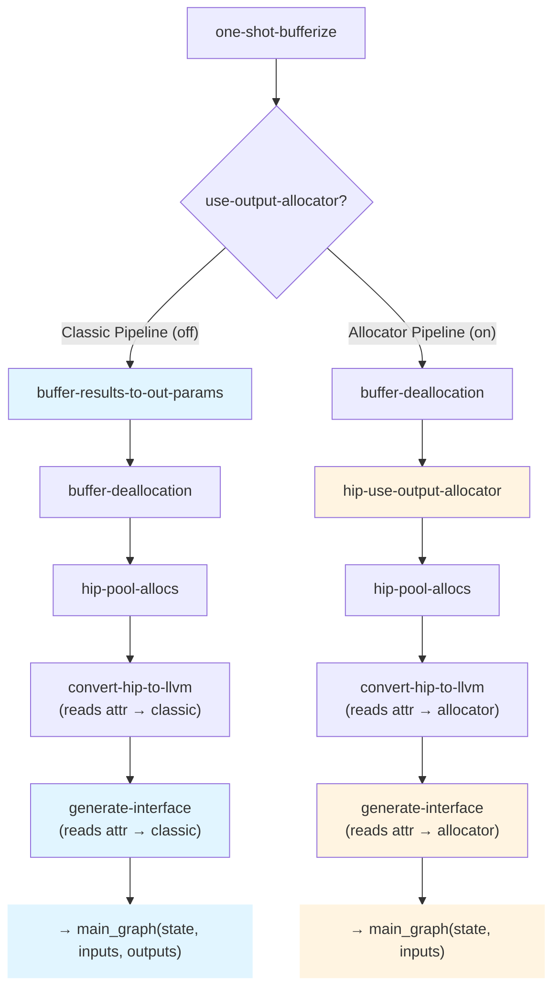
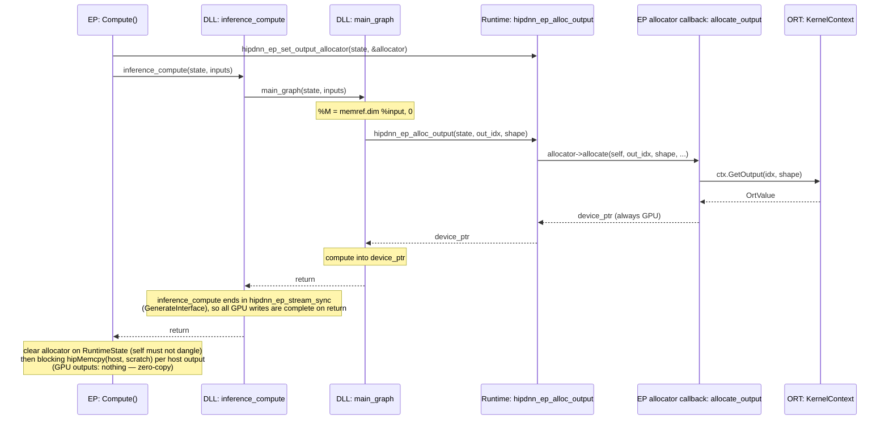

<!--
Copyright (C) 2026 Advanced Micro Devices, Inc. All rights reserved.
Licensed under the MIT License.
-->
# Output Allocator — Design

**Date:** 2026-06-06
**Document Type:** Design
**Status:** Draft

---

## Table of Contents

- [1. Overview](#1-overview)
- [2. Design](#2-design)
- [3. Phased Design](#3-phased-design)

---

## 1. Overview

Let `main_graph` allocate each output **at the point where its shape is computed** by pulling the buffer from an EP-supplied allocator. The graph owns *when/what shape*, the EP owns *where the memory comes from*.

**Scope.** Shape-derived dynamic outputs (extent from `memref.dim` of inputs). Data-dependent outputs (`NonZero`, `Range` — extent from kernel results) deferred.

---

## 2. Design

### Why a New Pipeline

**Today's pipeline** (classic):
1. Bufferize tensors → memrefs
2. `BufferResultsToOutParams` converts output returns → out-param arguments
3. `GenerateInterface` builds `outputs_array` from `prepare_output` calls
4. `main_graph(state, inputs_array, outputs_array)` signature

**The problem:** Output buffers are allocated by the EP **before** `main_graph` runs and passed as out-params. For dynamic shapes, the output shape is computed **inside** the graph (e.g., `M = memref.dim %input`), but the allocation happens **outside** the graph. This requires the EP to know output shapes before calling `inference_compute`, forcing shape computation to happen in two places: once in the graph (to size intermediate buffers), once in the EP (to allocate outputs).

**Attempting to retrofit allocator into this pipeline creates complexity:**
- `BufferResultsToOutParams` must skip allocator-based outputs (conditional logic)
- `GenerateInterface` must emit different code depending on allocation method (two code paths)
- Mixed semantics: some outputs are out-params, some are allocated in-graph
- Ambiguous intermediate states during compilation

**Solution:** A **new pipeline** where outputs are never converted to out-params — the DLL allocates them in-graph and calls the allocator once the shape is known. The mode is recorded once as a module attribute (`hipdnn.use_output_allocator`, a `BoolAttr` set to `true`) that `convert-hip-to-llvm` and `generate-interface` read to emit the allocator ABI.

### Two Pipelines



Only `hip-use-output-allocator` is allocator-specific. `convert-hip-to-llvm` and `generate-interface` are the SAME passes in both branches — they switch on the `hipdnn.use_output_allocator` attribute, so there is no allocator-specific codegen pass to keep in sync.

> `hip-use-output-allocator` does two things in one pass: it rewrites returned `memref.alloc` → `hip.alloc_output`, and it stamps the `hipdnn.use_output_allocator` `BoolAttr` (= `true`) on the module. The stamp is the mode switch and is unconditional (it fires even for a zero-output graph, where no alloc is rewritten), because the mode is decided by the pass being scheduled — the allocator pipeline runs it, the classic pipeline does not.

**Pipeline A: Classic** (flag off, existing design)
```
one-shot-bufferize
buffer-results-to-out-params     ← outputs become out-params
buffer-deallocation
hip-pool-allocs
convert-hip-to-llvm
generate-interface               ← builds outputs_array, prepare/finalize
```
- `main_graph(state, inputs_array, outputs_array) -> i32`
- Outputs pre-allocated by EP, passed as array of memref pointers

**Pipeline B: Allocator** (flag on, new design)
```
one-shot-bufferize
~~buffer-results-to-out-params~~     ← REMOVED
buffer-deallocation              ← output still memref.alloc (owned) → no clone
hip-use-output-allocator         ← NEW: memref.alloc → hip.alloc_output (AFTER dealloc)
                                   AND stamps hipdnn.use_output_allocator = true
hip-pool-allocs                  ← pools only intermediates; skips hip.alloc_output
convert-hip-to-llvm              ← reads attr → 2-arg main_graph wrapper
generate-interface               ← SAME pass as classic; reads attr → allocator ABI
```
- `main_graph(state, inputs_array) -> i32`
- Outputs allocated in-graph via `hip.alloc_output`, no `outputs_array`

Each pipeline has single responsibility, no conditional logic, clear semantics. Changes to allocator model don't affect classic path.

**Pipeline ordering is load-bearing.** `hip-use-output-allocator` runs *after* `buffer-deallocation` and *before* `hip-pool-allocs` (the "slot 4.5" placement). After dealloc, the output is still a plain `memref.alloc` (owned) and is returned with no clone; running before dealloc would make the deallocator clone the unowned `hip.alloc_output` result at the `return`, defeating zero-copy. Before pool-allocs keeps the EP-owned output out of the GPU pool. Pinned in [test/lit/Pipeline/output-allocator-dealloc.mlir](../../test/lit/Pipeline/output-allocator-dealloc.mlir).

**Selection.** The `use-output-allocator` option (default off → Classic) lives in the **ONNX-to-HIP half only** (`OnnxToHipPipelineOptions`): off → slot-3 `buffer-results-to-out-params`; on → the slot-4.5 `hip-use-output-allocator`. The HIP-to-LLVM half has no allocator option — `convert-hip-to-llvm` and `generate-interface` read the module attribute, so the mode rides on the IR itself rather than a second option. The EP enables the flag for models with shape-derived dynamic outputs.

---

## 3. Phased Design

The design separates into five conceptual layers, each building on the previous.

### Phase 1: In-Graph Allocation Abstraction

Introduce `hip.alloc_output` — an operation that allocates output buffers via an external allocator.

```mlir
%out = hip.alloc_output(%ctx, %M, %N) {out_idx = 0 : i64} : memref<?x?xf16>
```

**Design:**
- Operands: runtime context + dynamic dimension values (one per dynamic dim, in type order)
- Attribute: `out_idx` identifying which graph output
- Result type: memref with static dims from type, dynamic dims from operands

**Key property:** Does not declare `Allocate` memory effect — the buffer is owned by the EP/runtime, not the graph, so buffer-deallocation never inserts a `hip.free` for it.

**Placement in pipeline:** *after* `buffer-deallocation`, *before* `hip-pool-allocs` (so pooling skips the EP-owned buffer). `hip-use-output-allocator` is FuncOp-scoped: it rewrites returned allocs (leaving each signature + `return` intact) and stamps the module-level mode attribute in the same pass. The after-dealloc order is load-bearing — see [§2](#two-pipelines).

The `hip-use-output-allocator` pass replaces the returned `memref.alloc` for each graph output with `hip.alloc_output`, reusing the alloc's dynamic-size operands.

**Example: Add → MatMul → Sigmoid**

After `one-shot-bufferize`:
```mlir
func.func @main_graph(%ctx: !hip.context, %X: memref<?x64xf16>, %W: memref<64x?xf16>)
    -> memref<?x?xf16> {
  %c0 = arith.constant 0 : index
  %c1 = arith.constant 1 : index
  %M = memref.dim %X, %c0
  %N = memref.dim %W, %c1
  %t0 = memref.alloc(%M) : memref<?x64xf16>
  hip.add(%ctx) ins(%X, %X) outs(%t0)
  %t1 = memref.alloc(%M, %N) : memref<?x?xf16>
  hip.matmul(%ctx) ins(%t0, %W) outs(%t1)
  %out = memref.alloc(%M, %N) : memref<?x?xf16>
  hip.sigmoid(%ctx) ins(%t1) outs(%out)
  return %out
}
```

After `hip-use-output-allocator`:
```mlir
func.func @main_graph(%ctx: !hip.context, %X: memref<?x64xf16>, %W: memref<64x?xf16>)
    -> memref<?x?xf16> {
  %c0 = arith.constant 0 : index
  %c1 = arith.constant 1 : index
  %M = memref.dim %X, %c0
  %N = memref.dim %W, %c1
  %t0 = memref.alloc(%M) : memref<?x64xf16>        // intermediate → pooled later
  hip.add(%ctx) ins(%X, %X) outs(%t0)
  %t1 = memref.alloc(%M, %N) : memref<?x?xf16>    // intermediate → pooled later
  hip.matmul(%ctx) ins(%t0, %W) outs(%t1)
  %out = hip.alloc_output(%ctx, %M, %N) {out_idx = 0 : i64} : memref<?x?xf16>  // ← output uses allocator
  hip.sigmoid(%ctx) ins(%t1) outs(%out)
  return %out
}
```

### Phase 2: LLVM Lowering

Lower `hip.alloc_output` to a runtime call that returns a device pointer, then construct a memref descriptor.

```mlir
// Before lowering
%out = hip.alloc_output(%ctx, %M, %N) {out_idx = 0 : i64} : memref<?x?xf16>

// After lowering to LLVM
%shape = llvm.alloca %c2 x i64           // shape array: [%M, %N]
llvm.store %M, %shape[0]
llvm.store %N, %shape[1]

// Call allocator (returns void* device pointer)
%ptr = llvm.call @hipdnn_ep_alloc_output(%state, %c0_out_idx, %shape, %c2_rank, %c2_elem_size)
  : (!llvm.ptr, i64, !llvm.ptr, i64, i64) -> !llvm.ptr

// Build memref descriptor: { allocPtr=%ptr, alignedPtr=%ptr, offset=0,
//                             sizes=[%M, %N], strides=[%N, 1] }
```

**Shape array:** Interleaves static dims (from result type) and dynamic dims (from operands) in correct order.

**Strides:** Computed as row-major from shape.

**Returns** a `void*` device pointer; the DLL never tracks memory types. Full allocator contract in Phase 3.

---

### Phase 3: Runtime Allocator Contract

Two runtime entry points bridge the EP and the generated `model.dll`, plus the struct that travels between them.

**Allocator interface:**
```c
typedef struct {
  void *self;          // opaque EP context (borrowed; runtime never owns/frees)
  void *(*allocate)(void *self, int64_t out_idx, const int64_t *shape,
                    int64_t rank, int64_t elem_size);
} hipdnn_output_allocator_t;
```

The struct is a fixed-layout ABI contract across the `model.dll` ↔ EP boundary, mirrored by an identical EP-side copy — same convention as `tensor_t`. There is intentionally no size/version field: a layout change is an ABI break resolved by rebuilding the `model.dll`, exactly like any other runtime change.

**Runtime entry points:**
```c
// EP → model.dll: installs the allocator before inference_compute.
void hipdnn_ep_set_output_allocator(RuntimeState *state,
                                    const hipdnn_output_allocator_t *allocator);

// main_graph → runtime (emitted by lowering hip.alloc_output):
// forwards to the installed callback; returns null if none is installed.
void *hipdnn_ep_alloc_output(RuntimeState *state, int64_t out_idx,
                             const int64_t *shape, int64_t rank,
                             int64_t elem_size);
```

The setter is the only output-allocator symbol the EP resolves by name; a pre-allocator `model.dll` simply lacks it, so the EP no-ops. The classic pipeline never installs an allocator, leaving `hipdnn_ep_alloc_output` an unused null-guarded forwarder.

**Allocator responsibility:** `allocate` always returns a device pointer. The implementation (Phase 5) maps each graph output to it:
- GPU output: return ORT's GPU buffer pointer (zero-copy)
- Host output: allocate GPU scratch, track a D2H task, return the scratch pointer

### Phase 4: Allocator-Aware Code Generation

A single `generate-interface` pass emits both ABIs, reading the `hipdnn.use_output_allocator` `BoolAttr` by VALUE: attr absent or `= false` → classic 3-arg `inference_compute`; attr `= true` → allocator 2-arg (classic output staging is gated on the attribute, so it is skipped).

**`main_graph` mode + arity check.** `convert-hip-to-llvm` runs *before* interface generation and reads the **same** attribute to pick the mode (it no longer guesses from the param count). It then verifies `main_graph`'s arity for that mode — each memref unpacks to `3 + 2*rank` LLVM params, a returned memref adds none, so classic = context + inputs + outputs and allocator = context + inputs — emitting a mode-specific error on mismatch. Sharing the attribute keeps the wrapper arity and the interface generator in agreement, and disambiguates a zero-output graph (where both counts coincide).

Classic mode (`hipdnn.use_output_allocator` absent or `false`) emits:
```c
int inference_compute(void *state, span_t *inputs, span_t *outputs) {
  // prepare inputs → inputs_array
  // prepare outputs → outputs_array
  // main_graph(state, inputs_array, outputs_array)
}
```

Allocator mode (`hipdnn.use_output_allocator = true`) emits:
```c
int inference_compute(void *state, span_t *inputs) {
  // prepare inputs → inputs_array
  // main_graph(state, inputs_array)
}
```

**Key differences:**

| Classic | Allocator |
|---------|-----------|
| 3 parameters: `state, inputs, outputs` | 2 parameters: `state, inputs` |
| Calls `prepare_output` per output | No `prepare_output` |
| Builds `outputs_array` from memref descriptors | No `outputs_array` |
| `main_graph(state, inputs_array, outputs_array)` | `main_graph(state, inputs_array)` |
| Calls `finalize_output` per output | No `finalize_output` |

**Design rationale:** Outputs are allocated in-graph via the allocator callback, which creates OrtValues directly. The `outputs` parameter serves no purpose and would be confusing.

**Return:** The pass leaves `main_graph`'s `return` alone. `convert-hip-to-llvm` wraps the body in the `-> i32` entry and returns `0`; the body's memref return is ignored, same as the classic path.

### Phase 5: EP Bridge and Zero-Copy



**Status: implemented.** The illustrative pseudocode above is realized by these files (the per-model auto-enable heuristic is deferred — allocator mode is an explicit, default-off `use_output_allocator` provider option):

| Concern | Where |
|---|---|
| Compile flag (`use_output_allocator`) | [schemas/compilation_options.fbs](../../schemas/compilation_options.fbs) → [lib/Compiler/CompilerDriver.cpp](../../lib/Compiler/CompilerDriver.cpp) sets `onnxToHipOpts.useOutputAllocator` only; the slot-4.5 pass stamps `hipdnn.output_allocator` and the HipToLLVM half reads it off the IR |
| Pipeline gating | [lib/Dialect/Transforms/Pipelines.cpp](../../lib/Dialect/Transforms/Pipelines.cpp): classic `buffer-results-to-out-params` vs the slot-4.5 `hip-use-output-allocator` + `hip-set-output-allocator-attr`; one `generate-interface` reads the attribute to pick the 3-arg vs 2-arg ABI |
| EP front-end (provider option → compile JSON + metadata) | [backend-mlir-compiler/level-1-pass/src/pass_main.cpp](../../backend-mlir-compiler/level-1-pass/src/pass_main.cpp), [MlirCompiler.cpp](../../backend-mlir-compiler/level-1-pass/src/MlirCompiler.cpp) |
| Mode-detection metadata | [backend-mlir-compiler/proto/metadata.proto](../../backend-mlir-compiler/proto/metadata.proto) (`use_output_allocator`) |
| EP-local ABI mirror | `output_allocator_t` in [custom_op_mlir.hpp](../../backend-mlir-compiler/custom-op-mlir/src/custom_op_mlir.hpp) (same `static_assert`s as the runtime struct) |
| 2-arg dispatch + setter | [InferenceState.cpp](../../backend-mlir-compiler/custom-op-mlir/src/InferenceState.cpp) (`compute_with_output_allocator`, `set_output_allocator`) |
| Callback + per-Compute ctx + host D2H | [MlirCustomOp.cpp](../../backend-mlir-compiler/custom-op-mlir/src/MlirCustomOp.cpp) (`output_allocate_cb`, `OutputAllocatorCtx`, `compute_with_output_allocator`) |
| Shared present.* override helper | [output_shape_override.h](../../backend-mlir-compiler/custom-op-mlir/src/output_shape_override.h) |

**Key design points (as built):**

1. **Single source of truth = compile flag → module attribute + embedded metadata bit.** The `use_output_allocator` provider option is set once on the OnnxToHip half, where the slot-4.5 `hip-set-output-allocator-attr` pass stamps the `hipdnn.output_allocator` module attribute. The HipToLLVM half (`convert-hip-to-llvm` + `generate-interface`) reads that attribute off the IR — so `main_graph` arity and the `inference_compute` wrapper agree without threading a second flag. The same compile flag is also written into the model `Metadata`. The EP reads its dispatch arity from the *embedded* metadata (`metadata_.use_output_allocator()` in the `MlirCustomOp` ctor), not from the live provider option — so a reused ORT EPContext always reports the mode matching its own cached DLL's ABI, and arity can never disagree.

2. **The callback is `noexcept` across the C ABI.** `output_allocate_cb` is invoked from the model.dll's C runtime; a C++ exception unwinding through those frames is UB. The body is wrapped in `try/catch` and any failure (out-of-range `out_idx`, ORT throw, scratch `hipMalloc` failure) ends in `LOG(FATAL)` — it never returns null, because the lowering builds a memref from the returned pointer and a null write would segfault with no diagnostic.

3. **Allocator returns a GPU device pointer** (Phase 3 contract). GPU outputs (EP `hipHostMalloc` allocator or OGA device memory: `memory_type == TENSOR_MEMORY_GPU`) zero-copy ORT's buffer. Host (CPU) outputs get an EP-owned GPU scratch pointer; the DLL writes there and the EP D2H-copies into ORT's host buffer after compute.

4. **Host-output D2H is EP-side and real-build-only.** The GPU scratch (one buffer per output index, grow-on-demand, reused across `Compute()`, freed in the dtor) and the `hipMemcpy` are under `#ifndef BUILD_MOCK_RUNTIME` (the EP only links `hip::host` in non-mock builds; mock writes host memory directly). The generated 2-arg `inference_compute` already ends in `hipdnn_ep_stream_sync`, so writes are complete on return and a plain **blocking** `hipMemcpy` D2H suffices — no extra stream sync.

5. **KV cache share-buffer override lives in the callback.** In allocator mode `marshal_output_tensors` is not called, so the present.*→past `max_length` override is replicated inside `output_allocate_cb`: for a `present.*` output it reads the matching `past_key_values.*` input's runtime shape and bumps each *dynamic* present dim up to the past capacity before `GetOutput`, so ORT returns the pre-bound shared `OrtValue` (pointer identity preserved for in-place GQA append). The override math is factored into the pure, GPU-free `apply_present_share_buffer_override` helper shared with the classic marshal path (so the two paths cannot drift) and unit-tested across several dynamic shapes.

6. **Output-completeness guard.** Allocator mode requires every declared output to be produced in-graph (one `hip.alloc_output` → one callback). After `compute_with_output_allocator` returns, the EP asserts every metadata output index was served, else `LOG(FATAL)` naming the missing one. This turns the two unsupported graph shapes (passthrough output that returns a graph input; deduped aliased output) into a clear error instead of an unfilled ORT output. None of the target models have them.

7. **Per-Compute allocator install/clear.** The `OutputAllocatorCtx` lives on `MlirCustomOp::compute_with_output_allocator`'s stack; the allocator is installed (with `self = &ctx`) before `InferenceState::compute_with_output_allocator` and cleared (`set_output_allocator(nullptr)`) immediately after, so `self` can never dangle into a later `Compute()`.
