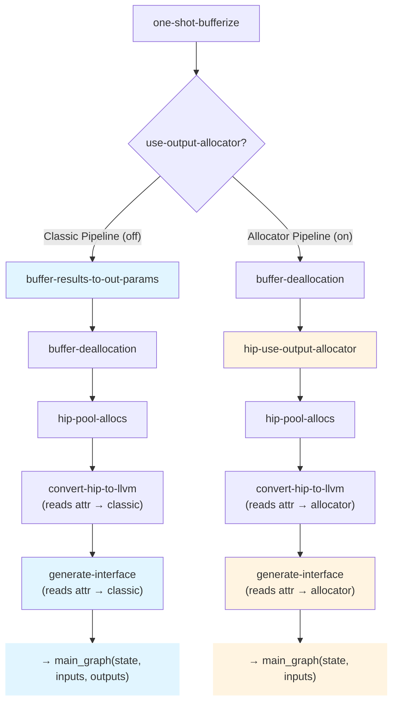
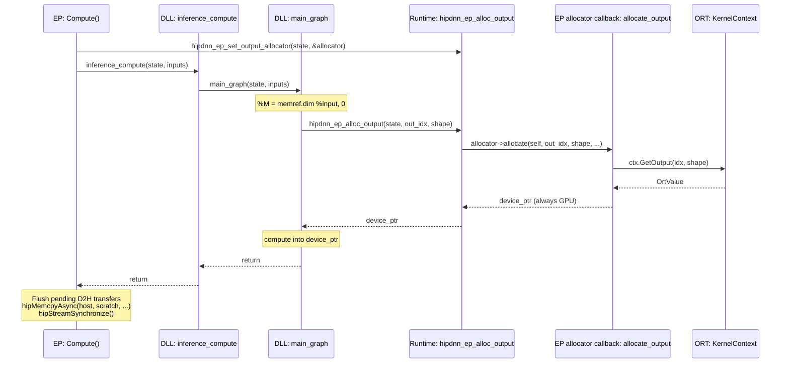

<!--
Copyright (C) 2026 Advanced Micro Devices, Inc. All rights reserved.
Licensed under the MIT License.
-->
# Output Allocator — Design

**Date:** 2026-06-06
**Document Type:** Design
**Status:** Draft

---

## Table of Contents

- [1. Overview](#1-overview)
- [2. Design](#2-design)
- [3. Phased Design](#3-phased-design)

---

## 1. Overview

Let `main_graph` allocate each output **at the point where its shape is computed** by pulling the buffer from an EP-supplied allocator. The graph owns *when/what shape*, the EP owns *where the memory comes from*.

**Scope.** Shape-derived dynamic outputs (extent from `memref.dim` of inputs). Data-dependent outputs (`NonZero`, `Range` — extent from kernel results) deferred.

---

## 2. Design

### Why a New Pipeline

**Today's pipeline** (classic):
1. Bufferize tensors → memrefs
2. `BufferResultsToOutParams` converts output returns → out-param arguments
3. `GenerateInterface` builds `outputs_array` from `prepare_output` calls
4. `main_graph(state, inputs_array, outputs_array)` signature

**The problem:** Output buffers are allocated by the EP **before** `main_graph` runs and passed as out-params. For dynamic shapes, the output shape is computed **inside** the graph (e.g., `M = memref.dim %input`), but the allocation happens **outside** the graph. This requires the EP to know output shapes before calling `inference_compute`, forcing shape computation to happen in two places: once in the graph (to size intermediate buffers), once in the EP (to allocate outputs).

**Attempting to retrofit allocator into this pipeline creates complexity:**
- `BufferResultsToOutParams` must skip allocator-based outputs (conditional logic)
- `GenerateInterface` must emit different code depending on allocation method (two code paths)
- Mixed semantics: some outputs are out-params, some are allocated in-graph
- Ambiguous intermediate states during compilation

**Solution:** A **new pipeline** where outputs are never converted to out-params. The DLL allocates outputs in-graph, calls the allocator when shape is known. The mode is recorded once as a module attribute (`hipdnn.output_allocator`) that the shared `generate-interface` pass (and `convert-hip-to-llvm`) read to emit the allocator ABI.

### Two Pipelines



In the allocator branch `hip-use-output-allocator` does the IR rewrite. `convert-hip-to-llvm` and `generate-interface` are the SAME passes in both branches — they branch internally on the `hipdnn.output_allocator` module attribute, so there is no allocator-specific pass to keep in sync.

> **The attribute is set by a one-line marker pass, `hip-set-output-allocator-attr`, run right after `hip-use-output-allocator`** (omitted from the diagram — it is not a transformation, just the mode switch). It is kept as its own trivial pass so the switch is a single deletable step once the allocator path is the only one and the readers can hard-code the mode (see "Deprecation plan"). Until then it is the single source of truth for the mode.

**Pipeline A: Classic** (flag off, existing design)
```
one-shot-bufferize
buffer-results-to-out-params     ← outputs become out-params
buffer-deallocation
hip-pool-allocs
convert-hip-to-llvm
generate-interface               ← builds outputs_array, prepare/finalize
```
- `main_graph(state, inputs_array, outputs_array) -> i32`
- Outputs pre-allocated by EP, passed as array of memref pointers

**Pipeline B: Allocator** (flag on, new design)
```
one-shot-bufferize
~~buffer-results-to-out-params~~     ← REMOVED
buffer-deallocation              ← output still memref.alloc (owned) → no clone
hip-use-output-allocator         ← NEW: memref.alloc → hip.alloc_output (AFTER dealloc)
hip-set-output-allocator-attr    ← NEW: sets hipdnn.output_allocator module attr
                                   (trivial, deletable marker — the mode switch)
hip-pool-allocs                  ← pools only intermediates; skips hip.alloc_output
convert-hip-to-llvm              ← reads attr → 2-arg main_graph wrapper
generate-interface               ← SAME pass as classic; reads attr → allocator ABI
```
- `main_graph(state, inputs_array) -> i32`
- Outputs allocated in-graph via `hip.alloc_output`, no `outputs_array`

Each pipeline has single responsibility, no conditional logic, clear semantics. Changes to allocator model don't affect classic path.

**Pipeline ordering is load-bearing.** `hip-use-output-allocator` MUST run *after* `buffer-deallocation`, not before. `hip.alloc_output` carries a Write effect but **no** Allocate effect, so if the rewrite ran first, the ownership-based deallocation pass would treat the returned buffer as unowned and clone it at the `return` (`%c = bufferization.clone %out; return %c`) — a per-inference alloc + full-output copy that defeats the zero-copy goal. Running the rewrite *after* deallocation lets the pass see a plain `memref.alloc` (Allocate effect ⇒ owned) and return it directly with no clone and no dealloc. It still runs *before* `hip-pool-allocs` so the EP-owned output never enters the GPU pool (pool-allocs only absorbs `memref.alloc`). This is the as-built "slot 4.5" placement in [lib/Dialect/Transforms/Pipelines.cpp](../../lib/Dialect/Transforms/Pipelines.cpp); both orderings are pinned in the gate test [test/lit/Pipeline/output-allocator-dealloc.mlir](../../test/lit/Pipeline/output-allocator-dealloc.mlir).

**Selection.** A pipeline option `use-output-allocator` (default off → Classic) selects the branch in the **ONNX-to-HIP half only** (`OnnxToHipPipelineOptions`): off → slot-3 `buffer-results-to-out-params`; on → the slot-4.5 pair `hip-use-output-allocator` (rewrite) + `hip-set-output-allocator-attr` (which sets the `hipdnn.output_allocator` module attribute). The HIP-to-LLVM half (`convert-hip-to-llvm`, `generate-interface`) has **no** allocator option — both passes read the module attribute, so the mode is carried by the IR itself (single source of truth) rather than threaded through a second option. The EP enables the flag for models with shape-derived dynamic outputs.

---

## 3. Phased Design

The design separates into five conceptual layers, each building on the previous.

### Phase 1: In-Graph Allocation Abstraction

Introduce `hip.alloc_output` — an operation that allocates output buffers via an external allocator.

```mlir
%out = hip.alloc_output(%ctx, %M, %N) {out_idx = 0 : i64} : memref<?x?xf16>
```

**Design:**
- Operands: runtime context + dynamic dimension values (one per dynamic dim, in type order)
- Attribute: `out_idx` identifying which graph output
- Result type: memref with static dims from type, dynamic dims from operands

**Key property:** Does not declare `Allocate` memory effect — the buffer is owned by the EP/runtime, not the graph, so buffer-deallocation never inserts a `hip.free` for it.

**Placement in pipeline:** *After* `buffer-deallocation`, *before* `hip-pool-allocs` (so pooling skips the EP-owned buffer — pool-allocs only absorbs `memref.alloc`). `hip-use-output-allocator` is **FuncOp-scoped** (rewrites returned allocs per function, leaving each signature + `return` intact); the sibling **ModuleOp-scoped** `hip-set-output-allocator-attr` runs immediately after it and sets the `hipdnn.output_allocator` module attribute. The original sketch placed the rewrite *before* `buffer-deallocation`; the gate test showed that triggers a clone-at-return, so the as-built order is the reverse — see "Pipeline ordering is load-bearing" in [§2](#two-pipelines).

The `hip-use-output-allocator` pass replaces the returned `memref.alloc` for each graph output with `hip.alloc_output`, reusing the alloc's dynamic-size operands.

**Example: Add → MatMul → Sigmoid**

After `one-shot-bufferize`:
```mlir
func.func @main_graph(%ctx: !hip.context, %X: memref<?x64xf16>, %W: memref<64x?xf16>)
    -> memref<?x?xf16> {
  %c0 = arith.constant 0 : index
  %c1 = arith.constant 1 : index
  %M = memref.dim %X, %c0
  %N = memref.dim %W, %c1
  %t0 = memref.alloc(%M) : memref<?x64xf16>
  hip.add(%ctx) ins(%X, %X) outs(%t0)
  %t1 = memref.alloc(%M, %N) : memref<?x?xf16>
  hip.matmul(%ctx) ins(%t0, %W) outs(%t1)
  %out = memref.alloc(%M, %N) : memref<?x?xf16>
  hip.sigmoid(%ctx) ins(%t1) outs(%out)
  return %out
}
```

After `hip-use-output-allocator`:
```mlir
func.func @main_graph(%ctx: !hip.context, %X: memref<?x64xf16>, %W: memref<64x?xf16>)
    -> memref<?x?xf16> {
  %c0 = arith.constant 0 : index
  %c1 = arith.constant 1 : index
  %M = memref.dim %X, %c0
  %N = memref.dim %W, %c1
  %t0 = memref.alloc(%M) : memref<?x64xf16>        // intermediate → pooled later
  hip.add(%ctx) ins(%X, %X) outs(%t0)
  %t1 = memref.alloc(%M, %N) : memref<?x?xf16>    // intermediate → pooled later
  hip.matmul(%ctx) ins(%t0, %W) outs(%t1)
  %out = hip.alloc_output(%ctx, %M, %N) {out_idx = 0 : i64} : memref<?x?xf16>  // ← output uses allocator
  hip.sigmoid(%ctx) ins(%t1) outs(%out)
  return %out
}
```

### Phase 2: LLVM Lowering

Lower `hip.alloc_output` to a runtime call that returns a device pointer, then construct a memref descriptor.

```mlir
// Before lowering
%out = hip.alloc_output(%ctx, %M, %N) {out_idx = 0 : i64} : memref<?x?xf16>

// After lowering to LLVM
%shape = llvm.alloca %c2 x i64           // shape array: [%M, %N]
llvm.store %M, %shape[0]
llvm.store %N, %shape[1]

// Call allocator (returns void* device pointer)
%ptr = llvm.call @hipdnn_ep_alloc_output(%state, %c0_out_idx, %shape, %c2_rank, %c2_elem_size)
  : (!llvm.ptr, i64, !llvm.ptr, i64, i64) -> !llvm.ptr

// Build memref descriptor: { allocPtr=%ptr, alignedPtr=%ptr, offset=0,
//                             sizes=[%M, %N], strides=[%N, 1] }
```

**Shape array:** Interleaves static dims (from result type) and dynamic dims (from operands) in correct order.

**Strides:** Computed as row-major from shape.

**Returns** a `void*` device pointer; the DLL never tracks memory types. Full allocator contract in Phase 3.

---

### Phase 3: Runtime Allocator Contract

Two runtime entry points bridge the EP and the generated `model.dll`, plus the struct that travels between them.

**Allocator interface:**
```c
typedef struct {
  void *self;          // opaque EP context (borrowed; runtime never owns/frees)
  void *(*allocate)(void *self, int64_t out_idx, const int64_t *shape,
                    int64_t rank, int64_t elem_size);
} hipdnn_output_allocator_t;
```

The struct is a fixed-layout ABI contract across the `model.dll` ↔ EP boundary, mirrored by an identical EP-side copy — same convention as `tensor_t`. There is intentionally no size/version field: a layout change is an ABI break resolved by rebuilding the `model.dll`, exactly like any other runtime change.

**Runtime entry points:**
```c
// EP → model.dll: installs the allocator before inference_compute.
void hipdnn_ep_set_output_allocator(RuntimeState *state,
                                    const hipdnn_output_allocator_t *allocator);

// main_graph → runtime (emitted by lowering hip.alloc_output):
// forwards to the installed callback; returns null if none is installed.
void *hipdnn_ep_alloc_output(RuntimeState *state, int64_t out_idx,
                             const int64_t *shape, int64_t rank,
                             int64_t elem_size);
```

The setter is the only output-allocator symbol the EP resolves by name; a pre-allocator `model.dll` simply lacks it, so the EP no-ops. The classic pipeline never installs an allocator, leaving `hipdnn_ep_alloc_output` an unused null-guarded forwarder.

**Allocator responsibility:** `allocate` always returns a device pointer. The implementation (Phase 5) maps each graph output to it:
- GPU output: return ORT's GPU buffer pointer (zero-copy)
- Host output: allocate GPU scratch, track a D2H task, return the scratch pointer

### Phase 4: Allocator-Aware Code Generation

Status: implemented. Key files: [lib/Dialect/Transforms/UseOutputAllocator.cpp](../../lib/Dialect/Transforms/UseOutputAllocator.cpp) (FuncOp pass: rewrites returned allocs to `hip.alloc_output`), [lib/Dialect/Transforms/SetOutputAllocatorAttr.cpp](../../lib/Dialect/Transforms/SetOutputAllocatorAttr.cpp) (ModuleOp marker pass: sets the `hipdnn.output_allocator` module attribute — the deletable mode switch), [lib/Dialect/Transforms/GenerateInterface.cpp](../../lib/Dialect/Transforms/GenerateInterface.cpp) (single `generate-interface` pass + shared `GenerateInterfacePassBase`; mode read from the attribute), [lib/Conversion/HipToLLVM/HipToLLVM.cpp](../../lib/Conversion/HipToLLVM/HipToLLVM.cpp) (`transformMainFunction` reads the attribute for mode + 2-arg vs 3-arg wrapper synthesis), [lib/Dialect/Transforms/Pipelines.cpp](../../lib/Dialect/Transforms/Pipelines.cpp) (slot-4.5 ordering; one `generate-interface` for both modes), [include/hip/Dialect/Transforms/Pipelines.h](../../include/hip/Dialect/Transforms/Pipelines.h) (`useOutputAllocator` on `OnnxToHipPipelineOptions` + `HipdnnPipelineOptions`; **removed** from `HipToLLVMPipelineOptions`). LIT coverage: [test/lit/Dialect/hip-set-output-allocator-attr.mlir](../../test/lit/Dialect/hip-set-output-allocator-attr.mlir) (marker pass sets the attr, leaves bodies untouched), [test/lit/e2e/test_output_allocator_model.mlir](../../test/lit/e2e/test_output_allocator_model.mlir) (allocator 2-arg vs classic 3-arg `inference_compute`, attribute presence) and [test/lit/Conversion/hip-to-llvm/test_main_graph_param_mismatch.mlir](../../test/lit/Conversion/hip-to-llvm/test_main_graph_param_mismatch.mlir) (mode-specific param-count mismatch diagnostic, split-input-file).

**One pass, one base class — mode from a module attribute.** `GenerateInterfacePassBase::runImpl(module)` holds the body; the single `GenerateInterfacePass` calls it. `verifyPrerequisites` and `generateInferenceCompute` read `module->hasAttr("hipdnn.output_allocator")` in place: allocator mode expects a 2-arg `main_graph` and skips the output-staging calls + `outputs` span; classic mode (no attribute) expects 3-arg and emits the full output staging. The classic-only staging is wrapped in explicit `if (!allocatorMode)` scopes (tagged `classic out-param staging - delete when classic is removed`) so the dead branch is mechanically removable — see "Deprecation plan" below.

**`main_graph` mode + arity check.** `convert-hip-to-llvm` runs *before* interface generation; its `transformMainFunction` reads the **same** `hipdnn.output_allocator` attribute to pick the mode (it no longer guesses from the param count). It then computes the expected param count for that mode — each memref unpacks to `3 + 2*rank` LLVM params (allocatedPtr + alignedPtr + offset + sizes[rank] + strides[rank]); a returned memref lowers to a by-value struct result and adds no param; `expectedAllocator` = context + input memrefs, `expectedClassic` = `expectedAllocator` + output memrefs — and verifies `main_graph` matches, emitting a mode-specific `emitError` on mismatch. Because both `convert-hip-to-llvm` and `generate-interface` read the same attribute, the wrapper arity and the interface generator can never disagree (and a zero-output graph, where the two expected counts coincide, is disambiguated by the attribute rather than a classic-first tiebreak).

Classic mode (no `hipdnn.output_allocator` attribute) emits:
```c
int inference_compute(void *state, span_t *inputs, span_t *outputs) {
  // prepare inputs → inputs_array
  // prepare outputs → outputs_array
  // main_graph(state, inputs_array, outputs_array)
}
```

Allocator mode (attribute present) emits:
```c
int inference_compute(void *state, span_t *inputs) {
  // prepare inputs → inputs_array
  // main_graph(state, inputs_array)
}
```

**Key differences:**

| Classic | Allocator |
|---------|-----------|
| 3 parameters: `state, inputs, outputs` | 2 parameters: `state, inputs` |
| Calls `prepare_output` per output | No `prepare_output` |
| Builds `outputs_array` from memref descriptors | No `outputs_array` |
| `main_graph(state, inputs_array, outputs_array)` | `main_graph(state, inputs_array)` |
| Calls `finalize_output` per output | No `finalize_output` |

**Design rationale:** Outputs are allocated in-graph via the allocator callback, which creates OrtValues directly. The `outputs` parameter serves no purpose and would be confusing.

**Return:** The pass leaves `main_graph`'s `return` alone. `convert-hip-to-llvm` wraps the body in the `-> i32` entry and returns `0`; the body's memref return is ignored, same as the classic path.

**Deprecation plan (when classic out-params are removed).** The allocator path is the target end state; the classic out-param path is what gets retired. The codebase is staged so that retirement is a mechanical deletion rather than a rewrite:

- In `generateInferenceCompute`, every classic-only block is wrapped in an `if (!allocatorMode)` scope and tagged with the comment `classic out-param staging - delete when classic is removed`. Removing classic = delete those scopes (output `TensorBuffer` allocas, the `prepare_output` loop, the output-memref array build, the `finalize_output` loop), drop the hoisted `outputMemrefArray` and the `outputsSpanPtr` arg, and make the wrapper unconditionally 2-arg.
- `convert-hip-to-llvm::transformMainFunction` similarly collapses to the allocator branch (2-arg wrapper, discard returned descriptor).
- The `useOutputAllocator` pipeline option (and the slot-3 vs slot-4.5 branch in `buildOnnxToHipPipelineTail`) collapses: `hip-use-output-allocator` always runs, and the whole mode switch is one deletable pass — drop `hip-set-output-allocator-attr` (the marker), make the readers hard-code allocator mode.
- The module attribute itself can then be dropped once no reader needs to distinguish modes (delete the marker pass `SetOutputAllocatorAttr.cpp`, its TableGen def, its LIT test, and the `pm.addPass(createSetOutputAllocatorAttrPass())` line).

Until then, both modes share one set of passes; the attribute is the only switch.

### Phase 5: EP Bridge and Zero-Copy



**EP allocator callback implementation:**

```cpp
struct PendingD2H {
  void *scratch_ptr;   // GPU scratch buffer
  void *host_ptr;      // Host destination (from OrtValue)
  size_t bytes;
};

class HipdnnEP {
  std::vector<PendingD2H> pending_d2h_;  // per-Compute() call

  static void *allocate_output(void *self, int64_t out_idx,
                            const int64_t *shape, int64_t rank,
                            int64_t elem_size) {
    auto *ep = static_cast<HipdnnEP*>(self);
    auto ort_idx = ep->dll_to_ort_output_index_[out_idx];

    // Create ORT output tensor
    auto out = ep->ctx_->GetOutput(ort_idx, {shape, shape + rank});
    auto mem_info = out.GetTensorMemoryInfo();

    // GPU output: zero-copy path
    if (mem_info.GetDeviceType() == OrtDevice::GPU) {
      return out.GetTensorMutableRawData();
    }

    // Host output: allocate GPU scratch, queue D2H
    size_t bytes = elem_size;
    for (int64_t i = 0; i < rank; i++) bytes *= shape[i];

    void *scratch = ep->scratch_allocator_->Alloc(bytes);
    void *host_dest = out.GetTensorMutableRawData();

    ep->pending_d2h_.push_back({scratch, host_dest, bytes});
    return scratch;  // DLL computes into scratch
  }

  Status Compute(OpKernelContext *ctx) override {
    ctx_ = ctx;
    pending_d2h_.clear();

    // Install allocator
    hipdnn_output_allocator_t allocator = {allocate_output, this};
    hipdnn_ep_set_output_allocator(state_, &allocator);

    // Run inference (allocator called in-graph)
    span_t inputs[num_inputs];
    // ... prepare inputs ...
    int status = inference_compute(state_, inputs);

    // Flush pending D2H transfers
    for (auto &d2h : pending_d2h_) {
      hipMemcpyAsync(d2h.host_ptr, d2h.scratch_ptr, d2h.bytes,
                     hipMemcpyDeviceToHost, stream_);
    }
    hipStreamSynchronize(stream_);

    return status == 0 ? Status::OK() : /* error */;
  }
};
```

**Key design points:**

1. **Allocator returns a GPU device pointer** (Phase 3 contract): GPU output zero-copies ORT's buffer; host output gets scratch + queued D2H. The DLL only ever sees a device pointer.

2. **EP owns D2H:** After `inference_compute` returns, EP flushes all D2H transfers

3. **KV cache share-buffer:** For `present.*` outputs, the allocator callback can request capacity shape (`max_length`) to get pre-bound buffer
