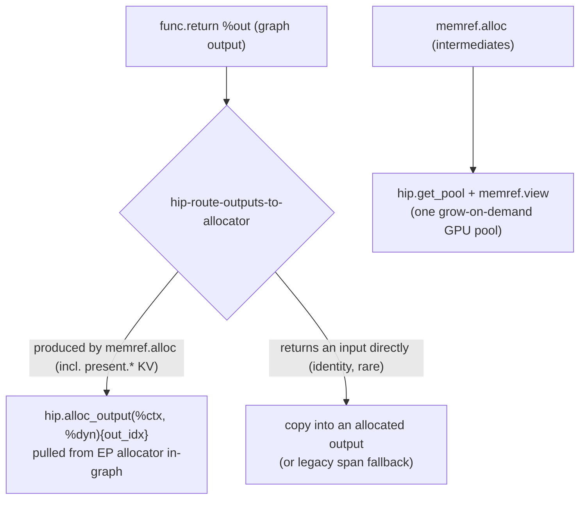
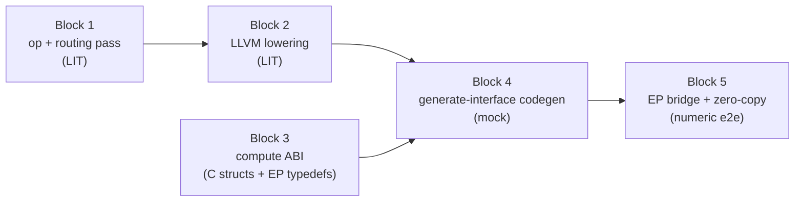

<!--
Copyright (C) 2026 Advanced Micro Devices, Inc. All rights reserved.
Licensed under the MIT License.
-->
# Output Allocator — Design

**Date:** 2026-06-05
**Document Type:** Design
**Status:** Draft
**Related:** [compiler-runtime-contract.md](compiler-runtime-contract.md), [morphizen-ep-integration.md](morphizen-ep-integration.md), [dynamic-shapes.md](dynamic-shapes.md), [memory-manager.md](memory-manager.md)

---

## Table of Contents

- [1. Goal](#1-goal)
- [2. Background: how outputs flow today](#2-background-how-outputs-flow-today)
- [3. The core idea: in-graph output allocation](#3-the-core-idea-in-graph-output-allocation)
- [4. Why not the alternatives](#4-why-not-the-alternatives)
- [5. Scope](#5-scope)
- [6. Decomposition into five blocks](#6-decomposition-into-five-blocks)
- [7. The compute ABI: object vs callback](#7-the-compute-abi-object-vs-callback)
- [8. End state: retiring DimSource](#8-end-state-retiring-dimsource)
- [9. Invariants and risks](#9-invariants-and-risks)
- [10. Related documents](#10-related-documents)

---

## 1. Goal

Let the **model.dll allocate each graph output at the point inside `main_graph`
where its shape is actually computed**, by pulling the buffer from an
EP-supplied *output allocator*, instead of requiring the EP to pre-compute the
output shape and pre-bind the buffer before `inference_compute` runs.

Concretely, for a model with dynamic-shaped outputs we want to stop treating
graph outputs as **destination-passing-style (DPS) out-params** that the caller
must size and supply up front. Instead `main_graph` should call an allocator
when the output's extent is a live value in the IR, write the result into the
returned buffer, and the EP becomes a thin bridge that hands the runtime the
correct (possibly zero-copy) buffer at exactly the right moment.

This is the same separation TensorRT draws with `IOutputAllocator`: the engine
owns *when/what shape*, the framework owns *where the memory comes from*.

**Why now.** The output shape is sometimes hard or fragile to obtain on the EP
side before compute. Today the EP re-derives every dynamic output dim from input
shapes via compile-time `DimSource` metadata plus a set of `past_present_share_buffer`
override heuristics (both documented as brittle in `CLAUDE.md`). Moving
allocation into the graph — where the shape is already an SSA value — makes the
DLL the single authority on output shapes and removes that re-derivation from the
EP.

**Non-goal (this design):** value/data-dependent outputs whose extent is only
known after a kernel scans data (e.g. `NonZero`, `Range`). The mechanism here
accommodates them later (the dynamic dim simply comes from a host-read count
instead of `memref.dim`), but they are out of scope until the shape-derived case
lands. See [§5](#5-scope).

---

## 2. Background: how outputs flow today

### 2.1 The DPS / out-param path

After bufferization the pipeline runs `BufferResultsToOutParams`
(`lib/Dialect/Transforms/Pipelines.cpp`), which **moves every `func.return`
value into a trailing memref out-param argument** of `main_graph`. So a graph
that logically returns one tensor becomes a `void` function whose last argument
is the output buffer the caller must supply:

```mlir
// before BufferResultsToOutParams
func.func @main_graph(%ctx, %in: memref<?x64xf16>) -> memref<?x4096xf16> { ... return %out }

// after BufferResultsToOutParams
func.func @main_graph(%ctx, %in: memref<?x64xf16>, %out: memref<?x4096xf16> {bufferize.result}) { ... return }
```

`PoolAllocs` only ever pools `memref.alloc` **intermediates**; out-param
arguments are block arguments and are never pooled. So at the end of the
pipeline graph outputs are **caller-supplied buffers, disjoint from the GPU
pool**. That out-param-vs-`memref.alloc` boundary is exactly the seam this design
splits along: *outputs = allocator, intermediates = pool*.

The generated `inference_compute` then wires the caller's buffers in:

```c
int inference_compute(void *state, span_t *inputs, span_t *outputs);
```

with, per output, `hipdnn_ep_tensor_prepare_output` (alias the buffer if it is
GPU memory, else stage a pool buffer) → `main_graph(...)` writes the out-param →
`hipdnn_ep_tensor_finalize_output` (D2H if not aliased).

### 2.2 EP-side shape resolution (DimSource + share-buffer override)

For the caller to *supply* the output buffer, it must know the output shape
first. The EP does this in `marshal_output_tensors`
(`backend-mlir-compiler/custom-op-mlir/src/MlirCustomOp.cpp`):

1. Seed each output shape from compiled metadata (`-1` = dynamic).
2. **DimSource**: for each `-1` dim, look up a compile-time `DimSource{input_idx, dim_idx}`
   that says "this output dim equals `input[X].shape[Y]`", and read it from the
   live input. `DimSource` is built in `pass_main.cpp` by mapping each symbolic
   `dim_param` (e.g. `total_sequence_length`) to whichever input *first* declares
   that name.
3. **Share-buffer override**: for `present.*` outputs, override the dynamic seq
   dim from the matching `past_key_values.*` input when past is *larger* than the
   DimSource result (OGA `past_present_share_buffer=true` binds the same OrtValue
   to past-input and present-output; the buffer is the `max_length` capacity, not
   the tight current length).
4. `ctx.GetOutput(ort_idx, resolved_shape)` to obtain the writable OrtValue.

### 2.3 Limitations

| Limitation | Consequence |
|---|---|
| EP must know every output shape **before** compute | Forces shape re-derivation outside the graph, duplicating what `main_graph` already computes |
| `DimSource` relies on symbolic `dim_param` resolution | Fragile: depends on which input first declares a name; fails for outputs with no resolvable `dim_param` |
| Share-buffer override is a heuristic (`past > tight`) | Brittle coupling between EP and OGA's KV buffer convention |
| Value/data-dependent outputs unsupported | `NonZero`/`Range` have no input-derived `dim_param`, so they cannot be sized by `DimSource` at all |

The structural fix is to compute the shape **once**, inside the graph, and
allocate there.

---

## 3. The core idea: in-graph output allocation

Introduce a HIP op, `hip.alloc_output`, that asks an EP-supplied allocator for
an output buffer **at the point in `main_graph` where the output's shape is a
live SSA value**, and a pass that rewrites would-be out-param outputs into this
op. `main_graph` then has fewer (eventually zero) output out-params; the output
buffer is *pulled* from the EP mid-graph rather than *pushed* in by the caller.



At runtime the call threads through the runtime into the EP and back:

```mermaid
sequenceDiagram
  participant EP as EP (MlirCustomOp)
  participant DLL as model.dll (inference_compute)
  participant RT as runtime (RuntimeState)
  EP->>RT: hipdnn_ep_set_output_allocator(state, allocator)
  EP->>DLL: inference_compute(state, inputs, outputs)
  DLL->>DLL: main_graph: %M = memref.dim(input)
  DLL->>RT: hipdnn_ep_alloc_output(state, out_idx, [%M,4096], rank, elem)
  RT->>EP: allocator.allocate(self, out_idx, shape, rank, elem)
  EP->>EP: ort_idx = output_index_map[out_idx]; GetOutput(ort_idx, shape)
  EP-->>RT: device pointer (zero-copy if ORT buffer is GPU; else scratch)
  RT-->>DLL: device pointer -> memref descriptor
  DLL->>DLL: producer kernel writes the buffer; stream_sync
  DLL-->>EP: return
  EP->>EP: drain any pending D2H (scratch -> host OrtValue), free scratch
```

Key properties:

- **Single-phase, exact shape.** Unlike TensorRT's two-phase
  `reallocateOutput`/`notifyShape` (the framework allocates *before* it knows the
  shape), here the DLL computes the shape *first* and only then calls the
  allocator, so the requested shape is always exact. ORT has no resize anyway.
- **Device-in / device-out runtime.** The allocator always returns a **device**
  pointer. The runtime never touches host output memory and never does a D2H;
  any host copy happens in the EP *after* `inference_compute` returns. This keeps
  the runtime device-only and preserves the zero-copy aliasing the production
  path already enjoys.
- **`main_graph` is shared.** The same `main_graph` body works whether an output
  is pulled via the allocator or pushed via an out-param; only the buffer source
  differs.

---

## 4. Why not the alternatives

| Alternative | Why rejected |
|---|---|
| **Static prologue allocation** (allocate all outputs at the top of `inference_compute`) | A dynamic extent is not known at the top of the function — it is computed later as `memref.dim(input)`. Only an *in-graph* op can allocate at that point. |
| **DLL allocates internally, EP copies out afterward** | Breaks zero-copy: the EP must hand ORT the output buffer via `GetOutput`; if the DLL owns the buffer, the EP must copy DLL→ORT after compute (a D2D for device outputs). The callback lets the DLL write straight into the ORT buffer. |
| **Two-phase allocator (TensorRT-style)** | Unnecessary: our shape is exact at the call site. Over-allocation is still possible single-phase (the callback MAY return a larger buffer — see the share-buffer case in [Block 5](#block-5--ep-bridge-and-zero-copy)). |
| **Add a parallel `compute_v2` entry point** | Two compute paths to maintain and reconcile. We instead keep the single `inference_compute` (signature unchanged) and add the allocator out-of-band (see [Block 3](#block-3--the-compute-abi)). |

---

## 5. Scope

**In scope (this design + the five blocks):** *shape-derived* dynamic outputs —
the dynamic extent comes from an input **shape** (e.g. a dynamic batch/row dim
`M`), is computed in-graph via `memref.dim` before any output kernel runs, and
needs no readback. Demonstrated end-to-end on `Add → MatMul → Sigmoid` with a
dynamic `M`, then extended to real transformer models.

**One output mechanism (learning from ORT).** In the routed path *every* output
is acquired through the allocator — exactly as an ORT kernel acquires every output
through the single `GetOutput` call ([Block 3, Q1](#block-3--the-compute-abi)).
Fresh `memref.alloc` outputs (logits, and `present.*` KV — see
[Block 1](#block-1--hipalloc_output-op--routing-pass)) convert directly; the
callback returns the EP-bound buffer for shared KV just as `GetOutput` does. The
only residual case is an identity passthrough (returning an input unchanged),
handled by an inserted copy. The `outputs`-span path is the flag-**off** build's;
the routed path does not need it.

**Out of scope (deferred):** value/data-dependent outputs (`NonZero`, `Range`,
compress) whose extent is known only after a kernel scans data. The same op
covers them later — the only difference is the source of the dynamic dim
(`memref.dim` vs an input-scalar arith vs a count-kernel result read host-side).
That path needs a mid-graph host-scalar sync and per-op lowering and is not
addressed here.

---

## 6. Decomposition into five blocks

Each block is independently implementable and verifiable, and ships as its own
PR with its own sub-plan. The dependency order:



Blocks 1–4 add machinery that is **dormant** (gated off, never wired into the
default pipeline) so they can land without changing any existing behavior. Block
5 turns it on for real models behind a flag.

Throughout, the running example is `Add → MatMul → Sigmoid`:

- inputs `X : [M, 64]` (M dynamic), `W : [64, 4096]`
- `t0 = Add(X, X)` → `[M, 64]`
- `t1 = MatMul(t0, W)` → `[M, 4096]`
- `out = Sigmoid(t1)` → `[M, 4096]` (single dynamic output)

> HIP op syntax in the snippets below is simplified for readability (attribute
> clutter dropped, SSA names shortened), following the `Before:`/`After:`
> convention in `CLAUDE.md`.

---

### Block 1 — `hip.alloc_output` op + routing pass

**Goal.** Define the op and a pass that rewrites would-be out-param outputs into
it. Do **not** wire the pass into the default pipeline — expose it only as a
standalone pass so LIT tests can drive it.

**Inputs → Outputs.** Input: bufferized `main_graph` IR (after
`one-shot-bufferize`, before `BufferResultsToOutParams`). Output: the same IR
with each fresh-alloc output replaced by `hip.alloc_output` and dropped from
`func.return`.

**The op.**

```mlir
%out = hip.alloc_output(%ctx, %M) {out_idx = 0 : i64} : memref<?x4096xf16>
```

- `%ctx : !hip.context` — first operand, as every HIP op.
- `%M ... : index` (variadic) — the dynamic dim values, in result-type order.
- `out_idx : i64` — which graph output this is (position in `func.return`).
- result memref — static dims from the type, dynamic dims from the operands.

**Routing pass** `--hip-route-outputs-to-allocator`. For each `func.return`
operand produced by a `memref.alloc`: create `hip.alloc_output` reusing the
alloc's dynamic-size operands, RAUW the alloc, drop the value from `func.return`,
erase the dead alloc. The only output *not* produced by a fresh `memref.alloc` is
a `func.return` that yields an input directly (identity passthrough, rare); it is
left untouched here (full span-removal handles it with an inserted copy).
Note `present.*` KV **is** a fresh `memref.alloc` in the IR — the past/present
sharing is a runtime pointer trick — so it routes like any other output.

**When the pass runs (and why).** One narrow window — **after `one-shot-bufferize`,
before `buffer-results-to-out-params`**:

```text
one-shot-bufferize              tensors -> memrefs; output becomes %out = memref.alloc(%M)
hip-route-outputs-to-allocator  (NEW)  func.return %out  ->  hip.alloc_output
buffer-results-to-out-params    remaining results -> out-param args
buffer-deallocation             inserts frees
hip-pool-allocs                 pools intermediates
```

- **After bufferize**: only now is the output a `memref.alloc(%M)`, so `%M` (the
  dynamic size) is a live `index` to reuse.
- **Before out-params**: the last moment the output is still a `func.return`
  value to intercept; after it, the output is an out-param argument.
- **Before dealloc + pool-allocs**: so the EP-owned buffer is never freed or
  pooled.

This placement is realized in [Block 5](#block-5--ep-bridge-and-zero-copy) (gated
by the flag); Block 1 ships the pass standalone for LIT only.

**Before / After.**

```mlir
// Before  (bufferized; output is a fresh alloc returned by the function)
func.func @main_graph(%ctx: !hip.context, %X: memref<?x64xf16>, %W: memref<64x4096xf16>)
    -> memref<?x4096xf16> {
  %c0 = arith.constant 0 : index
  %M  = memref.dim %X, %c0 : memref<?x64xf16>
  %t0 = memref.alloc(%M) : memref<?x64xf16>
  hip.add(%ctx) ins(%X, %X) outs(%t0)
  %t1 = memref.alloc(%M) : memref<?x4096xf16>
  hip.matmul(%ctx) ins(%t0, %W) outs(%t1)
  %out = memref.alloc(%M) : memref<?x4096xf16>     // <-- graph output
  hip.sigmoid(%ctx) ins(%t1) outs(%out)
  return %out : memref<?x4096xf16>
}

// After   (output pulled in-graph; function returns void; intermediates untouched)
func.func @main_graph(%ctx: !hip.context, %X: memref<?x64xf16>, %W: memref<64x4096xf16>) {
  %c0 = arith.constant 0 : index
  %M  = memref.dim %X, %c0 : memref<?x64xf16>
  %t0 = memref.alloc(%M) : memref<?x64xf16>        // stays -> pool later
  hip.add(%ctx) ins(%X, %X) outs(%t0)
  %t1 = memref.alloc(%M) : memref<?x4096xf16>      // stays -> pool later
  hip.matmul(%ctx) ins(%t0, %W) outs(%t1)
  %out = hip.alloc_output(%ctx, %M) {out_idx = 0 : i64} : memref<?x4096xf16>
  hip.sigmoid(%ctx) ins(%t1) outs(%out)
  return
}
```

**Why `main_graph` returns nothing — and why that's valid.** After bufferization
the IR is destination-passing: `return %out` only passes back the buffer
*handle*; the data is delivered by the producer *writing into* the buffer. Since
the allocator already gave that buffer to the EP, the EP already has it — so the
return is redundant and the pass drops it, leaving a `void` function. This is the
same thing `buffer-results-to-out-params` does today (which already makes
`main_graph` void); only the buffer's origin differs. It is valid MLIR: a
result-less `func.func` is legal (it is what the pipeline emits today), and the
pass drops the function-type result and the matching `func.return` operand
together (the verifier needs them to match).

**Will optimization eliminate the output?** No. DCE removes an op only when it has
no uses **and** no side effects. `hip.alloc_output` is consumed by the producer's
`outs` operand, and the producer (`hip.sigmoid`) has a memory `Write` effect, so
the whole chain survives even though nothing returns it.

**Ownership constraint (the central correctness requirement).** `hip.alloc_output`
returns an **EP-owned** buffer. It is introduced *before* `buffer-deallocation`,
so — unlike `hip.get_pool`/`hip.get_host_scratch`, which are introduced *after*
deallocation and may safely declare an `Allocate` effect — it must **not** declare
a `DefaultResource` `Allocate` effect, or the deallocator will free an EP-owned
buffer. It must still carry *some* memory effect so it is never DCE'd or
CSE-merged across distinct outputs (distinct `out_idx` = distinct buffers).

**Verification (LIT, no pipeline integration).**
- Op parse / verify / round-trip; verifier rejects rank mismatch
  (`#static dims + #dynamic operands != result rank`).
- Routing before/after on the running example: dynamic operand `%M` carried into
  `hip.alloc_output`, value dropped from `func.return`, alloc erased.
- **No `bufferization.dealloc` / `memref.dealloc` targets the
  `hip.alloc_output` result** (run the dealloc pipeline after routing in a LIT
  test and assert `CHECK-NOT`).
- An identity passthrough (a `func.return` of an input) is left as a return
  (fallback path preserved).

**PR boundary.** Op definition + verifier + routing pass + LIT. Nothing wired
into the production pipeline.

---

### Block 2 — Lower `hip.alloc_output` to LLVM

**Goal.** Lower the op to a runtime call returning a device pointer, plus a
memref descriptor over it. Do **not** wire into the pipeline; LIT-test the
lowering pattern directly on hand-written `hip.alloc_output` IR.

**Inputs → Outputs.** Input: a module containing `hip.alloc_output`. Output: the
op replaced by a materialized shape array, a `llvm.call`, and a memref
descriptor — mirroring `GetHostScratchOpLowering` in
`lib/Conversion/HipToLLVM/MemoryLowering.cpp`.

**The runtime entry point** (returns a **device** pointer):

```c
void *hipdnn_ep_alloc_output(RuntimeState *state, int64_t out_idx,
                             const int64_t *shape, int64_t rank,
                             int64_t elem_size);
```

**Before / After.**

```mlir
// Before
%out = hip.alloc_output(%ctx, %M) {out_idx = 0 : i64} : memref<?x4096xf16>

// After (simplified): materialize the shape array, call the runtime, wrap in a descriptor
%shape = llvm.alloca %c2 x i64 : !llvm.ptr            // [ %M, 4096 ]
llvm.store %M,     %shape[0]
llvm.store %c4096, %shape[1]
%ptr = llvm.call @hipdnn_ep_alloc_output(%state, %c0_out_idx, %shape, %c2_rank, %c2_elem)
       : (!llvm.ptr, i64, !llvm.ptr, i64, i64) -> !llvm.ptr
// memref descriptor: { allocPtr=%ptr, alignedPtr=%ptr, offset=0,
//                      sizes=[%M, 4096], strides=[4096, 1] }
```

The shape array interleaves **static dims (from the result type)** and **dynamic
dims (from the operands)** in the correct positions; strides are contiguous
row-major.

**Verification (LIT).**
- The op lowers to exactly one `llvm.call @hipdnn_ep_alloc_output` with the
  shape array carrying `[%M, 4096]` in order.
- The descriptor has the right sizes and row-major strides.
- A fully static output (`hip.alloc_output(%ctx) {out_idx} : memref<8x4096xf16>`,
  no dynamic operands) lowers with a constant shape array.

**PR boundary.** Lowering pattern + `hipdnn_ep_alloc_output` name constant +
LIT. The runtime function body is a stub here (Block 3 implements it). Not in the
pipeline.

---

### Block 3 — The compute ABI

**Goal.** Add the output-allocator seam to the EP ↔ model.dll contract. The
`inference_compute` **signature stays unchanged** — the allocator is set
*out-of-band* on the runtime state by a new sibling export, and the existing
`outputs` span is retained only as the flag-off legacy vehicle (the routed path
acquires every output through the allocator, like ORT's `GetOutput`). (No
`compute_v2`.)

**Inputs → Outputs.** Input: the C ABI between EP and model.dll. Output: the
allocator struct + two new runtime exports, mirrored in the EP's ABI typedefs;
`inference_compute` itself is untouched.

#### Q1 — Do we need the `outputs` span alongside the allocator?

**No — not in the routed path.** ORT itself uses *one* call for every output,
`KernelContext_GetOutput(ctx, index, shape) → OrtValue*`, which returns a fresh
buffer or — when the user pre-bound the output (IoBinding / shared KV) — the
user's buffer at the user's address (when the requested shape matches). Our
allocator callback just wraps that call, so it covers every output, including
`present.*` KV (a fresh `memref.alloc` in the IR; see
[Block 1](#block-1--hipalloc_output-op--routing-pass)). Only an identity
passthrough (returning an input unchanged) falls outside the allocator, handled
with an inserted copy.

So the span is unused in the routed path; it stays in the signature only for the
flag-**off** legacy path (Q2) and is dropped at the end state (§8).

#### Q2 — Who sets the allocator? The EP, out-of-band.

`hip.alloc_output` can reach the allocator only through `state`, so it lives on
`RuntimeState`, set by the EP once per `Compute()` before calling compute:

```c
hipdnn_ep_set_output_allocator(state, &allocator);  // EP, per call
inference_compute(state, &inputs, &outputs);        // signature unchanged
```

Passing it *into* compute would be redundant (compute could only forward it to
`set_output_allocator`); out-of-band keeps the signature stable and avoids an ABI
break. `self` carries the per-call `KernelContext`, so it is re-set each call; a
routed DLL run with no allocator set is a hard error.

#### The ABI

```c
// New: the output allocator the DLL pulls *allocated* outputs from.
typedef struct {
  // Called by the DLL when output `out_idx`'s shape is known. Returns a DEVICE
  // pointer valid for the duration of inference_compute, sized for `shape`.
  void *(*allocate)(void *self, int32_t out_idx, const int64_t *shape,
                    int64_t rank, int64_t elem_size);
  void *self;  // opaque EP context (carries the per-call KernelContext)
} hipdnn_output_allocator_t;

// Unchanged compute entry point. `outputs` is the flag-off legacy vehicle;
// in the routed path it is empty (every output comes from the allocator).
int inference_compute(void *state, span_t *inputs, span_t *outputs);

// New EP-facing export: the EP calls this once per Compute() before compute.
void  hipdnn_ep_set_output_allocator(void *state,
                                     const hipdnn_output_allocator_t *allocator);

// New DLL-internal runtime call: emitted ONLY by lowered hip.alloc_output.
// Reads the stashed allocator and invokes allocator->allocate(...).
// The EP never calls this directly.
void *hipdnn_ep_alloc_output(void *state, int64_t out_idx,
                             const int64_t *shape, int64_t rank, int64_t elem_size);
```

See [§7](#7-the-compute-abi-object-vs-callback) for the object-vs-callback choice
of `hipdnn_output_allocator_t`.

**Verification (mock runtime, no GPU).** With `BUILD_MOCK_RUNTIME=ON`, a unit
test calls `hipdnn_ep_set_output_allocator` then `hipdnn_ep_alloc_output` with a
mock allocator (returning a `malloc`'d buffer) and asserts the buffer + shape
round-trip. Shared with Block 4.

**PR boundary.** Allocator struct + the two runtime exports (+ `getRuntimeFuncSpecs`
/ extern-C decl / bitcode `DEPENDS`) + EP-side typedefs in `custom_op_mlir.hpp`.
`inference_compute` signature unchanged. The EP does not yet *use* it (Block 5).

---

### Block 4 — Generate-interface codegen

**Goal.** Make `GenerateInterface` emit the updated `inference_compute` **body**
(the signature is unchanged): when routing ran, call `main_graph` without the
routed outputs' memref descriptors and skip `prepare_output`/`finalize_output`
for them. This block is where the routed-vs-out-param split is reflected in the
generated MLIR/LLVM.

**Inputs → Outputs.** Input: a module after routing (Block 1) + lowering (Block
2). Output: an `inference_compute` LLVM function with the same signature and an
updated body.

**Codegen before / after** (the generated wrapper, conceptual):

```text
// Before (today): outputs are out-params
inference_compute(state, inputs, outputs):
  for each input  i: prepare_input(state, inputs, i, ...)
  for each output i: prepare_output(state, outputs, i, ...)   // alloc/alias
  main_graph(state, [input_descs...], [output_descs...])      // DPS out-params
  for each output i: finalize_output(state, ...)              // D2H if not aliased
  stream_sync(state)

// After (routed): signature unchanged; allocator already set by the EP via
// hipdnn_ep_set_output_allocator *before* this call (Block 3 / Block 5).
inference_compute(state, inputs, outputs):
  for each input  i: prepare_input(state, inputs, i, ...)
  // routed outputs: NO prepare_output; main_graph calls hip.alloc_output ->
  //                 hipdnn_ep_alloc_output -> the EP allocator in-graph
  // non-routed outputs (if any): prepare_output as before
  main_graph(state, [input_descs...] [, non-routed output_descs...])
  // routed outputs: NO finalize_output (EP owns post-compute D2H)
  stream_sync(state)
```

Only the **body** differs (signature unchanged). **Inputs are untouched** — the
allocator is output-only, so every input still goes through `prepare_input`. For a
routed output, `hip.alloc_output` now does what `prepare_output` used to (get/alias
its buffer), so the codegen drops that output's `prepare_output`/`finalize_output`
and omits its out-param descriptor from the `main_graph` call. A fully-routed graph
emits **no** `prepare_output`/`finalize_output`; a residual identity passthrough /
flag-off output keeps today's out-param body verbatim.

**The input side stays symmetric.** `prepare_input`'s H2D is only a fallback for
host inputs — when the EP passes device memory (`memory_type=GPU`, the zero-copy
path) it aliases instead, so the H2D already happened *outside* the call. With the
device-out allocator ([§3](#3-the-core-idea-in-graph-output-allocation)), the
routed path is device-in / device-out: all host↔device staging is an EP-boundary
concern, and `prepare_input` survives only to build the input descriptor.

**Verification (mock runtime, no GPU).** Drive the running example through
`route-outputs-to-allocator` → `convert-hip-to-llvm` → `generate-interface`
manually (these passes are not in the default pipeline yet), link against the
mock runtime, `hipdnn_ep_set_output_allocator(state, mock)` then
`inference_compute(state, inputs, outputs)`, and assert the output buffer is
filled correctly. Also a LIT check that, when routing ran, `main_graph` has no
out-param for the routed output and the body emits no `prepare_output`/
`finalize_output` for it (while `inference_compute` keeps its 3-arg signature).

**PR boundary.** `GenerateInterface` codegen + CompilerDriver export wiring +
mock test + LIT. Still not in the default pipeline (the routing pass is invoked
only by the test harness).

---

### Block 5 — EP bridge and zero-copy

**Goal.** Make the EP provide a real output allocator that bridges the runtime
to ORT's `KernelContext`, achieving genuine zero-copy, and turn the whole path
on behind a flag. Validate on `Add → MatMul → Sigmoid` first, then real models.

**Inputs → Outputs.** Input: a routed model.dll exporting
`hipdnn_ep_set_output_allocator` (its `inference_compute` signature is
unchanged). Output: a working EP `Compute()` that sets the allocator and pulls
outputs through it.

**The EP allocator callback.**

```cpp
// self -> OutputAllocatorCtx { Ort::KernelContext* ctx;
//                              const std::vector<int>* output_index_map;
//                              std::vector<PendingD2H> pending; }
void *output_allocator_cb(void *self, int32_t out_idx, const int64_t *shape,
                          int64_t rank, int64_t elem_size) {
  int ort_idx = (*octx->output_index_map)[out_idx];
  auto out = octx->ctx->GetOutput(ort_idx, {shape, shape + rank});
  if (out.GetTensorMemoryInfo().GetDeviceType() == GPU)
    return out.GetTensorMutableRawData();          // zero-copy: DLL writes ORT buffer
  void *scratch = hipMalloc(numel * ort_elem_size); // host output (sess.run path)
  octx->pending.push_back({scratch, out.GetTensorMutableRawData(), bytes});
  return scratch;
}
```

After `inference_compute` returns (and its terminal `stream_sync`), the EP drains
`pending`: `hipMemcpy` D2H scratch → host OrtValue, free scratch.

**Wiring it into `Compute()`.** Each call the EP builds
`OutputAllocatorCtx{ &ctx, &output_index_map_, {} }`, wraps it as
`hipdnn_output_allocator_t{ output_allocator_cb, &octx }`, then:

```cpp
hipdnn_ep_set_output_allocator(state, &allocator);  // per-call; ctx changes each Compute()
inference_compute(state, &inputs, &outputs);        // unchanged signature
// drain octx.pending (D2H + free scratch)
```

`inputs` are marshaled into the input span as today; routed outputs arrive
through the callback, so the `outputs` span is empty (only a residual identity
passthrough, if any, would use it).

**The callback is the EP-side shape seam.** The DLL passes the shape it computed;
the callback decides the shape it requests from ORT — exactly the freedom ORT's
own `GetOutput` gives a kernel. For most outputs they're identical. For OGA
`present.*` share-buffer outputs the callback requests the pre-bound **capacity**
(`max_length`) shape rather than the tight one, so `GetOutput` returns the
user-bound buffer and preserves `past == present` pointer identity (the DLL still
writes only what it computed). This *replaces* the brittle `past > tight`
override in `marshal_output_tensors` with one explicit seam — the same thing ORT
does for any pre-bound output, now done in our callback.

**The flag.** A pipeline option `route-outputs-to-allocator` (default off), set
by the EP from `HIPDNN_EP_USE_OUTPUT_ALLOCATOR`. Off → no `hip.alloc_output`,
no allocator use, byte-identical to today. On → routing runs → EP uses the
allocator. Toggling changes the DLL, so clear `%TEMP%\morphizen_mlir_*` when
flipping it.

**Verification (numeric e2e, on the GPU host).**
1. `Add → MatMul → Sigmoid` with dynamic `M` at `M ∈ {4, 16}`, `--backend ort_ep`
   vs ORT CPU, with `HIPDNN_EP_USE_OUTPUT_ALLOCATOR=1` +
   `HIPDNN_EP_STRICT=1` + `HIPDNN_EP_DEBUG=1`; confirm GPU dispatch, the
   post-compute D2H, and correctness.
2. Extend to a real model (all outputs routed: logits + `present.*` KV via the
   capacity-shape callback), confirm parity with the flag off.
3. Smoke a canonical model with the flag **off** → existing path, byte-identical.

**PR boundary.** EP allocator + `Compute()` path + flag plumbing + numeric tests.
This is the PR that wires the routing pass into the pipeline (gated).

---

## 7. The compute ABI: object vs callback

The question (raised in the task): pass the allocator **by object** or **by
callback**? (This concerns what `hipdnn_ep_set_output_allocator` takes — per Q2
the allocator is set out-of-band, not passed to `inference_compute`.)

Across the model.dll boundary only C-ABI-safe values may be passed, so both
forms reduce to a function pointer plus an opaque context. The two shapes:

| Form | Passed to `set_output_allocator` | Pros | Cons |
|---|---|---|---|
| **Callback** | `output_alloc_fn fn, void *cb_ctx` (two params) | Simplest; matches the scalar runtime-func-spec style | Adding a second hook (e.g. `notify_shape`, `free`) later changes `set_output_allocator`'s arity |
| **Object** (recommended) | `const hipdnn_output_allocator_t *allocator` (one param; struct = `{ allocate fn, self }`) | One param; extensible (add fields without changing arity); mirrors TensorRT `IOutputAllocator` / ORT allocator objects; self-documenting | One extra indirection; a tiny struct to keep ABI-stable |

**Recommendation: the object form.** The stated end goal — replace `DimSource`
and eventually cover value/data-dependent outputs — will likely want more than a
single `allocate` hook (e.g. a `free` for upper-bound scratch, or a capacity
query). A struct-of-function-pointers seam absorbs those additions without
breaking the `set_output_allocator` arity again. The struct is C-ABI-safe (no C++
vtable crosses the DLL boundary). If a later block proves only `allocate` is ever
needed, collapsing to the bare callback is a trivial follow-up.

Either way, the allocator is **not** baked into metadata or globals — it is set
per `Compute()` via `hipdnn_ep_set_output_allocator` and stashed on
`RuntimeState`, so concurrent sessions and per-call contexts stay isolated.

---

## 8. End state: retiring DimSource

This design's intended terminus is for the model.dll to be the **sole authority**
on output shapes via the in-graph allocator, retiring the EP-side `DimSource`
machinery and the `past_present_share_buffer` override entirely.

This is **not** done in the five blocks above. They establish the mechanism on
the safe shape-derived case while `DimSource` continues to serve:
- the flag-**off** legacy path (and any residual identity passthrough), and
- value/data-dependent outputs not yet covered.

Once `hip.alloc_output` covers all output-shape cases (value-dependent included,
in later work), `DimSource`, its `build_metadata_json` resolution, and the
share-buffer override in `marshal_output_tensors` can be deleted, and the outputs
span can be dropped from `inference_compute` — leaving the allocator as the only
way outputs leave the graph. Until then, the migration keeps both paths and gates
the new one off by default.

---

## 9. Invariants and risks

| Invariant / risk | Why it matters | Where enforced |
|---|---|---|
| `hip.alloc_output` is **never** freed by `buffer-deallocation` | It is EP-owned; a spurious free is a use-after-free | No `DefaultResource` `Allocate` effect; LIT `CHECK-NOT` dealloc (Block 1) |
| Routing runs **after** `one-shot-bufferize`, **before** `BufferResultsToOutParams` and `hip-pool-allocs` | So the output is a `memref.alloc` with live dynamic operands, never turned into an out-param or pooled | Pipeline placement (Block 5) |
| The dynamic dim is a **live SSA value** at the producer | Required to size the buffer in-graph; true for shape-derived outputs (`memref.dim` of an input) | Routing only converts fresh-alloc outputs; others fall back (Block 1) |
| Allocator returns a **device** pointer; runtime does no D2H | Keeps the runtime device-only; preserves zero-copy | EP callback contract; D2H drained EP-side (Block 5) |
| Routed DLLs need the allocator **set before** `inference_compute` | The compute signature is unchanged (no stack-ABI break); a routed DLL run with no allocator set must hard-error, not read garbage | EP calls `hipdnn_ep_set_output_allocator` every `Compute()` (Block 5); runtime asserts allocator ≠ null inside `hip.alloc_output`; clear `%TEMP%\morphizen_mlir_*` when toggling the flag |
| Erasing the output alloc leaves no dangling `memref.dim` | Dangling ops break later passes | Routing reuses the alloc's operands; LIT check (Block 1) |
| Flag off ⇒ byte-identical to today | Safe incremental rollout | Gate test + canonical smoke (Block 5) |

---

## 10. Related documents

- [compiler-runtime-contract.md](compiler-runtime-contract.md) — the metadata
  schema and `inference_*` ABI this design extends.
- [morphizen-ep-integration.md](morphizen-ep-integration.md) — EP custom-op
  lifecycle, `Compute()`, output marshaling, DimSource.
- [dynamic-shapes.md](dynamic-shapes.md) — how dynamic dims flow through the
  compiler today (the DimSource path this design supersedes).
- [memory-manager.md](memory-manager.md) — the GPU pool / host scratch
  allocation model that `hip.alloc_output` sits alongside (allocator vs pool).
