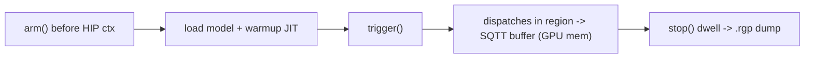

<!--
Copyright (C) 2026 Advanced Micro Devices, Inc. All rights reserved.
Licensed under the MIT License.
-->
# rgp_parser

Turns a **Radeon GPU Profiler (RGP)** capture (`.rgp`) into analysis-friendly
formats: a per-kernel summary, an operators CSV, a per-dispatch CSV, and a
Chrome/Perfetto trace.

## What it does

RGP captures great GPU data but only exposes it through its **GUI** — there's no
headless way to pull symbolized, per-dispatch timing out of a `.rgp`. This tool
makes RGP captures programmable:

- **Automation / CI + AI analysis** — decode a `.rgp` in one command into
  structured JSON/CSV; diff perf across builds and feed the trace to an LLM/agent
  for automated bottleneck analysis instead of clicking through the GUI.
- **Low performance distortion** — SQTT is hardware thread-tracing, so it perturbs
  the workload far less than the EP's internal instrumentation-based profiling;
  measured timings stay close to real, uninstrumented behavior.
- **Wave-accurate per-dispatch metrics** — kernel name, start/duration (busy time
  from occupancy wave start/end), exact wavefront/thread counts (from RGP SQTT
  event-marker grids), workgroup size, VGPR/SGPR/LDS allocation, cache
  flush/invalidate flags, and driver barriers; plus queue attribution `(me, pipe)`
  and a wall-clock timeline from the realtime counter.
- **Symbolization** — deterministic CodeObject-hash ↔ load-base pairing maps every
  dispatch PC back to its kernel name (falls back to coverage-based mapping).
- **Kernel-name decoding + op-family rollup** — Tensile/hipBLASLt/HIP names are
  parsed into `library/family/dtype/tile/mi/workgroup/arch/flags` (e.g.
  `Cijk_..._HHS_..._MT64x16x32_MI16x16x1_..._WG64_2_1` → `hgemm 64x16x32
  wmma16x16 wg64x2 +bias`), so GEMM tile variants and repeated ops collapse into
  per-family aggregates.
- **Bottleneck analysis** — idle-gap/launch-overhead detection, theoretical
  occupancy with the binding resource (gfx1151 constants verified vs LLVM), and a
  per-dispatch bound class; with SPM, per-kernel memory bandwidth (EA counter) and
  memory/compute-bound calls. Numbers degrade honestly when SPM is absent.
- **Multiple outputs** — one command emits an AI-friendly summary (JSON + Markdown),
  operators/families/dispatches CSVs, and a Perfetto/`chrome://tracing` timeline.

Scope: a post-capture **decoder**, not a profiler. You still capture the `.rgp`
with RGP/RDP; this owns everything after.

## Workload to capture

For performance-optimization captures, drive the model onlu with:

- **VLM models** → `vlm_benchmark.py`
- **non-VLM models** → `model_benchmark`

Capture one representative slice (a single prefill or decode step) at steady state.

## Setup (Git Bash)

RGP ships in the **Radeon Developer Tool Suite (RDTS)** — no installer, just unzip.
Get the current Windows zip URL from <https://gpuopen.com/tools/> (filename is versioned).

```bash
cd /c/tools
curl -L -O https://gpuopen.com/download/RadeonDeveloperToolSuite-2026-05-28-1806.zip
unzip -q RadeonDeveloperToolSuite-2026-05-28-1806.zip   # extracts to a versioned subfolder

# add that subfolder (contains RadeonGPUProfiler.exe) to the Windows user PATH,
# permanently (survives reboots, all shells)
RGP_DIR='C:\tools\RadeonDeveloperToolSuite-2026-05-28-1806'
powershell -Command "[Environment]::SetEnvironmentVariable('PATH', [Environment]::GetEnvironmentVariable('PATH','User').TrimEnd(';') + ';$RGP_DIR', 'User')"

# reopen your shell, then verify
which RadeonGPUProfiler
```

> Currently installed: RGP **v2.7.0.32** at
> `C:\tools\RadeonDeveloperToolSuite\RadeonDeveloperToolSuite-2026-05-28-1806`.

## What an RGP capture is

A `.rgp` is a **dispatch-mode SQTT snapshot** of a bounded slice of the workload,
not continuous profiling. The capture is driven in-process:

1. **Arm before the HIP context exists** — `RadeonDeveloperPanelCLI -m profiling
   --rgp-capture-mode dispatch --rgp-render-op-count <N> --rgp-sqtt-buffer-size
   <sz>` is launched first so the driver hooks the process on connect.
2. **`trigger()`** starts recording; the hardware writes SQTT tokens for the
   dispatches after the trigger into an **SQTT buffer allocated in GPU memory**.
3. **`stop()`** dwells for the driver to dump the `.rgp`.



The resulting `.rgp` is an RDF container of chunks; a **usable** capture has one or
more `SqttData` chunks (the hardware token stream) plus `CodeObject`s and, if SPM
is on, `SpmCounterData`. A capture with `CodeObject`s but **no `SqttData`**, or a
**0-byte** file, is unusable.

## Limitations

RGP allocates the **SQTT buffer in GPU memory**. On a shared-memory APU (no
discrete VRAM) that buffer, the SPM counter buffers, and the model's own
activations all compete for the same physical memory. This shared-memory
footprint, not just token overflow, is the real constraint.

**Verified failure modes** (gfx1151, Qwen3.5-9B VLM prefill):

- **`--rgp-sqtt-buffer-size maximum` wedges the workload → no `.rgp`.** The
  oversized reservation drives `SQTT + SPM + activations` past physical memory; the
  app's HIP path fails mid-run (`hipMalloc` failure /
  `hipErrorLaunchFailure` (719), process aborts) and **no file is written**.
  Reproduced every time on a full prefill.
- **Trigger miss (no dispatches in the region) → empty capture.** If the trigger
  fires but the profiled region runs zero dispatches (workload already finished, or
  the trigger lands outside steady state), the panel reports `capture FAILED
  (tiny/empty)` and produces a **0-byte / no usable `.rgp`**.
- **Undersized buffer silently truncates.** Too small and you get only part of the
  run with no hard error — verify the capture contains your kernels before trusting
  totals.

**Not a failure mode (tested, falsified):** an oversized **`--rgp-render-op-count`**
does *not* empty the capture. With `--rgp-render-op-count 100000` (window never
fills) the capture still finalized fully — 169 MB `.rgp`, `SqttData` present
(33.6 MB), identical to the 3000-op control — because dispatch mode dumps whatever
was recorded up to `stop()`. `render_ops` affects window size/timing, not
usability.

**Recommended recipe** (verified good): `--rgp-sqtt-buffer-size minimum` + a modest
`--rgp-render-op-count` (e.g. 3000), triggered during steady state over one
representative slice (a single prefill or decode step). Do **not** shrink the
prompt/image to fit — that changes the operating point, so the numbers no longer
represent real inference. Verified control capture: **169 MB `.rgp`, 2 `SqttData`
chunks (33.6 MB), 20 `CodeObject`s, 533 `SpmCounterData`**.

## Usage

```bash
pip install -r requirements.txt

# one .rgp + one output base -> every analyzed file at once
python main.py <capture>.rgp sample
```

Given output base `sample`, this emits:

| file | purpose |
|---|---|
| `sample_summary.json` / `sample_summary.md` | compact, AI-primary overview: capture meta + bottleneck classes + top idle gaps + op-family rollup + top kernels |
| `sample_operators.csv` | per-kernel aggregate (grouped by full signature; artifacts flagged) + decoded family/dtype/tile, occupancy, bound class |
| `sample_families.csv` | per-**op-family** rollup (GEMM tile variants and every instance of an op collapsed by `family/dtype/tile`) |
| `sample_dispatches.csv` | one row per dispatch (drill-down) + idle gaps, occupancy, bound class/reason |
| `sample_trace.json` | Perfetto/`chrome://tracing` timeline (human) |

The base may include a directory (`out/sample`); any extension is ignored.

## How the non-obvious numbers work

Everything below is derived from the SQTT stream + kernel names; nothing is
fabricated when data is missing.

**Bound class** (per dispatch): `overhead` (tiny kernel dominated by its idle
gap) · `latency/low-occupancy` (low theoretical occupancy) · `memory-bound` /
`compute-bound` (**only** with SPM samples in-window) · `compute-or-memory
(undetermined)` (SPM absent or window too short — reported honestly, never
guessed). Theoretical occupancy is a static *resource ceiling* (like rocprof's),
not measured achieved occupancy.

**SPM memory bandwidth** (when present): attributed per dispatch from the raw EA
ev55 unified-memory request counter,
`mem_gbps = (requests in window × bytes/req) / window-time`, needing ≥3 samples
in-window. We **sum raw request counts** rather than average per-sample GB/s on
purpose — EA samples are bursty arbiter *arrivals*, so a single-sample rate is
meaningless (it can exceed the roofline); only the windowed total is physical.
Without SPM, `mem_gbps` stays `0`/`-` and the class degrades gracefully.

Honest caveats: (1) a short window can catch the *drain* of a prior kernel's
queued requests, so a few very short dispatches read above roofline — treat
per-kernel `mem_gbps` as order-of-magnitude. (2) `memory-bound` = ≥70% of the
*theoretical* roofline (`mem_roofline_gbps`, default 256 GB/s for Strix Halo
LPDDR5X); the `compute-bound` label means "not memory-BW-bound with occupancy
headroom filled", not a proof of ALU saturation (no VALU/IPC counters).

Cleanup after a capture session (kills the Radeon Developer Service/Panel
listeners):

```bash
python cleanup.py
```

## References

- [libamdrdf](https://github.com/GPUOpen-Drivers/libamdrdf) — RDF `.rgp` container format (parse chunks)
- [rocprof-trace-decoder](https://github.com/ROCm/rocm-systems/tree/develop/projects/rocprof-trace-decoder) — SQTT token format (ported to pure Python in `struct/sqtt_decode.py`)
- Mesa — RGP SQTT marker struct layouts (`ac_sqtt.h`), used to decode grid dims and barrier fields
